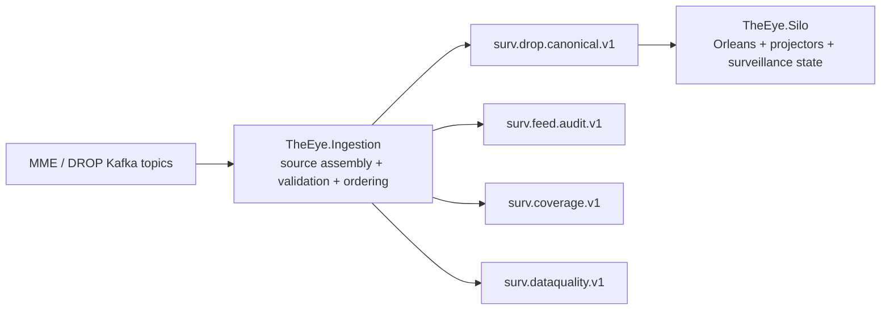

# Architecture Change Plan

> Status: planned architecture correction after live Ingestor implementation.

## Goal

Make the surveillance platform use one clean boundary between the raw MME/DROP world and the surveillance world.



## Architecture rule

**The Ingestor owns transport correctness. The Silo owns market meaning and surveillance behavior.**

The Ingestor must not perform investor resolution, trade pairing, order-book surveillance logic, rules evaluation, or detector logic. It produces a clean canonical stream only.

The Silo must not know about the 37 raw DROP topics, raw Kafka header layouts, sparse-topic ordering, watermark calculation, quarantine logic, or source-topic reconciliation.

## Required fixes before Phase B

### P0 — Correct source-offset durability

Current risk: a source Kafka offset can be committed after a record is accepted into the in-memory sequence buffer but before its canonical event is safely published. A process crash in that window can permanently lose a surveillance event.

Target behavior:

1. Consume raw source record.
2. Decode and validate it.
3. Insert into the sequence buffer.
4. Release safe globally ordered records.
5. Publish canonical/audit/coverage/data-quality output successfully.
6. Only then advance the source offsets that are now safe to commit.

Use at-least-once delivery. Duplicate replay is acceptable because deterministic `EventId` makes replay idempotent. Silent event loss is not acceptable.

### P0 — Prove canonical ordering contract

`surv.drop.canonical.v1` must preserve the ordering produced by the Source Assembler.

Initial rule: one Kafka partition per `SequenceDomain`. Do not increase partitions until an explicit partitioning/order design exists.

### P0 — Confirm Kafka source-header contract

The Nasdaq DROP specification defines the binary DROP payload, not the Kafka-header serialization added by the existing MME ingestors.

`DropSourceRecordContextFactory` must use the real producer encoding for:

- `mme-sequence-number`
- `drop-group-id`
- `drop-message-id`
- `drop-partition-id`

Do not infer a fixed byte width from the Nasdaq payload specification. Validate this against live header dumps and/or the existing MME.Drop.Ingestor source code.

### P0 — Confirm sequence epoch/domain semantics

Replace the placeholder/unverified `SequenceEpoch` only after the real reset boundary is known. Document when sequence numbers reset and whether they are global across all three source families.

### P1 — Classify source topics

The registry must distinguish:

- `Required`
- `Optional`
- `NotProvisioned`

A missing optional/not-provisioned topic must not permanently mark coverage degraded. A missing required topic must.

### P1 — Make sequence conflicts first-class data-quality events

When the same MME sequence contains multiple distinct identities, publish a `SourceSequenceConflictEvent` to `surv.dataquality.v1` with both identities and Kafka coordinates. Do not only log it.

### P1 — Wire source-quality topics

Consume `mme.drop.parsed.unhandled` and the raw-message DLQ when available and map them into `UnknownDropMessageEvent` / data-quality evidence.

### P1 — Clarify Redis-down wording and behavior

If Redis watermark data is unavailable, ingestion may continue consuming/buffering, but canonical release must never jump across an unproven missing sequence. The safe behavior is to stall at the first unresolved hole rather than invent a gap.

## Investor/reference behavior

Investor remains a canonical reference event in the Ingestor. Identity resolution happens later in the Silo.

```text
InvestorEvent  ─┐
AccountEvent   ─┼──> surv.drop.canonical.v1 ──> TheEye.Silo reference projectors
ActorEvent     ─┤
ParticipantEvent┘
```

The Silo builds the relationship:

```text
Order / Trade account
        ↓
Account reference
        ↓
InvestorId
        ↓
Investor reference/state
```

The Ingestor must not attach Investor state to orders/trades.

## Exit criteria

Phase B / Silo implementation starts only after:

- source Kafka header encoding is confirmed;
- no source offset is committed before the corresponding released output is durable;
- canonical topic ordering is proven with an integration test;
- sequence epoch/domain reset semantics are documented;
- required/optional topic classification is decided;
- crash/restart test proves no silent canonical event loss.
