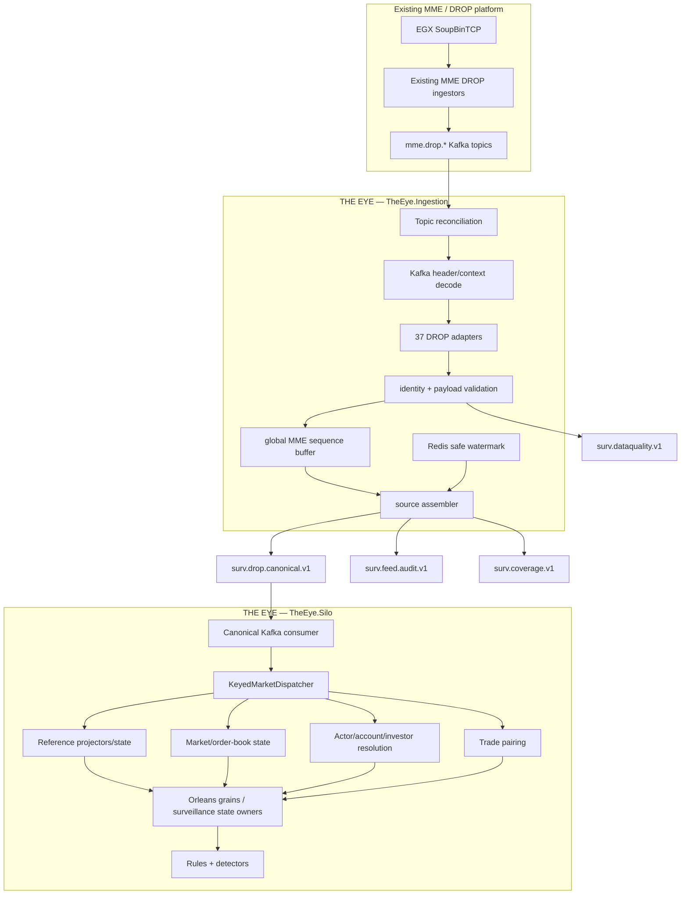
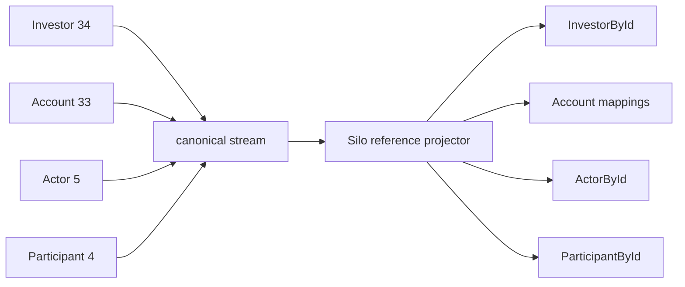

# Canonical Ingestion Architecture

> Authoritative runtime architecture for the boundary between the existing MME/DROP platform and THE EYE surveillance runtime.

## One-line model

**Raw MME/DROP → trustworthy canonical event log → Orleans surveillance state.**



## Responsibility boundary

### TheEye.Ingestion owns

- discovering available documented source topics;
- consuming the raw MME/DROP Kafka topics;
- decoding Kafka transport metadata;
- mapping payloads into typed DROP DTOs without changing their business meaning;
- validating header/payload identity;
- deterministic `EventId` generation;
- replay duplicate detection;
- buffering by MME sequence;
- safe-watermark calculation;
- global canonical ordering;
- confirmed coverage-gap production;
- data-quality quarantine;
- canonical/audit publication.

### TheEye.Ingestion does not own

- investor/account/participant enrichment;
- order-book surveillance state;
- trade-side pairing;
- spoofing/layering stories;
- behavioral counters;
- RulesEngine evaluation;
- alert creation;
- ML scoring.

### TheEye.Silo owns

- consuming only `surv.drop.canonical.v1` for market/reference events;
- reference projections;
- account → investor resolution;
- actor/participant/reference relationships;
- trade pairing;
- order lifecycle and order-book state;
- transaction/session context;
- Orleans routing and grain state;
- surveillance facts/stories;
- rules, statistics and detector execution;
- downstream surveillance alerts/state events.

### TheEye.Silo must not know

- which of the raw 37 topics an event came from for business processing;
- the raw source Kafka-header serialization contract;
- source-family watermarks;
- source topic sparsity;
- source sequence buffering/gap declaration mechanics.

Source Kafka coordinates and source identity remain in the canonical envelope only for audit/evidence.

## Canonical topic contract

`surv.drop.canonical.v1` is the only normal input to `TheEye.Silo` from DROP.

A canonical event contains:

- deterministic `EventId`;
- `EventType` + schema version;
- `MmeSequenceNumber`;
- `SequenceDomain`;
- `SequenceEpoch`;
- DROP message group / message ID / partition ID;
- routing hints such as order-book/actor/account when naturally present;
- event time from the payload;
- receive time;
- original source Kafka coordinates;
- typed DROP payload.

The typed payload keeps the meaning of the source DROP message. Canonicalization is not enrichment.

## Ordering contract

The Source Assembler is the owner of canonical MME order.

For the first production version:

- one canonical Kafka partition per `SequenceDomain`;
- the publisher writes released events in increasing `MmeSequenceNumber` order;
- the Silo consumes the partition sequentially;
- the Silo must not use consumer parallelism that reorders events before state application;
- duplicates after replay are ignored by `EventId`.

If multiple sequence domains are proven later, each domain may use an independent ordered lane, but ordering may never be assumed across unrelated domains.

## Gap semantics

A missing number is not a gap merely because one raw topic is sparse.

A `CoverageGapEvent` is published only when the safe watermark proves all active source families have moved beyond the missing sequence.

If the watermark cannot be proven (for example Redis is unavailable), the safe behavior is:

- continue consuming/buffering where capacity permits;
- continue releasing contiguous records already known;
- stop at the first unresolved hole;
- never manufacture a coverage gap.

## Reference / Investor semantics

Reference messages remain independent canonical events.



The Account message supplies the `InvestorId` relationship. Orders and trades carry account information. The Silo resolves those references while processing surveillance state.

**Do not perform this resolution inside the Ingestor.**

## Reliability contract

Transport is at-least-once; state application is idempotent by deterministic `EventId`.

A raw source offset must not be advanced past data that exists only in the volatile reorder buffer. The implementation must delay source offset advancement until released output is safely durable, or introduce an explicitly durable reorder/outbox design.

The preferred first implementation is delayed safe commits rather than adding a new persistence technology.

## Deployment boundary

`TheEye.SourceAssembly` is a code/library boundary, not a separately deployed service.

One deployable runs on the ingestion side:

```text
TheEye.Ingestion
  ├── TheEye.DropAdapters
  ├── TheEye.SourceAssembly
  └── TheEye.Contracts
```

The Orleans deployment is separate:

```text
TheEye.Silo
  ├── canonical Kafka consumer
  ├── projectors
  ├── dispatcher
  ├── grains
  └── rules/detectors
```

Kafka is the isolation and replay boundary between them.

## Architectural invariants

1. The Silo consumes the canonical topic, not the raw DROP topic set.
2. SourceAssembly runs in the Ingestor deployable.
3. Ingestion canonicalizes; it does not enrich surveillance meaning.
4. Reference identity resolution happens in the Silo.
5. The assembler is the only owner of global source ordering/gap decisions.
6. Never commit volatile buffered input as safely processed.
7. Never trade event loss for lower duplicate probability; prefer replay + dedupe.
8. Never increase canonical partitions without preserving the sequence-domain ordering contract.
9. Missing optional/not-provisioned source topics are different from missing required topics.
10. Every declared blind spot or conflict is represented as durable evidence, not only a log line.
