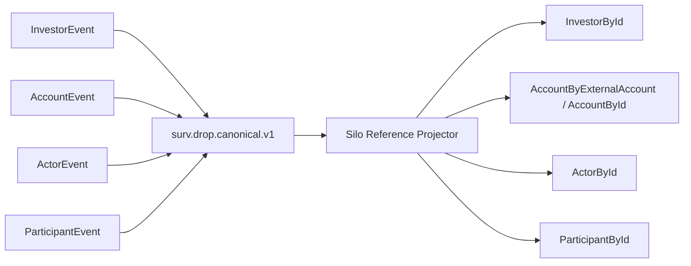

# Investor and Reference Flow

## Rule

The Ingestor transports reference truth; the Silo resolves reference relationships.



## Investor source message

DROP Investor is message group `31`, message ID `34` and carries the investor reference fields such as investor ID, name, description, status and action.

## Account relationship

DROP Account is message group `31`, message ID `33` and carries the relationship from an account to `InvestorId` and `ParticipantId`, plus external account information.

## Runtime resolution

When an Order or Trade arrives, the Silo uses canonical reference state to resolve its account to the corresponding investor where possible.

```text
Order/Trade account
      ↓
Account reference state
      ↓
InvestorId
      ↓
Investor reference/state
```

This resolution is Silo-side. The canonical Ingestor does not mutate Order/Trade payload meaning to embed Investor enrichment.

## Why

- keeps the canonical source stream faithful to DROP;
- allows late reference updates to be handled by one state owner;
- avoids coupling ingestion to surveillance business relationships;
- supports replay because reference events and market events rebuild the same projection deterministically.
