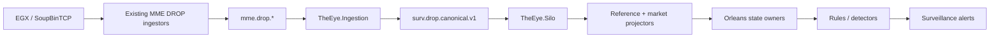

# Current Runtime Path



Side outputs from `TheEye.Ingestion`:

```text
surv.feed.audit.v1
surv.coverage.v1
surv.dataquality.v1
```

This is the current runtime architecture. See [[01 - Canonical Ingestion Architecture]].
