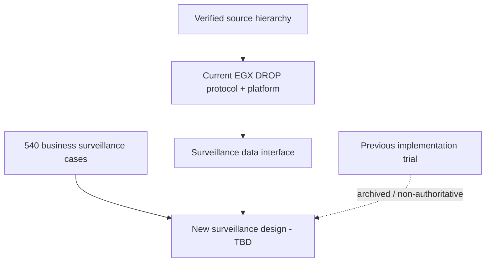

# Market Surveillance - Project Home

> [!IMPORTANT]
> **Restart baseline:** we are gathering business requirements and the real DROP data interface first. Previous surveillance implementation architecture is **legacy / not authoritative** for the new build.

## Start here now

1. [[MOCs/04 - Current DROP System Map|Current DROP System Map]] - current feed, protocol, runtime and data interface.
2. [[DROP-Current-System/02 - DROP Message Catalog|DROP Message Catalog]] - all 37 official DROP messages with field-level notes.
3. [[DROP-Current-System/06 - Surveillance Data Interface Boundary|Surveillance Data Interface Boundary]] - exactly what the future surveillance system can consume, without choosing implementation yet.
4. [[MOCs/01 - Surveillance Case Map|Surveillance Case Map]] - the 540 business surveillance scenarios.
5. [[MOCs/03 - Reusable Detector Map|Reusable Detector Map]] - historical/business detector concepts; implementation decisions are not frozen.

## Current knowledge model

## Current baseline rule

- Build business understanding first.
- Use official DROP protocol semantics and verified current platform docs as data truth.
- Keep current-vs-proposed-vs-legacy status explicit.
- Do not reuse the previous surveillance implementation as an approved architecture.

## Legacy implementation area

[[Implementation-Architecture/00 - Implementation Architecture Home|Previous Implementation Architecture]] remains in the vault for historical traceability only and is now marked legacy/non-authoritative.
