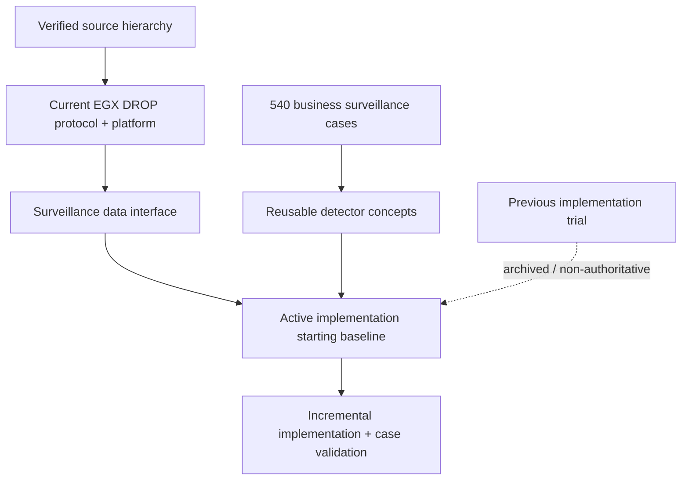

# Market Surveillance - Project Home

> [!IMPORTANT]
> **Current baseline:** the real DROP interface and the 540 business cases remain the source inputs. We now also have an **active implementation starting baseline** for the first build. It is intentionally small and can evolve as cases are validated.

## Start here now

1. [[MOCs/04 - Current DROP System Map|Current DROP System Map]] - current feed, protocol, runtime and data interface.
2. [[DROP-Current-System/02 - DROP Message Catalog|DROP Message Catalog]] - all 37 official DROP messages with field-level notes.
3. [[DROP-Current-System/06 - Surveillance Data Interface Boundary|Surveillance Data Interface Boundary]] - what surveillance can consume and the global-sequence requirement.
4. [[MOCs/01 - Surveillance Case Map|Surveillance Case Map]] - the 540 business surveillance scenarios.
5. [[MOCs/03 - Reusable Detector Map|Reusable Detector Map]] - reusable behavioral facts shared by many cases.
6. [[Architecture/Implementation-Start/00 - Implementation Start Home|Implementation Start Home]] - the active engineering starting point.

## Current knowledge model

## Current baseline rules

- Official DROP semantics and verified current platform behavior remain the data truth.
- The MME source sequence is treated as **global across all message types inside its actual source sequence domain**; Kafka topic/message family is not a sequence domain.
- Global feed continuity and fraud detection are separate concerns.
- `OrderBookGrain` owns live book state; reusable detector classes calculate surveillance facts; rules decide whether facts form a suspicious scenario.
- Start with a small vertical slice and expand detector/case coverage incrementally.
- Keep current-vs-proposed-vs-legacy status explicit in every architecture note.

## Active implementation area

- [[Architecture/Implementation-Start/00 - Implementation Start Home|Implementation Start Home]]
- [[Architecture/Surveillance Detection Pipeline|Surveillance Detection Pipeline]]
- [[Architecture/Implementation Workspace Guide|Implementation Workspace Guide]]

## Legacy implementation area

[[Implementation-Architecture/00 - Implementation Architecture Home|Previous Implementation Architecture]] remains in the vault for historical traceability only and is marked legacy/non-authoritative.
