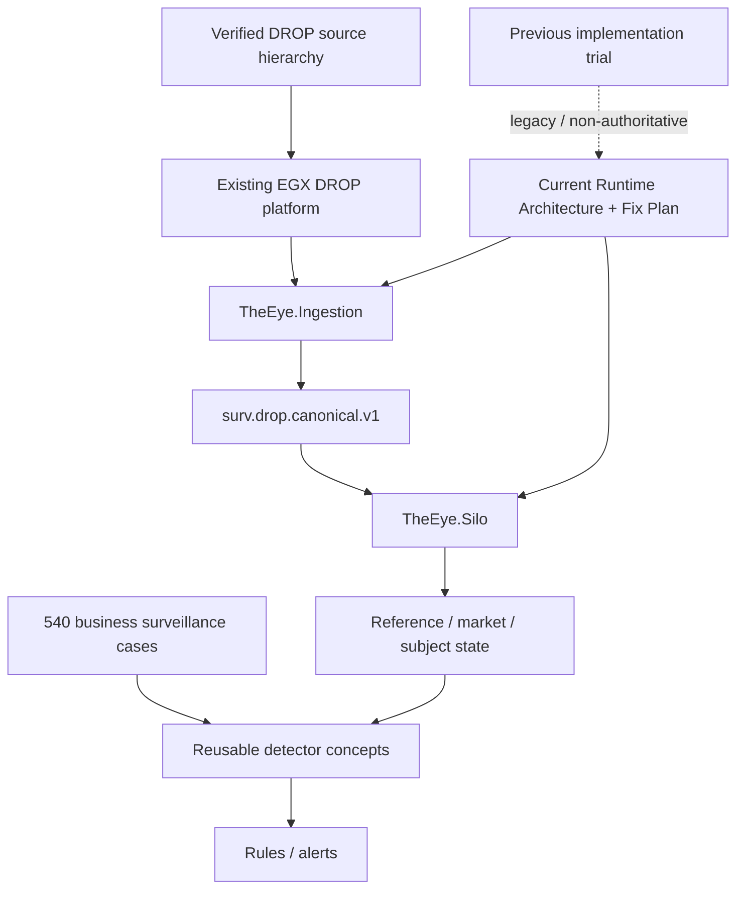

# Market Surveillance - Project Home

> [!IMPORTANT]
> **Current baseline:** the official DROP semantics and verified platform behavior remain source truth. The current implementation architecture is now the built canonical boundary: `TheEye.Ingestion` cleans/orders raw DROP evidence, then `TheEye.Silo` consumes `surv.drop.canonical.v1`.

## Start here now

1. [[MOCs/05 - Current THE EYE Architecture Map|Current THE EYE Architecture Map]] - current implementation graph.
2. [[Architecture/Implementation-Start/15 - Current Runtime Architecture and Fix Plan|Current Runtime Architecture and Fix Plan]] - authoritative Ingestor → Kafka → Silo architecture and P0/P1 fix plan.
3. [[MOCs/04 - Current DROP System Map|Current DROP System Map]] - existing feed/protocol/runtime source system.
4. [[DROP-Current-System/02 - DROP Message Catalog|DROP Message Catalog]] - documented DROP messages and fields.
5. [[DROP-Current-System/06 - Surveillance Data Interface Boundary|Surveillance Data Interface Boundary]] - how current DROP enters THE EYE.
6. [[MOCs/01 - Surveillance Case Map|Surveillance Case Map]] - the 540 surveillance scenarios.
7. [[MOCs/03 - Reusable Detector Map|Reusable Detector Map]] - reusable facts shared by cases.

## Current knowledge model



## Current baseline rules

- Official DROP semantics and verified current platform behavior remain the data truth.
- `TheEye.Ingestion` is the only normal THE EYE consumer of the raw/current `mme.drop.*` topic family.
- `TheEye.SourceAssembly` is a library inside the Ingestor deployable, not a standalone service.
- `surv.drop.canonical.v1` is the hard Kafka boundary into `TheEye.Silo`.
- The MME source sequence is treated as global across message types inside its actual source domain; filtered topics are sparse views.
- The Ingestor owns source ordering/dedupe/gap proof/data-quality quarantine.
- The Silo owns reference projection, Account → Investor resolution, transaction/business-date/market context, trade pairing, dispatcher, Orleans state and detection.
- Prefer at-least-once replay + deterministic `EventId` over silent event loss.
- Source Kafka offsets must not be committed while records are represented only in the volatile reorder buffer.
- Canonical Kafka starts with one ordered partition per `SequenceDomain`.
- `OrderBookGrain` owns live book state; detector classes calculate facts; rules decide suspicious scenarios.
- Start with a small vertical slice and expand detector/case coverage incrementally.
- Keep current-vs-proposed-vs-legacy status explicit.

## Current implementation findings to close

```text
22/37 documented source topics observed on first live broker run
real Kafka header encoding needs final confirmation
SequenceEpoch reset semantics need proof
source offset durability needs P0 correction
source-quality topics need wiring
same-sequence conflicts need durable event contract
```

See [[Architecture/Implementation-Start/15 - Current Runtime Architecture and Fix Plan|the fix plan]].

## Active implementation area

- [[MOCs/05 - Current THE EYE Architecture Map|Current THE EYE Architecture Map]]
- [[Architecture/Implementation-Start/15 - Current Runtime Architecture and Fix Plan|Current Runtime Architecture and Fix Plan]]
- [[Architecture/Implementation-Start/00 - Implementation Start Home|Implementation Start Home]]
- [[Architecture/Surveillance Detection Pipeline|Surveillance Detection Pipeline]]
- [[Architecture/Implementation Workspace Guide|Implementation Workspace Guide]]

## Legacy implementation area

[[Implementation-Architecture/00 - Implementation Architecture Home|Previous Implementation Architecture]] remains in the vault for historical traceability only and is legacy/non-authoritative. Any runtime diagram there that conflicts with the current architecture must not be used for new implementation.
