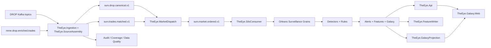

# Current Implementation Home

> [!IMPORTANT]
> This folder is the **single active implementation architecture** for THE EYE. It is derived from `the-eye-v2` branch `development` at commit `831668209d37f7586a0f08d97da2b2f61ac93a62` and documents the **DROP feed path only**.

Anything outside this folder may be useful research, case knowledge or historical reference, but it is **not authoritative for what the current code implements**.

## Read in this order

1. [[01 - Current Runtime Architecture]]
2. [[02 - Implementation Completion Matrix]]
3. [[03 - DROP Feed Coverage]]
4. [[04 - AI and Fusion Status]]
5. [[05 - Code Traceability]]
6. [[06 - Runtime Topics and Data Flow]]
7. [[07 - Verification Boundaries and Gaps]]

## Implementation headline

- **Core DROP surveillance pipeline:** implemented end-to-end in code.
- **Detection:** deterministic detectors, rules and Orleans stateful correlation are implemented.
- **Deep graph/cycle correlation:** implemented by `CoordinationWindowGrain` and `CoordinationDeepScanGrain`.
- **AI/ML model inference:** not implemented in the audited tree.
- **Dedicated Fusion Engine:** not present in the audited tree.
- **ML-ready infrastructure:** feature schemas, feature publishing/writing and synthetic-data tooling are present.

## Authoritative flow

## Rule for future KB updates

A component is marked **implemented** only when it exists in the current `development` code path. A plan document, model-training idea or architecture proposal must not be promoted to implemented status until corresponding runtime code exists.

Related: [[../../DROP-Current-System/01 - DROP Protocol Overview|DROP Protocol Overview]] · [[../../00 - Project Home|Project Home]]
