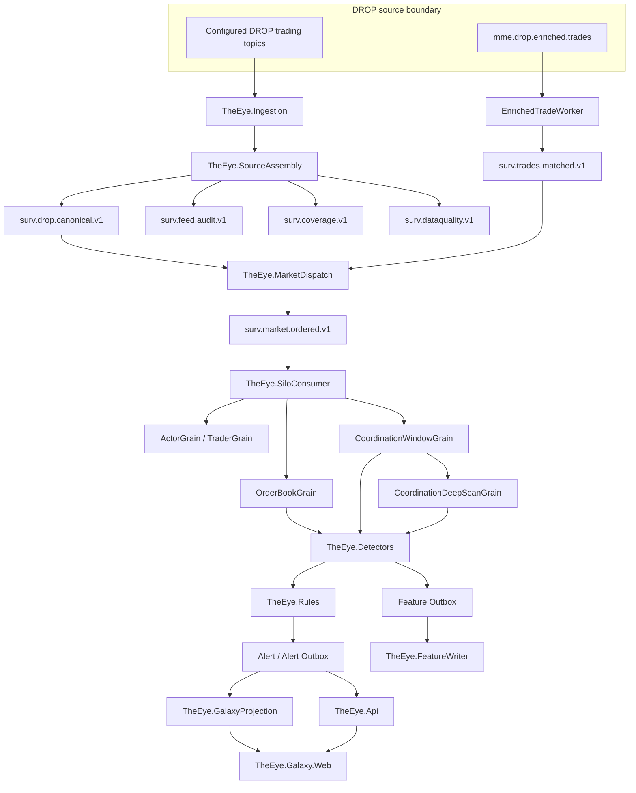

# Current Runtime Architecture

[[00 - Current Implementation Home|← Current Implementation Home]]

## End-to-end runtime

## What each layer owns

| Layer | Current responsibility |
|---|---|
| `TheEye.Ingestion` | Kafka consumption, DROP source worker hosting, checkpoints, quality/coverage, enriched-trade worker |
| `TheEye.SourceAssembly` | DROP topic registry, parsing/adaptation, global MME sequence assembly, canonical/audit publishing |
| `TheEye.MarketDispatch` | joins canonical market events with matched-trade companions, maintains projector/pairing state and emits one deterministic ordered command stream |
| `TheEye.SiloConsumer` | consumes the ordered stream and dispatches by deterministic keys into Orleans |
| `TheEye.Silo` | durable market/entity state, book lifecycle, coordination windows, deep graph/cycle correlation, alert/feature outboxes |
| `TheEye.Detectors` | deterministic reusable surveillance facts/detectors |
| `TheEye.Rules` | deterministic case policies/evaluators for spoofing, wash/matched, circular and related cases |
| `TheEye.FeatureStore` / `TheEye.FeatureWriter` | feature contracts and persisted training/analysis datasets; not model inference |
| `TheEye.Api` | authenticated HTTP/WebSocket application boundary, alert workflow, Galaxy/feature access, outbox services |
| `TheEye.GalaxyProjection` / `TheEye.Galaxy.Web` | graph/read-model projection and React/Vite surveillance UI |
| `TheEye.Telemetry` / `TheEye.OrleansHosting` | runtime observability and Orleans hosting/topology support |

## Important architecture correction

The current code **does not** use the older direct path `canonical topic -> SiloConsumer -> Orleans`. `TheEye.MarketDispatch` is now a required stage between source assembly and the Orleans consumer:

`surv.drop.canonical.v1 + surv.trades.matched.v1 -> MarketDispatch -> surv.market.ordered.v1 -> SiloConsumer -> Orleans`

This page replaces the previous architecture documents that omitted that stage or described aspirational ML/Fusion blocks as runtime components.

Next: [[02 - Implementation Completion Matrix]] · [[06 - Runtime Topics and Data Flow]]
