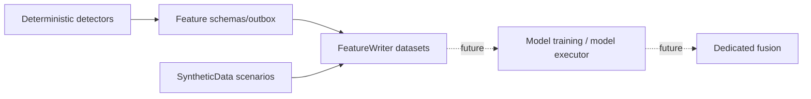

# AI and Fusion Status

[[00 - Current Implementation Home|← Current Implementation Home]]

## Current status

| Area | Status | Meaning |
|---|---|---|
| Feature engineering contracts | ✅ Implemented | circular/spoofing feature and sequence schemas exist |
| Feature persistence/export | ✅ Implemented infrastructure | FeatureWriter can validate/write/archive datasets; runtime behavior is configuration-dependent |
| Synthetic ML/training data | ✅ Implemented tooling | circular and spoofing scenario generators/configs exist |
| XGBoost runtime | ❌ Not implemented | no XGBoost runtime/model loader found in the audited tree |
| CNN/TCN runtime | ❌ Not implemented | no neural-model runtime found in the audited tree |
| ONNX/model executor | ❌ Not implemented | no ONNX or model-executor runtime found |
| AI inference service | ❌ Not implemented | no project/service currently scores live DROP events with a trained model |
| Dedicated Fusion Engine | ❌ Not implemented | no Fusion Engine project/class/runtime found |
| Deterministic graph correlation | ✅ Implemented | Orleans coordination/deep-scan grains correlate entities/trades and search bounded cycles |

## What DeepScan actually is

`CoordinationWindowGrain` and `CoordinationDeepScanGrain` implement **deterministic graph/cycle correlation** for coordinated/circular behavior. They use bounded state, relationships, rules and graph search.

They are useful as a future fusion input, but the current code should **not** describe them as:

- an AI model,
- an ML inference engine, or
- a dedicated Fusion Engine.

## Plans are not implementation

The development tree contains planning documents for XGBoost/CNN/TCN and a primitive model executor. Those documents are design intent only. The corresponding live model runtime is not present in the audited code tree.

## Current ML-ready boundary

Only the solid-line components are implemented in this snapshot.

Code-search checks against the development tree found no runtime/file matches for `Fusion`, `Onnx`, `ModelExecutor` or `XGBoost` beyond planning material where applicable.

Related: [[02 - Implementation Completion Matrix]] · [[05 - Code Traceability]]
