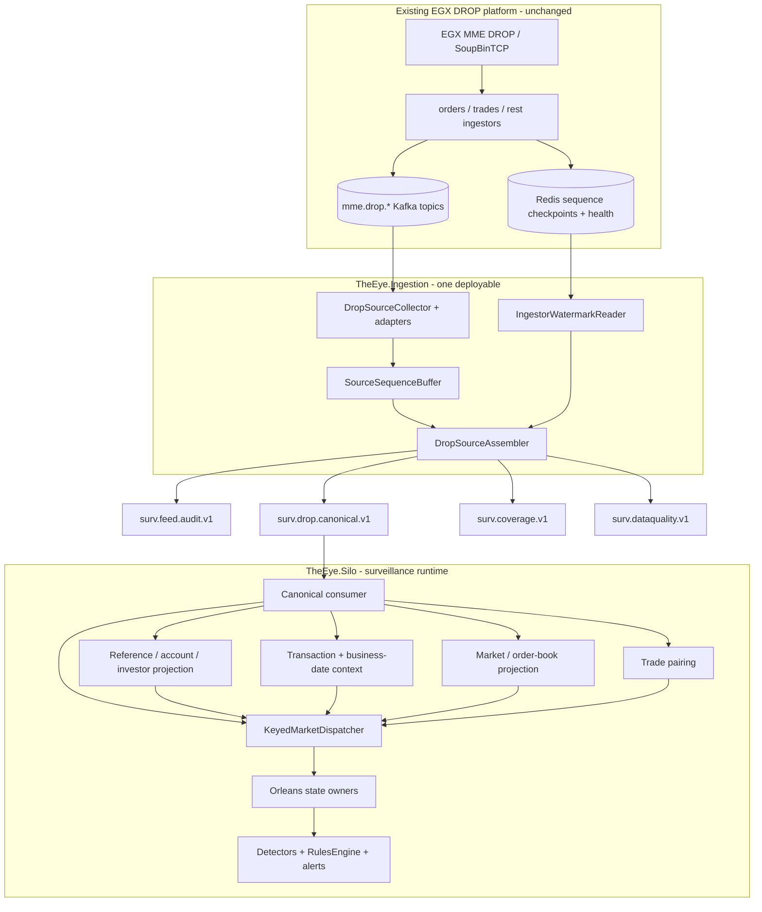

# Implementation Start Home

> [!IMPORTANT]
> This folder is the **active starting point for THE EYE implementation**. The current runtime boundary is now proven by the built Ingestor design: raw MME/DROP topics are cleaned/ordered inside `TheEye.Ingestion`, then the Orleans Silo consumes only the canonical Kafka stream.

> [!IMPORTANT]
> For the current Ingestor → Kafka → Silo architecture and reliability fixes, read [[15 - Current Runtime Architecture and Fix Plan|Current Runtime Architecture and Fix Plan]] first.

## Current architecture



## Hard architecture boundary

```text
raw MME/DROP
   ↓
TheEye.Ingestion
- raw topic handling
- header decode
- adapters/validation
- source ordering
- dedupe
- gap/data-quality handling
   ↓
surv.drop.canonical.v1
   ↓
TheEye.Silo
- reference projection
- account → investor resolution
- transaction/business-date context
- market/order-book state
- trade pairing
- Orleans grains
- rules/detectors/alerts
```

`TheEye.SourceAssembly` is a **library inside the Ingestor deployable**, not a separate service.

The Silo does **not** consume the 37 raw DROP topics for normal market/reference processing, and the Ingestor does **not** call Orleans grains directly.

## Detection architecture inside the Silo

The detailed case/archetype flow now lives in [[Architecture/Surveillance Detection Pipeline|Surveillance Detection Pipeline]].

The important implementation contract is:

```text
OrderBook/subject state
    -> immutable DetectorContext
    -> archetype FactPipeline
    -> typed FactBundle
    -> scoped CaseRouter
    -> archetype CaseEvaluator
    -> RulesEngine workflow
    -> ICasePolicy
    -> CaseDecision
    -> AlertDispatcher
    -> SurveillanceAlertGrain
```

This keeps responsibilities clean:

- grains own mutable state;
- detector/fact pipelines calculate reusable measurements;
- RulesEngine evaluates declarative conditions;
- `ICasePolicy` is the final judge for one surveillance case;
- alert recording owns deterministic identity, dedupe, evidence and coverage.

For a **new case inside an existing archetype**, normally add only the case policy, RulesEngine workflow, pack registration and tests. Do not modify grains/contracts just because a new case was added.

For a **new archetype**, add a parallel typed fact pipeline + evaluator + rule pack, and extend state only when that archetype genuinely needs new owned state.

## Core decisions

1. **The MME sequence is treated as global across message types inside its real source sequence domain.** A filtered Kafka topic is not a sequence domain.
2. **Current Kafka arrival order across topics is not exchange order.** `TheEye.Ingestion` assembles source events by MME sequence using validated metadata and safe watermarks.
3. **All 37 documented DROP messages remain first-class source contracts**, but runtime topic reconciliation decides what actually exists in the environment.
4. **The official Order message remains a rich lifecycle update.** Preserve native status/changeReason/quantities/ownership.
5. **The official Trade message remains one trade side.** Trade pairing is a Silo-side projection, not an Ingestor responsibility.
6. **Reference messages remain independent canonical events.** Account → Investor resolution happens in the Silo as-of source sequence.
7. **Current enriched orders/trades remain secondary views**, not authoritative surveillance evidence.
8. **OrderBookGrain owns mutable book state.** Detectors calculate facts; rules own policy.
9. **At-least-once + deterministic EventId + idempotent state application** remains the reliability model.
10. **Prefer duplicate replay over silent event loss.** Source offsets must not acknowledge records whose only accepted copy is still in the volatile reorder buffer.
11. **Canonical ordering is a contract.** Start with one canonical Kafka partition per `SequenceDomain`.
12. **The 540 cases require more than DROP.** Missing required external data means `NotEvaluableMissingDomain`, not “no fraud found.”
13. Every alert/rule result carries source evidence and coverage state.

## Current live implementation facts

The built Ingestor has already established these facts:

- SourceAssembly is hosted inside `TheEye.Ingestion`.
- Kafka is the isolation boundary between Ingestor and Silo.
- deterministic EventId/replay dedupe is implemented;
- watermark-gated gap declaration is implemented;
- malformed/lying records are quarantined;
- live topic reconciliation found **22/37 documented topics** available in the tested broker;
- the assumed fixed-width Kafka-header decode was disproved by the first live record;
- `SequenceEpoch` reset semantics remain unverified;
- source-quality topics are still a planned gap;
- source-offset durability before canonical release requires a P0 correction.

## Read in this order

### Current runtime authority

1. [[15 - Current Runtime Architecture and Fix Plan|Current Runtime Architecture and Fix Plan]]

### Source correctness

2. [[01 - Global Sequence and Feed Continuity|Global Sequence and Feed Continuity]]
3. [[02 - Canonical Event Contract|Canonical Event Contract]]
4. [[08 - DROP Event Acquisition Matrix|DROP Event Acquisition Matrix]]
5. [[09 - Source Assembly and Ordering Logic|Source Assembly and Ordering Logic]]
6. [[14 - Data Quality and Capability Gaps|Data Quality and Capability Gaps]]

### Complete event model

7. [[07 - Complete Surveillance Event Catalog|Complete Surveillance Event Catalog]]
8. [[10 - Reference State and Enrichment Strategy|Reference State and Enrichment Strategy]]
9. [[11 - External Event Contracts|External Event Contracts]]
10. [[12 - Case Family Event Coverage Matrix|Case Family Event Coverage Matrix]]
11. [[DTO-Reference/00 - DTO and Data Structure Implementation Map|DTO and Data Structure Implementation Map]]

### Processing and first code

12. [[13 - Event Processing Blocks|Event Processing Blocks]]
13. [[03 - Order Book Surveillance Core|Order Book Surveillance Core]]
14. [[06 - First Detector Specifications|First Detector Specifications]]
15. [[Architecture/Surveillance Detection Pipeline|Surveillance Detection Pipeline]]
16. [[04 - First Vertical Slice|First Vertical Slice]]
17. [[05 - Dotnet Solution Starting Structure|.NET Solution Starting Structure]]

## Phase 0 - mandatory proof/fixes before production Silo dependency

```text
confirm real Kafka header encodings
confirm SequenceDomain / SequenceEpoch reset semantics
fix source-offset durability across the in-memory reorder buffer
prove one ordered canonical lane per sequence domain
reconcile 22/37 live topic inventory as Required / Optional / NotProvisioned
prove safe-watermark behavior during idle family / Redis failure
wire source-quality topics when available
publish sequence conflicts as durable data-quality evidence
```

Detailed plan: [[15 - Current Runtime Architecture and Fix Plan|Current Runtime Architecture and Fix Plan]].

## Event coverage principle

```text
DROP native events
    -> core exchange surveillance

DROP-derived/projected state in Silo
    -> reusable behavioral evidence

External canonical events
    -> client/MNPI/settlement/lending/news/security/cross-venue domains

All three together
    -> full 540-case program
```

## External graph links

- [[Architecture/Surveillance Detection Pipeline|Surveillance Detection Pipeline]]
- [[DTO-Reference/00 - DTO and Data Structure Implementation Map|DTO and Data Structure Implementation Map]]
- [[DROP-Current-System/01 - DROP Protocol Overview|DROP Protocol Overview]]
- [[DROP-Current-System/02 - DROP Message Catalog|37 Official DROP Messages]]
- [[DROP-Current-System/03 - Current DROP Runtime Architecture|Current DROP Runtime Architecture]]
- [[DROP-Current-System/06 - Surveillance Data Interface Boundary|Surveillance Data Interface Boundary]]
- [[DROP-Current-System/08 - Kafka Topic Catalog|Current Kafka Topic Catalog]]
- [[DROP-Current-System/12 - Runtime Guarantees and Known Gaps|Current Runtime Guarantees and Gaps]]
- [[DROP-Current-System/15 - Source Classification and Reliability|Source Hierarchy]]
- [[MOCs/03 - Reusable Detector Map|Reusable Detector Map]]
- [[MOCs/01 - Surveillance Case Map|540 Surveillance Cases]]
- [[Architecture/Implementation Workspace Guide|Implementation Workspace Guide]]
- [[00 - Project Home|Project Home]]

## Legacy warning

[[Implementation-Architecture/00 - Implementation Architecture Home|Previous Implementation Architecture]] is historical reference only. Any old diagram that contradicts [[15 - Current Runtime Architecture and Fix Plan|the current runtime architecture]] is superseded.
