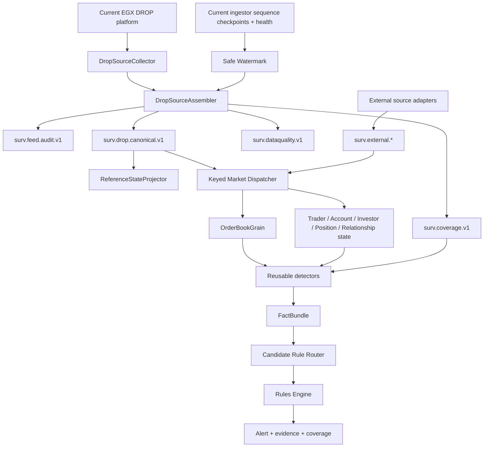

# Implementation Start Home

> [!IMPORTANT]
> This folder is the **active starting point for THE EYE implementation**. The design is grounded in the official DROP protocol, the verified current three-ingestor/Kafka/Redis architecture and the 540-case surveillance catalog.

> [!IMPORTANT]
> **Current implemented state:** [[16 - Development Implementation Snapshot|Development Implementation Snapshot]] is the authoritative code-backed mirror of `the-eye-v2/development` through commit `0b4af2e99e530ce56a94d894865c761b7d7306e8`. The notes below still contain target/design material; use the snapshot and its linked implementation notes when you need to know what is actually running in code.

## Complete starting graph



> [!WARNING]
> The graph above is the **target/starting architecture**, not a literal diagram of every current runtime process. The physical runtime and current gaps are documented in [[16 - Development Implementation Snapshot]], [[17 - Runtime Pipeline and Orleans Implementation]] and [[21 - Current Implementation Gaps and Known Defects]].

## Core decisions

1. **The MME sequence is global across message types inside its real source sequence domain.** A filtered Kafka topic is not a sequence domain.
2. **Current Kafka arrival order across topics is not exchange order.** THE EYE assembles source events by MME source sequence using validated source metadata and safe watermarks.
3. **Start with the current DROP Kafka outputs read-only.** Do not add a fourth DROP session unless Phase-0 validation proves downstream assembly is insufficient and EGX concurrent-session policy is confirmed.
4. **All 37 official DROP messages are first-class source events.** Do not throw away messages simply because the first detector does not use them.
5. **The official Order message is a rich lifecycle update.** Preserve native `orderStatus`, `orderStatusBefore`, `changeReason`, quantities and ownership; a simple New/Modify/Cancel action is only a derived convenience.
6. **The official Trade message is one trade side.** Build a complete `MatchedTradeEvent` deterministically from source sides when needed.
7. **Reference data is versioned state.** Initial reference data finishes before live traffic, but later reference updates can occur at any time. Resolve identities as-of source sequence.
8. **Current enriched orders/trades are secondary views, not authoritative surveillance evidence**, because current enrichment has documented degradation/duplicate/race windows.
9. **OrderBookGrain owns mutable book state.** Fraud monitoring around the book is reusable detector logic, not a second competing OrderBookWatcher grain.
10. **Grains own mutable state; detectors calculate facts; rules own policy.**
11. **At-least-once + deterministic EventId + idempotent state application** is the default end-to-end reliability model.
12. **The 540 cases require more than DROP.** Client orders, routing, borrow/locate, settlement, ownership, MNPI, news/social, security and other domains are explicit external event contracts.
13. Missing external data means **NotEvaluableMissingDomain**, not “no fraud found.”
14. Every alert/rule result carries source evidence and coverage state.

## Read in this order

### What is implemented now

1. [[16 - Development Implementation Snapshot|Development Implementation Snapshot]]
2. [[17 - Runtime Pipeline and Orleans Implementation|Runtime Pipeline and Orleans Implementation]]
3. [[18 - Detectors Rules and Alerts Implementation|Detectors, Rules and Alerts Implementation]]
4. [[19 - Feature Store and Archive Implementation|Feature Store and Archive Implementation]]
5. [[20 - Galaxy Implementation|Galaxy Implementation]]
6. [[21 - Current Implementation Gaps and Known Defects|Current Implementation Gaps and Known Defects]]
7. [[22 - Test and Verification Surface|Test and Verification Surface]]
8. [[23 - Contracts and DROP Adapter Implementation|Contracts and DROP Adapter Implementation]]
9. [[24 - Local Runtime and Persistence Implementation|Local Runtime and Persistence Implementation]]
10. [[25 - Development Delta 664cde8 to 0b4af2e|Latest audited development delta]]

### Source correctness and target design

11. [[01 - Global Sequence and Feed Continuity|Global Sequence and Feed Continuity]]
12. [[02 - Canonical Event Contract|Canonical Event Contract]]
13. [[08 - DROP Event Acquisition Matrix|DROP Event Acquisition Matrix]]
14. [[09 - Source Assembly and Ordering Logic|Source Assembly and Ordering Logic]]
15. [[14 - Data Quality and Capability Gaps|Data Quality and Capability Gaps]]

### Complete event model

16. [[07 - Complete Surveillance Event Catalog|Complete Surveillance Event Catalog]]
17. [[10 - Reference State and Enrichment Strategy|Reference State and Enrichment Strategy]]
18. [[11 - External Event Contracts|External Event Contracts]]
19. [[12 - Case Family Event Coverage Matrix|Case Family Event Coverage Matrix]]
20. [[DTO-Reference/00 - DTO and Data Structure Implementation Map|DTO and Data Structure Implementation Map]] - code-facing reference for source/derived/external contracts, detector facts and core state structures.

### Processing and target structure

21. [[13 - Event Processing Blocks|Event Processing Blocks]]
22. [[03 - Order Book Surveillance Core|Order Book Surveillance Core]]
23. [[06 - First Detector Specifications|First Detector Specifications]]
24. [[04 - First Vertical Slice|First Vertical Slice]]
25. [[05 - Dotnet Solution Starting Structure|.NET Solution Starting Structure]]

## Phase 0 - mandatory proof before detector implementation

Before relying on exact source ordering, prove on a controlled DROP run:

```text
all authoritative source records carry mme-sequence-number
header message/group/partition match payload
union of current source topics can be deterministically assembled
unhandled/raw-DLQ records preserve source identity when parsing fails
duplicates/replays are deterministic
sequence reset/epoch semantics are known
three ingestor checkpoints can be used as conservative progress watermarks
```

If these assumptions fail, fix the source metadata/audit contract first.

## Event coverage principle

```text
DROP native events
    -> core exchange surveillance

DROP-derived events/facts
    -> reusable behavioral evidence

External canonical events
    -> client/MNPI/settlement/lending/news/security/cross-venue domains

All three together
    -> full 540-case program
```

Creating an event class does not mean the source is connected. See [[12 - Case Family Event Coverage Matrix|Case Family Event Coverage Matrix]].

## External graph links

- [[16 - Development Implementation Snapshot|Development Implementation Snapshot]]
- [[21 - Current Implementation Gaps and Known Defects|Current Implementation Gaps and Known Defects]]
- [[25 - Development Delta 664cde8 to 0b4af2e|Latest audited development delta]]
- [[DTO-Reference/00 - DTO and Data Structure Implementation Map|DTO and Data Structure Implementation Map]]
- [[DROP-Current-System/01 - DROP Protocol Overview|DROP Protocol Overview]]
- [[DROP-Current-System/02 - DROP Message Catalog|37 Official DROP Messages]]
- [[DROP-Current-System/03 - Current DROP Runtime Architecture|Current DROP Runtime Architecture]]
- [[DROP-Current-System/06 - Surveillance Data Interface Boundary|Surveillance Data Interface Boundary]]
- [[DROP-Current-System/08 - Kafka Topic Catalog|Current Kafka Topic Catalog]]
- [[DROP-Current-System/12 - Runtime Guarantees and Known Gaps|Current Runtime Guarantees and Gaps]]
- [[DROP-Current-System/15 - Source Classification and Reliability|Source Hierarchy]]
- [[MOCs/03 - Reusable Detector Map|Reusable Detector Map]]
- [[MOCs/01 - Surveillance Case Map|540 Surveillance Cases]]
- [[Architecture/Implementation Workspace Guide|Implementation Workspace Guide]]
- [[00 - Project Home|Project Home]]

## Legacy warning

[[Implementation-Architecture/00 - Implementation Architecture Home|Previous Implementation Architecture]] is historical reference only. Reuse ideas only after revalidation against this active baseline and the current DROP interface.
