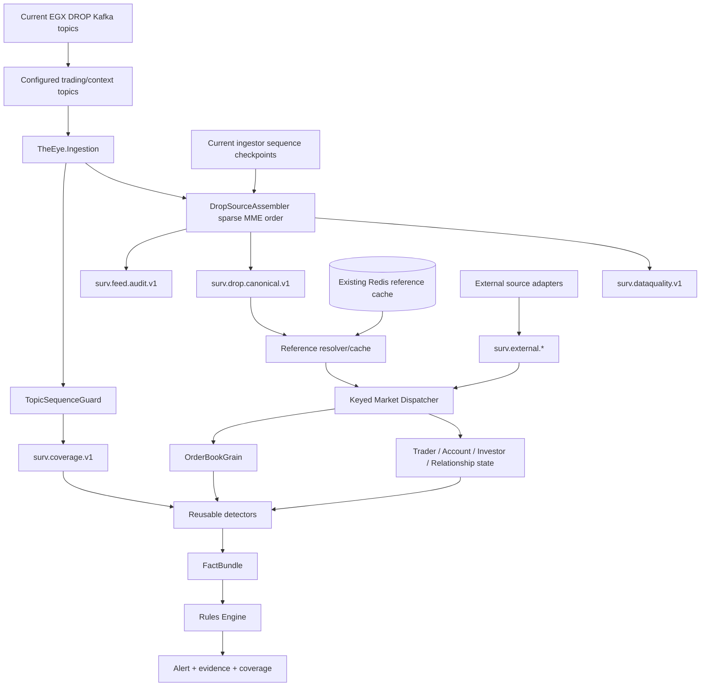

# Implementation Start Home

> [!IMPORTANT]
> This folder is the **active starting point for THE EYE implementation**. The current runtime profile consumes trading/live-market Kafka topics only, uses the existing Redis reference cache for identity/reference lookup, preserves selected events in MME relative order, and uses per-topic sequence headers for fast coverage gaps.

## Current starting graph



## Core decisions

1. **MME sequence is global source evidence/order metadata.** It remains attached to canonical events.
2. **The hot ingestion profile is intentionally filtered.** A jump in MME sequence caused by an excluded reference topic is not a selected-feed gap.
3. **Selected-topic gaps use `topic-sequence-epoch + topic-sequence-number`.** This is the fast coverage mechanism.
4. **`mme-sequence-number` and `topic-sequence-number` are verified 8-byte little-endian `UInt64` Kafka headers.**
5. **Topic sequence identity is `(KafkaTopic, TopicSequenceEpoch, TopicSequenceNumber)`.** Never use the number alone.
6. **Topic subscription and Kafka performance behavior live in `appsettings.json`.** No 37-topic hard-coded worker subscription.
7. **Reference/identity values come from the existing Redis reference cache in the current live profile.** Historical/as-of reference reproducibility remains a separate hardening requirement.
8. **Raw parsed orders/trades remain authoritative surveillance event evidence.** Current enriched topics are secondary views.
9. **The official Order message is a rich lifecycle update.** Preserve native status/changeReason/quantities/ownership.
10. **The official Trade message is one trade side.** Pair by source identity/`matchId` when a matched execution view is needed.
11. **OrderBookGrain owns mutable book state; grains own state; detectors calculate facts; rules own policy.**
12. **At-least-once + deterministic EventId + idempotent application** is the baseline reliability model.
13. **Missing data is explicit degraded/not-evaluable coverage**, never silently treated as clean market behavior.
14. **The full 540-case program may need external domains beyond DROP/Redis.** Those remain explicit external contracts.

## Read in this order

### Source correctness

1. [[01 - Global Sequence and Feed Continuity|Global Sequence and Feed Continuity]]
2. [[15 - MME Sequence Header Encoding Verification|Kafka Sequence Header Encoding Verification]]
3. [[16 - Trading-Only Acquisition and Topic Sequence Guard|Trading-Only Acquisition and Topic Sequence Guard]]
4. [[02 - Canonical Event Contract|Canonical Event Contract]]
5. [[08 - DROP Event Acquisition Matrix|DROP Event Acquisition Matrix]]
6. [[09 - Source Assembly and Ordering Logic|Source Assembly and Ordering Logic]]
7. [[14 - Data Quality and Capability Gaps|Data Quality and Capability Gaps]]

### Complete event model

8. [[07 - Complete Surveillance Event Catalog|Complete Surveillance Event Catalog]]
9. [[10 - Reference State and Enrichment Strategy|Reference State and Enrichment Strategy]]
10. [[11 - External Event Contracts|External Event Contracts]]
11. [[12 - Case Family Event Coverage Matrix|Case Family Event Coverage Matrix]]
12. [[DTO-Reference/00 - DTO and Data Structure Implementation Map|DTO and Data Structure Implementation Map]]

### Processing and first code

13. [[13 - Event Processing Blocks|Event Processing Blocks]]
14. [[03 - Order Book Surveillance Core|Order Book Surveillance Core]]
15. [[06 - First Detector Specifications|First Detector Specifications]]
16. [[04 - First Vertical Slice|First Vertical Slice]]
17. [[05 - Dotnet Solution Starting Structure|.NET Solution Starting Structure]]

## Current acquisition rule

The event catalog can contain all official DROP contracts, but that does **not** mean the current live worker must subscribe to every current Kafka topic.

Current implementation distinction:

```text
Event contract coverage
    -> broad; preserve ability to model official DROP domains

Live ingestion subscription
    -> narrow; trading + live market context only

Reference identity lookup
    -> existing Redis cache
```

The exact selected topic list is documented in [[16 - Trading-Only Acquisition and Topic Sequence Guard|Trading-Only Acquisition and Topic Sequence Guard]] and owned operationally by `appsettings.json`.

## Current Phase-0/validation focus

Validate on a controlled/high-volume run:

```text
required selected records carry mme-sequence-number
required selected records carry topic-sequence-number + topic-sequence-epoch
binary sequence decoding matches producer contract
header message/group/partition match payload
selected topic sequence increments correctly within each epoch
all selected topics satisfy the current one-partition assumption
three ingestor checkpoints remain safe enough as conservative cross-topic release watermarks
Redis reference availability meets detector lookup requirements
consumer lag/CPU/Redis/Kafka latency remain within measured targets
```

## Event coverage principle

```text
DROP selected live events
    -> core exchange surveillance hot path

Redis reference state
    -> current identity/instrument enrichment

External canonical events
    -> client/MNPI/settlement/lending/news/security/cross-venue domains

All together
    -> full surveillance program
```

## External graph links

- [[DTO-Reference/00 - DTO and Data Structure Implementation Map|DTO and Data Structure Implementation Map]]
- [[DROP-Current-System/01 - DROP Protocol Overview|DROP Protocol Overview]]
- [[DROP-Current-System/02 - DROP Message Catalog|37 Official DROP Messages]]
- [[DROP-Current-System/03 - Current DROP Runtime Architecture|Current DROP Runtime Architecture]]
- [[DROP-Current-System/08 - Kafka Topic Catalog|Current Kafka Topic Catalog]]
- [[DROP-Current-System/09 - Redis State and Reference Cache|Current Redis State and Reference Cache]]
- [[DROP-Current-System/12 - Runtime Guarantees and Known Gaps|Current Runtime Guarantees and Gaps]]
- [[MOCs/03 - Reusable Detector Map|Reusable Detector Map]]
- [[MOCs/01 - Surveillance Case Map|540 Surveillance Cases]]
- [[Architecture/Implementation Workspace Guide|Implementation Workspace Guide]]
- [[00 - Project Home|Project Home]]

## Legacy warning

[[Implementation-Architecture/00 - Implementation Architecture Home|Previous Implementation Architecture]] is historical reference only. Reuse ideas only after revalidation against this active baseline and the current DROP interface.
