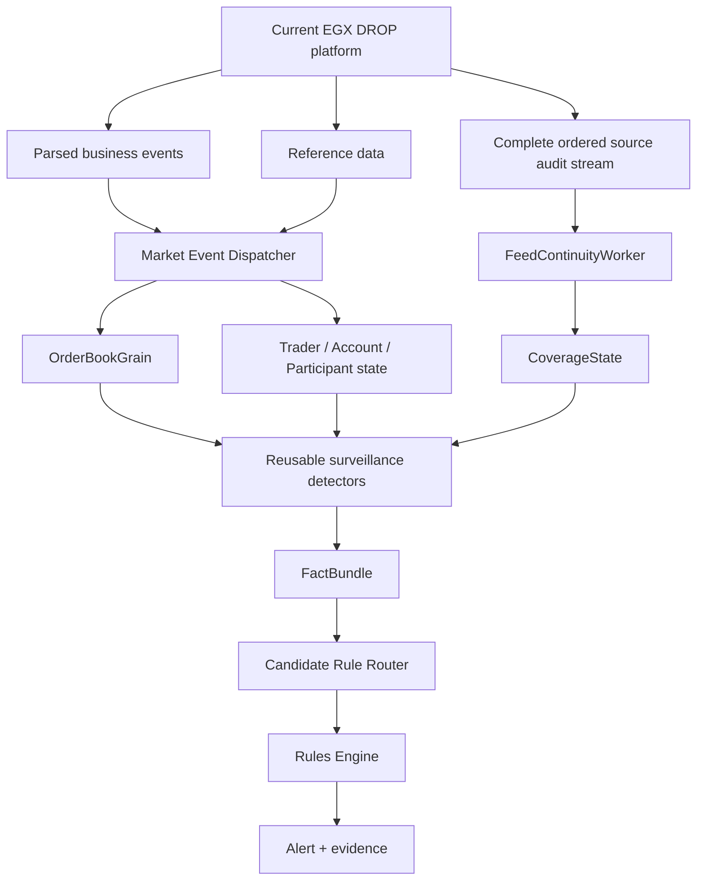

# Implementation Start Home

> [!IMPORTANT]
> This folder is the **active starting point** for THE EYE implementation. It is deliberately smaller than the old implementation trial: preserve source evidence, build correct state ownership, implement reusable detectors, then expand case coverage.

## Starting graph

## Core decisions for the first build

1. **Global sequence is not a Kafka-topic sequence.** The MME sequence spans message types inside the true source sequence domain. See [[01 - Global Sequence and Feed Continuity|Global Sequence and Feed Continuity]].
2. **Do not reconstruct global order by merging Kafka topics.** Use a complete ordered audit/source stream for continuity.
3. **OrderBookGrain owns book state.** It does not own global feed continuity.
4. **Order-book surveillance is detector logic**, not a second state-owning `OrderBookWatcherGrain`.
5. **Grains own mutable state; detectors calculate facts; rules own policy.**
6. **At-least-once + idempotent processing** is the default reliability model.
7. **Every alert carries evidence and coverage state** so investigators know whether the observation window was complete.
8. Build one end-to-end vertical slice before scaling toward all 540 cases.

## Read in this order

1. [[01 - Global Sequence and Feed Continuity|Global Sequence and Feed Continuity]]
2. [[02 - Canonical Event Contract|Canonical Event Contract]]
3. [[03 - Order Book Surveillance Core|Order Book Surveillance Core]]
4. [[06 - First Detector Specifications|First Detector Specifications]]
5. [[04 - First Vertical Slice|First Vertical Slice]]
6. [[05 - Dotnet Solution Starting Structure|.NET Solution Starting Structure]]

## External graph links

- [[DROP-Current-System/06 - Surveillance Data Interface Boundary|Surveillance Data Interface Boundary]]
- [[DROP-Current-System/03 - Current DROP Runtime Architecture|Current DROP Runtime Architecture]]
- [[MOCs/03 - Reusable Detector Map|Reusable Detector Map]]
- [[MOCs/01 - Surveillance Case Map|540 Surveillance Cases]]
- [[Architecture/Surveillance Detection Pipeline|Surveillance Detection Pipeline]]
- [[Architecture/Implementation Workspace Guide|Implementation Workspace Guide]]
- [[00 - Project Home|Project Home]]

## Legacy warning

[[Implementation-Architecture/00 - Implementation Architecture Home|Previous Implementation Architecture]] is historical reference only. Reuse ideas only after they are revalidated against this starting baseline and the current DROP interface.
