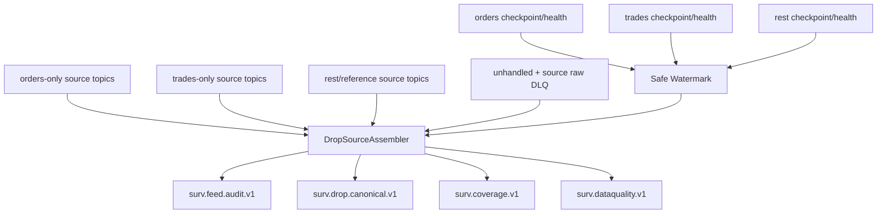

# Global Sequence and Feed Continuity

## Correct sequence model

The MME source sequence is treated operationally as **global across message types inside the real source sequence domain**.

Example:

```text
1000 Order
1001 Participant
1002 Trade
1003 BestBidOffer
1004 Order
1005 SessionChange
1006 Trade
```

Filtered topics naturally see sparse values:

```text
orders topic -> 1000, 1004
trades topic -> 1002, 1006
rest topic   -> 1001, 1003, 1005
```

Therefore `1000 -> 1004` inside the orders topic is **not a feed gap**.

## Important: source sequence is not a normal DROP payload field

The official DROP payload specification prefixes every message with:

```text
messageGroup
messageId
partitionId
```

The current implementation separately transports MME sequencing metadata in Kafka headers. Current persistence documentation reads:

```text
mme-sequence-number
drop-partition-id
drop-message-id
drop-group-id
```

So THE EYE must keep these concepts separate:

```text
MmeSequenceNumber              -> global source ordering evidence
DROP partitionId               -> protocol partition evidence
MarketAnnouncement.sequenceNumber -> announcement-specific sequence field
Kafka offset                   -> transport position inside one Kafka partition
```

Never substitute one for another.

## Current DROP topology matters

Current deployment has three MME.Drop.Ingestor instances:

```text
trades-only
orders-only
rest-messages
```

Each has its own Redis checkpoint:

```text
mme.drop.ingestor:{instance}:next_mme_sequence_number
```

and runtime health record.

The checkpoint is documented as being written only after a completed Kafka publish batch, and replay after checkpoint failure can duplicate already-published source messages.

This means the correct starting reliability model is:

```text
at-least-once source delivery
+ deterministic source identity
+ duplicate classification
+ conservative sequence watermarks
```

## What not to do

Do not:

- expect `SourceSequence + 1` inside any filtered topic;
- expect `SourceSequence + 1` inside `OrderBookGrain`;
- merge Kafka records by arrival time and call that exchange order;
- use Kafka topic, message family, DROP partition, trader or order book as the sequence domain without proving that is the real MME sequence namespace;
- use the MarketAnnouncement payload `sequenceNumber` as the global MME sequence;
- invent missing sequence values from Kafka offsets.

## Starting implementation for the current system

Instead of assuming a new fourth DROP connection, first attempt a **read-only downstream source assembler** over the current Kafka outputs.



The assembler reorders by the MME sequence header, not arrival time.

Detailed algorithm: [[09 - Source Assembly and Ordering Logic|Source Assembly and Ordering Logic]].

## Safe watermark

A later sequence arriving from one topic is not enough to call an earlier sequence missing, because another family can lag.

After validation, the conservative starting model is:

```text
tradesPublishedThrough = tradesNextCheckpoint - 1
ordersPublishedThrough = ordersNextCheckpoint - 1
restPublishedThrough   = restNextCheckpoint - 1

safeWatermark = min(
    tradesPublishedThrough,
    ordersPublishedThrough,
    restPublishedThrough)
```

A sequence can be finalized as missing only when it is absent **and** `sequence <= safeWatermark`.

> [!CAUTION]
> The exact checkpoint-as-watermark behavior must be proved in Phase 0. If one family checkpoint does not advance during quiet periods, this formula may stall conservatively. A stall is preferable to a false feed-gap declaration.

## Feed continuity algorithm

Conceptually:

```text
if nextExpected exists in source buffer
    finalize source record
    nextExpected++
else if nextExpected <= safeWatermark
    emit CoverageGapEvent(nextExpected)
    nextExpected++
else
    wait for lagging source family / watermark
```

Duplicates/replay are handled before this test.

If the same source sequence appears with conflicting identities/payloads, emit a critical data-quality event instead of arbitrarily choosing one.

## Audit stream

`surv.feed.audit.v1` is a compact immutable ledger of finalized source sequence positions.

Recommended fields:

```text
EventId
SequenceDomain
SequenceEpoch
MmeSequenceNumber
MessageGroup
MessageId
DropPartitionId
CanonicalEventType
EventTime
ReceiveTime
BusinessDate?
SourceStatus = Parsed|Unhandled|ParseFailure
OriginalKafkaCoordinates[]
```

One partition per global sequence domain is the simple starting design because the source sequence itself is serial.

## Canonical source stream

`surv.drop.canonical.v1` contains the typed source payload in finalized MME source order.

This becomes the stable input to reference projection and Orleans dispatch.

Parallelism starts downstream by book/subject key; do not reintroduce cross-topic ordering ambiguity before the book state owner.

## Coverage state

Maintain compact state such as:

```text
CoverageState
- SequenceDomain
- SequenceEpoch
- LastFinalizedSequence
- SafeWatermark
- CoverageEpoch
- IsDegraded
- OpenGapRanges
- SourceStalledInstances
- ParseCoverageState
```

A `CoverageStateGrain` is reasonable because it receives only coverage transitions/checkpoints, not every market event.

## CoverageGapEvent

```csharp
public sealed record CoverageGapEvent(
    string SequenceDomain,
    string SequenceEpoch,
    ulong MissingFrom,
    ulong MissingTo,
    DateTimeOffset DetectedAt,
    ulong SafeWatermark);
```

Keep the exact source evidence that justified the gap decision.

## Recovery policy

Starting policy:

- continue live processing after a confirmed gap;
- open a degraded coverage epoch;
- persist exact missing range;
- allow current ingestor replay/reconnect behavior to recover records;
- dedupe replayed records deterministically;
- rebuild/replay affected surveillance state before marking historical coverage complete.

Do not erase the fact that live surveillance was degraded at the time.

## When a DROP/ingestor change is required

The read-only assembler is preferred because it leaves current DROP behavior untouched.

However, add/fix source-side metadata or audit emission if validation proves any of these:

- some authoritative source records do not carry `mme-sequence-number`;
- a consumed source sequence can disappear without a normal/unhandled/raw-DLQ Kafka representation;
- current checkpoints cannot provide safe progress evidence;
- the three current source sessions do not collectively expose the complete sequence;
- sequence epoch/reset semantics cannot be determined safely downstream.

Do **not** assume a fourth DROP session is allowed until the EGX concurrent-session/replay contract is confirmed.

## Fraud detection relationship

```text
Source assembly / continuity
    -> "Did THE EYE observe complete source data?"

OrderBook and behavioral detectors
    -> "Does observed market behavior look suspicious?"
```

They are separate, but every alert/rule evaluation references coverage state.

## Phase-0 proof required

Before detector coding depends on exact ordering, run a controlled high-volume session and prove:

1. all required source records have real MME sequence headers;
2. header group/message/partition agree with payload;
3. union of current source topics + unhandled/source-DLQ can be assembled deterministically;
4. duplicate Start/Commit/replay records can be deduped;
5. sequence reset/epoch rule is understood;
6. current Redis checkpoints are safe enough for watermarking.

## Source basis

- [[DROP-Current-System/01 - DROP Protocol Overview|DROP Protocol Overview]]
- [[DROP-Current-System/03 - Current DROP Runtime Architecture|Current DROP Runtime Architecture]]
- [[DROP-Current-System/08 - Kafka Topic Catalog|Kafka Topic Catalog]]
- [[DROP-Current-System/12 - Runtime Guarantees and Known Gaps|Runtime Guarantees and Known Gaps]]
- [[DROP-Current-System/15 - Source Classification and Reliability|Source Classification and Reliability]]

## Navigation

- [[00 - Implementation Start Home|Implementation Start Home]]
- [[02 - Canonical Event Contract|Canonical Event Contract]]
- [[08 - DROP Event Acquisition Matrix|DROP Event Acquisition Matrix]]
- [[09 - Source Assembly and Ordering Logic|Source Assembly and Ordering Logic]]
- [[14 - Data Quality and Capability Gaps|Data Quality and Capability Gaps]]
