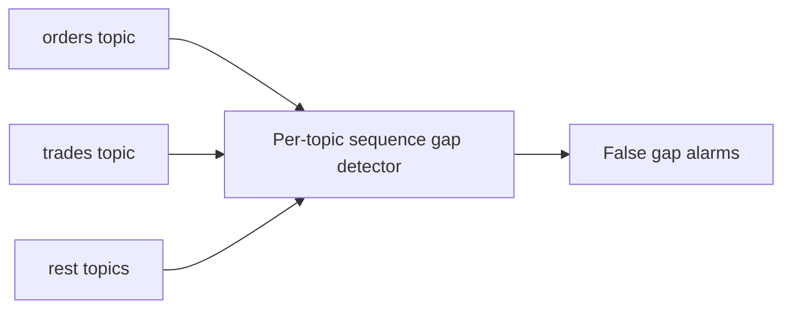
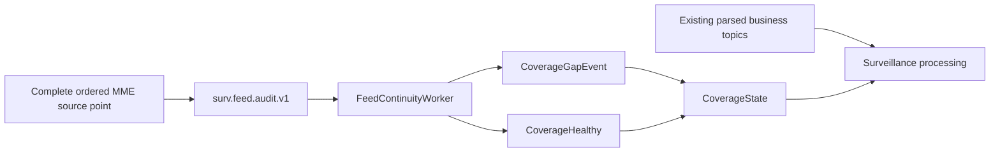

# Global Sequence and Feed Continuity

## Correct sequence model

The MME source sequence is treated as **global across all message types inside the real source sequence domain**.

Example:

```text
1000 Order
1001 Participant
1002 Trade
1003 BestBidOffer
1004 Order
1005 SessionChange
1006 Trade
```

Filtered topics naturally see sparse values:

```text
orders topic -> 1000, 1004
trades topic -> 1002, 1006
rest topic   -> 1001, 1003, 1005
```

Therefore `1000 -> 1004` inside the orders topic is **not a feed gap**.

## What not to do



Do not:

- expect `SourceSequence + 1` inside a filtered Kafka topic;
- expect `SourceSequence + 1` inside `OrderBookGrain`;
- merge arrival order from separate Kafka topics and call that source order;
- use Kafka topic, message family or order book as `SequenceDomain`.

## Preferred surveillance-safe design



### Audit stream

`surv.feed.audit.v1` is a lightweight immutable ledger with **one record for every source message**.

Minimum fields:

```text
EventId
SourceSequence
SequenceDomain
EventType
MessageGroup
MessageId
SourcePartitionId?      // when present in source protocol
EventTime
ReceiveTime
BusinessDate
```

The audit stream should have an ordering layout that preserves each `SequenceDomain` in one Kafka partition.

> [!NOTE]
> If the current platform already exposes a complete ordered source stream, consume that directly instead. The requirement is the complete source order, not the topic name.

## FeedContinuityWorker

Use a small .NET hosted worker, not a hot-path grain that receives every market event.

Responsibilities:

1. consume the complete ordered audit stream;
2. keep `LastSourceSequence` per `SequenceDomain`;
3. compare current sequence to the expected next sequence;
4. classify duplicates/replays separately from forward gaps;
5. emit `CoverageGapEvent` on a real forward jump;
6. publish coverage metrics;
7. remain deterministic under replay.

Starter logic:

```text
if current == last + 1
    healthy
else if current <= last
    duplicate/replay/out-of-order -> dedupe policy
else
    gap = [last + 1 .. current - 1]
```

The comparison above is valid **only on the complete ordered source stream**.

## Coverage state

Do not broadcast every audit event to every grain.

Maintain compact coverage state keyed by the actual source domain, for example conceptually:

```text
CoverageState
- SequenceDomain
- BusinessDate
- LastObservedSequence
- CoverageEpoch
- IsDegraded
- OpenGapFrom
- OpenGapTo
- GapHistory references
```

A `CoverageStateGrain` is reasonable because it receives only coverage changes/checkpoints, not all market traffic.

## CoverageGapEvent

```csharp
public sealed record CoverageGapEvent(
    string SequenceDomain,
    long PreviousSequence,
    long CurrentSequence,
    DateTimeOffset DetectedAt)
{
    public long MissingFrom => PreviousSequence + 1;
    public long MissingTo => CurrentSequence - 1;
}
```

Production contract should also carry business date/source identity and evidence coordinates.

## Relationship to fraud detection

```text
FeedContinuityWorker
    -> answers: "Did we lose source data?"

OrderBook surveillance detectors
    -> answer: "Is market behavior suspicious?"
```

These are separate systems but alerts must reference coverage state.

A missing global source message is initially **unknown**, so surveillance cannot safely assume it belonged to an unrelated book. Alerts overlapping a degraded coverage window must be marked accordingly until recovery/replay proves completeness.

## Recovery starting policy

For the first implementation:

- continue processing after a gap so the surveillance system does not become unavailable;
- mark the affected source-domain coverage epoch as degraded;
- persist the exact missing sequence range;
- request/rely on upstream replay according to the current DROP recovery mechanism;
- when the missing range is later recovered, rebuild/replay affected surveillance state deterministically before declaring the historical window complete.

A future production decision may choose to pause advancement for selected critical domains, but that is not required for the first slice.

## Navigation

- [[00 - Implementation Start Home|Implementation Start Home]]
- [[02 - Canonical Event Contract|Canonical Event Contract]]
- [[03 - Order Book Surveillance Core|Order Book Surveillance Core]]
- [[DROP-Current-System/06 - Surveillance Data Interface Boundary|Surveillance Data Interface Boundary]]
- [[DROP-Current-System/Services/MME Drop Ingestor|MME Drop Ingestor]]
- [[Architecture/Surveillance Detection Pipeline|Surveillance Detection Pipeline]]
