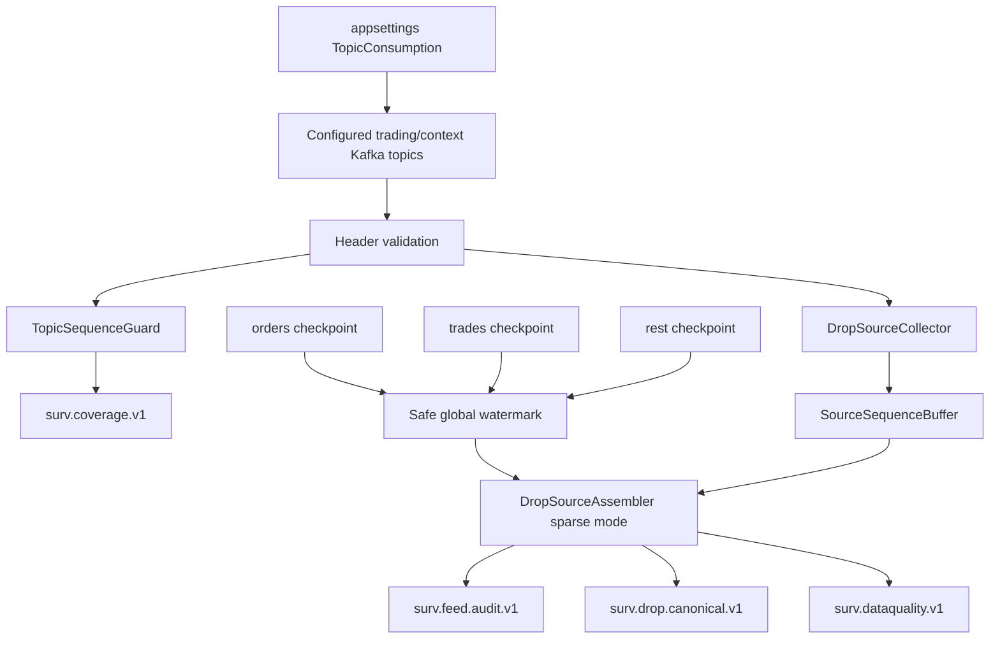

# Global Sequence and Feed Continuity

## Current sequence model

The MME source sequence remains **global across message types inside the real source sequence domain**.

Example:

```text
1000 Order
1001 Participant
1002 Trade
1003 BestBidOffer
1004 Investor
1005 SessionChange
1006 Trade
```

The active THE EYE runtime intentionally consumes trading/live-context topics only. Reference/identity messages such as Participant and Investor are resolved from the existing Redis reference cache.

Therefore the MME values visible to THE EYE are intentionally sparse:

```text
1000 Order
1002 Trade
1003 BestBidOffer
1005 SessionChange
1006 Trade
```

A global jump caused by an excluded topic is **not** a selected-feed gap.

See [[16 - Trading-Only Acquisition and Topic Sequence Guard|Trading-Only Acquisition and Topic Sequence Guard]].

## Two sequence systems, two jobs

### `MmeSequenceNumber`

Current Kafka contract:

```text
header: mme-sequence-number
format: 8-byte binary UInt64
byte order: little-endian
```

Use it for:

- source evidence;
- deterministic source identity;
- preserving relative MME order among selected events;
- replay/audit correlation.

Do **not** require `MmeSequenceNumber + 1` in the trading-only stream.

### `TopicSequenceEpoch + TopicSequenceNumber`

Current Kafka contract:

```text
topic-sequence-number
    8-byte binary UInt64, little-endian

topic-sequence-epoch
    32 lowercase hexadecimal ASCII/UTF-8 characters
```

Use the pair with the Kafka topic:

```text
KafkaTopic + TopicSequenceEpoch + TopicSequenceNumber
```

for continuity checking of the selected Kafka topic.

This is the fast gap detector.

See [[15 - MME Sequence Header Encoding Verification|Kafka Sequence Header Encoding Verification]].

## Current DROP topology

Current deployment has three source ingestors:

```text
trades-only
orders-only
rest-messages
```

Each still exposes Redis progress checkpoints:

```text
mme.drop.ingestor:{instance}:next_mme_sequence_number
```

These checkpoints remain useful as a conservative **global release watermark** for cross-topic ordering. They are no longer the primary mechanism for selected-topic gap detection.

## Active source assembly model



## Selected-topic continuity algorithm

For each `(KafkaTopic, TopicSequenceEpoch)`:

```text
first observed sequence
    -> establish baseline

next == last + 1
    -> healthy continuity

next > last + 1
    -> emit TopicSequenceGapEvent immediately

next <= last
    -> replay/duplicate; do not move frontier backward
```

This check is in memory and runs as soon as the record is consumed.

## Global selected-event ordering

The canonical stream still preserves relative MME order between selected events.

The assembler runs in sparse mode:

```text
SourceAssembly:RequireContiguousMmeSequence = false
```

Conceptually:

```text
selected event at MME 1405 buffered
selected event at MME 1409 buffered
source watermark advances through 1409

1406..1408 are not automatically gaps
because those MME values may belong to intentionally excluded topics

release selected events as 1405, 1409
```

The safe MME watermark therefore answers:

> "Can I safely release this selected event in relative global order?"

The topic sequence answers:

> "Did this selected Kafka topic lose one of its own records?"

Do not mix those two questions.

## What not to do

Do not:

- declare a gap from a jump in `MmeSequenceNumber` inside a filtered/trading-only topic set;
- use Kafka offset as a substitute for MME or topic sequence;
- use `MarketAnnouncement.sequenceNumber` as the MME sequence;
- merge records by arrival timestamp and call that exchange order;
- accept a `topic-sequence-number` without its epoch;
- silently invent values when required headers are missing or malformed.

## Current one-partition assumption

The verified current Kafka baseline is one partition per DROP topic.

The topic-sequence guard validates this on startup when:

```text
TopicConsumption:RequireSinglePartitionForTopicSequence = true
```

If topics become multi-partition, the sequence scope must be defined before the guard is changed.

## Coverage events

Global-source and selected-topic gaps are different event types:

```text
CoverageGapEvent
    -> global MME continuity, only meaningful when the complete source sequence is actually being audited

TopicSequenceGapEvent
    -> missing record in one selected topic/epoch
```

The current trading-only ingestion profile primarily uses `TopicSequenceGapEvent` for live coverage honesty.

## Failure policy

- missing/malformed sequence headers -> data-quality event + degraded coverage;
- forward topic-sequence gap -> publish coverage gap immediately, keep processing;
- duplicate/replay -> deterministic dedupe/idempotency;
- conflicting same MME source identity -> critical data-quality condition;
- Redis watermark unavailable -> keep already-proven topic coverage, but do not weaken cross-topic release ordering silently.

## Restart boundary note

The current in-process topic guard establishes a baseline on the first record observed for each `(topic, epoch)` after process start.

If the platform requires proof of a topic gap that occurs exactly across a THE EYE process restart without replaying an earlier Kafka record, persist/recover the last topic frontier as a separate hardening step. Do not add synchronous Redis writes to every message without measuring the throughput cost.

## Source basis

- [[DROP-Current-System/01 - DROP Protocol Overview|DROP Protocol Overview]]
- [[DROP-Current-System/03 - Current DROP Runtime Architecture|Current DROP Runtime Architecture]]
- [[DROP-Current-System/08 - Kafka Topic Catalog|Kafka Topic Catalog]]
- [[DROP-Current-System/09 - Redis State and Reference Cache|Redis State and Reference Cache]]
- [[DROP-Current-System/12 - Runtime Guarantees and Known Gaps|Runtime Guarantees and Known Gaps]]

## Navigation

- [[00 - Implementation Start Home|Implementation Start Home]]
- [[08 - DROP Event Acquisition Matrix|DROP Event Acquisition Matrix]]
- [[09 - Source Assembly and Ordering Logic|Source Assembly and Ordering Logic]]
- [[15 - MME Sequence Header Encoding Verification|Kafka Sequence Header Encoding Verification]]
- [[16 - Trading-Only Acquisition and Topic Sequence Guard|Trading-Only Acquisition and Topic Sequence Guard]]
