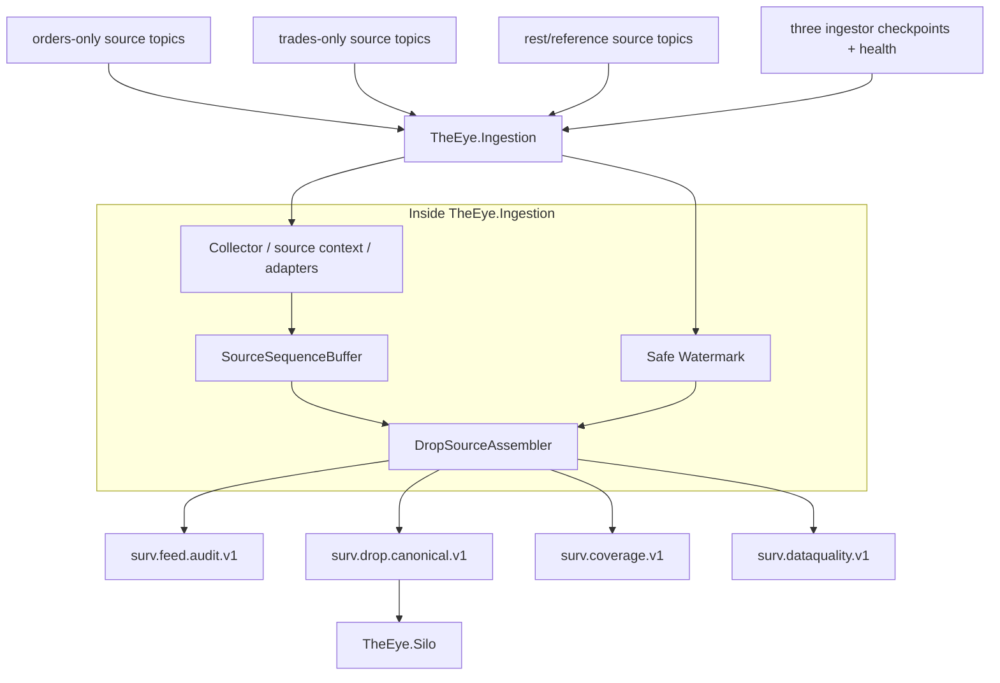

# Global Sequence and Feed Continuity

> [!IMPORTANT]
> Feed continuity is owned by `TheEye.Ingestion` through the in-process `TheEye.SourceAssembly` library. The Silo receives only the already ordered canonical stream.

See [[15 - Current Runtime Architecture and Fix Plan|Current Runtime Architecture and Fix Plan]].

## Correct sequence model

The MME source sequence is treated operationally as **global across message types inside the real source sequence domain**.

Example:

```text
1000 Order
1001 Participant
1002 Trade
1003 BestBidOffer
1004 Order
1005 SessionChange
1006 Trade
```

Filtered topics naturally see sparse values:

```text
orders topic -> 1000, 1004
trades topic -> 1002, 1006
rest topic   -> 1001, 1003, 1005
```

Therefore `1000 -> 1004` inside the orders topic is **not a feed gap**.

## Source sequence is not a normal DROP payload field

The official DROP payload prefixes messages with:

```text
messageGroup
messageId
partitionId
```

The existing MME application separately transports source sequence/identity metadata in Kafka headers:

```text
mme-sequence-number
drop-partition-id
drop-message-id
drop-group-id
```

Keep these concepts separate:

```text
MmeSequenceNumber                  -> source ordering evidence
DROP partitionId                   -> protocol partition identity
MarketAnnouncement.sequenceNumber  -> announcement-specific field
Kafka offset                       -> transport position in one Kafka partition
```

Never substitute one for another.

## Kafka header encoding - current live finding

The Nasdaq DROP specification defines the binary **payload** layout. It does not define how the existing MME application serializes Kafka headers.

The first live `TheEye.Ingestion` record disproved the original assumption that every Kafka header had the fixed byte width implied by the DROP payload types.

Therefore Phase 0 must confirm the real encoding for all four source headers from live evidence and, preferably, the producer source code. Unknown encodings are quarantined; values are never invented.

## Current topology

The existing platform has three MME.Drop.Ingestor instances:

```text
trades-only
orders-only
rest-messages
```

Each has a Redis checkpoint:

```text
mme.drop.ingestor:{instance}:next_mme_sequence_number
```

and a runtime health record.

The correct reliability direction is:

```text
at-least-once source delivery
+ deterministic source identity
+ replay duplicate classification
+ conservative safe watermarks
+ delayed safe source-offset commit
```

## Current THE EYE runtime



`mme.drop.parsed.unhandled` and the raw-message DLQ are planned source-quality inputs but are not wired in the current build yet.

## What not to do

Do not:

- expect `SourceSequence + 1` inside any filtered topic;
- expect `SourceSequence + 1` inside `OrderBookGrain`;
- merge Kafka records by arrival time and call that exchange order;
- derive `SequenceDomain` from Kafka topic/message family/order book/actor without proof;
- use `MarketAnnouncement.sequenceNumber` as global MME sequence;
- invent missing source sequence values from Kafka offsets;
- let the Silo consume raw topics and repeat source-gap logic;
- commit source offsets just because records are buffered only in RAM.

## Safe watermark

Candidate model after validation:

```text
tradesPublishedThrough = tradesNextCheckpoint - 1
ordersPublishedThrough = ordersNextCheckpoint - 1
restPublishedThrough   = restNextCheckpoint - 1

safeWatermark = min(active published-through values)
```

A sequence can be finalized as missing only when it is absent **and** `sequence <= safeWatermark`.

Idle/never-published family behavior remains a live validation item. The first build excludes a never-published family from the active watermark set; that behavior must be proven before production reliance.

If Redis/watermark proof is unavailable:

```text
known contiguous records -> may release
first unresolved hole     -> stop and wait
unproven gap              -> never declare
```

## Feed continuity algorithm

```text
if nextExpected exists in source buffer
    release it in order
    publish canonical/audit outcome
    nextExpected++
else if nextExpected <= proven safeWatermark
    publish CoverageGapEvent(nextExpected)
    nextExpected++
else
    wait
```

Replay duplicates are normalized before this decision.

If the same source sequence contains distinct identities, produce a durable `SourceSequenceConflictEvent` rather than arbitrarily choosing one. The current log-only behavior is a P1 gap.

## P0 source-offset durability

A source Kafka record is **not processed safely** when its only accepted copy is still inside the volatile sequence buffer.

Wrong:

```text
consume -> buffer in RAM -> commit source offset -> publish later
```

Target:

```text
consume
-> validate/buffer
-> release/publish durable terminal outcome
-> mark source record safe
-> commit highest contiguous safe Kafka offset per topic-partition
```

If a crash occurs before the safe offset is committed, Kafka can replay the source record. Duplicate replay is acceptable because deterministic `EventId` makes downstream state application idempotent.

Never commit a later offset past an earlier unresolved record in the same source Kafka partition.

## Audit stream

`surv.feed.audit.v1` is a forensic copy/ledger of finalized source evidence.

Recommended fields:

```text
EventId
SequenceDomain
SequenceEpoch
MmeSequenceNumber
MessageGroup
MessageId
DropPartitionId
CanonicalEventType
EventTime
ReceiveTime
SourceStatus
OriginalKafkaCoordinates[]
```

## Canonical source stream

`surv.drop.canonical.v1` contains typed source events in finalized MME source order.

Initial production contract:

```text
one Kafka partition per SequenceDomain
```

The Silo consumes the ordered lane sequentially, then parallelizes downstream by book/subject key.

## Coverage state

Maintain compact state such as:

```text
CoverageState
- SequenceDomain
- SequenceEpoch
- LastFinalizedSequence
- SafeWatermark
- CoverageEpoch
- IsDegraded
- OpenGapRanges
- SourceStalledInstances
- ParseCoverageState
```

Coverage state may later be projected to a `CoverageStateGrain`, but source-gap decisions remain Ingestor-owned.

## Topic availability

The first live run found **22 of 37 documented source topics present**.

Every registry entry must be classified:

```text
Required
Optional
NotProvisioned
```

Missing Required => degraded source coverage.

Missing Optional/NotProvisioned => visible warning, not automatic false permanent degradation.

## Recovery policy

Starting policy:

- retain exact gap/stall evidence;
- allow source replay/reconnect to recover records;
- dedupe replayed records deterministically;
- rebuild/replay downstream Silo state when required;
- never erase the fact that live surveillance was degraded at the time.

## Phase-0/P0 proof required

Before production Silo logic depends on exact ordering, prove:

1. real encoding for all four Kafka source headers;
2. all required source records expose valid source identity;
3. header group/message/partition agree with payload;
4. `SequenceDomain` scope is correct across the three source families;
5. sequence reset / `SequenceEpoch` semantics are known;
6. safe watermark does not produce false gaps during idle-family behavior;
7. source offsets cannot outrun durable canonical/data-quality outcomes;
8. crash/restart produces no silent canonical event loss;
9. canonical sequence is monotonic per domain;
10. required/optional/not-provisioned topic inventory is reconciled.

## Navigation

- [[15 - Current Runtime Architecture and Fix Plan|Current Runtime Architecture and Fix Plan]]
- [[00 - Implementation Start Home|Implementation Start Home]]
- [[02 - Canonical Event Contract|Canonical Event Contract]]
- [[08 - DROP Event Acquisition Matrix|DROP Event Acquisition Matrix]]
- [[09 - Source Assembly and Ordering Logic|Source Assembly and Ordering Logic]]
- [[14 - Data Quality and Capability Gaps|Data Quality and Capability Gaps]]
