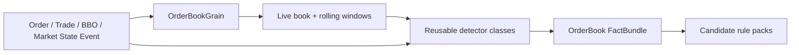

# Order Book Surveillance Core

## Purpose

The order-book surveillance core continuously reconstructs market state and calculates reusable facts that help detect manipulation such as spoofing, layering, quote stuffing, fake liquidity and book-pressure abuse.

It is **not** the global sequence-gap detector.

## State ownership

Use one `OrderBookGrain` per:

```text
venueId|instrumentId
```

The grain owns mutable state that must be ordered together for that market book.



## What OrderBookGrain owns

Starting state:

```text
ActiveOrdersById
BidLevels
AskLevels
BestBid / BestAsk
RecentExecutions
RecentAdds / Modifies / Cancels
Per-trader short windows
Per-account short windows when identity is available
Rolling depth snapshots / imbalance summaries
LastAppliedSourceSequence   // evidence/order aid only, not contiguous expectation
LastEventTime
CoverageEpoch reference
```

Do not write the full book to a database after every order. Kafka/source history is the immutable evidence; grain state is the live working model.

## Important sequence rule

For one book the received source sequence can look like:

```text
1000 Order book A
1004 Order book A
1012 Trade book A
```

This is normal because source messages for other books/types occurred between them.

`OrderBookGrain` may use `SourceSequence` to reject a duplicate already applied event or preserve evidence ordering, but it must **not** treat `1000 -> 1004` as a global gap.

Global continuity belongs to [[01 - Global Sequence and Feed Continuity|Global Sequence and Feed Continuity]].

## "Order book watcher" implementation

Do not create a second state-owning `OrderBookWatcherGrain` for the first build.

Use normal .NET detector services/classes that read the current event + grain-owned state and calculate facts.

```text
OrderBookGrain
  ├─ CancellationRatioDetector
  ├─ OrderLifetimeDetector
  ├─ DisplayedSizeAnomalyDetector
  ├─ MultiLevelDepthPressureDetector
  ├─ OppositeSideExecutionDetector
  ├─ PriceImpactDetector
  └─ OrderMessageBurstRateDetector
```

This keeps one owner of mutable book state and prevents duplicated/corrupt state between a book grain and a watcher grain.

## Detector responsibility

Detectors answer questions such as:

```text
How large is this order compared with normal visible size?
How close is it to the touch?
How much did it change book imbalance?
How long did it remain active?
Was it cancelled without meaningful execution?
Did the same trader repeat the behavior?
Did the price move after the pressure appeared?
Did the trader execute on the opposite side?
Was there a burst of order messages across several levels?
```

Detectors output **facts**, not final legal conclusions.

Example:

```text
OrderBookPressureFact
- VenueId
- InstrumentId
- TraderId
- Side
- WindowStart
- WindowEnd
- AddedVisibleQuantity
- CancelledQuantity
- ExecutedQuantity
- CancellationRatio
- MaxDepthShare
- LevelsUsed
- BookImbalanceBefore
- BookImbalanceAfter
- PriceMoveTicks
- OppositeSideExecutedQuantity
- SourceSequenceMin
- SourceSequenceMax
- CoverageEpoch
```

Rules can combine these facts differently for spoofing, layering, phantom liquidity, order-book imbalance manipulation and other cases.

## State update order

For each event keep processing deterministic:

```text
1. validate/dedupe envelope
2. capture pre-event book snapshot/facts needed by detectors
3. apply event to authoritative OrderBookGrain state
4. capture post-event state
5. run relevant detectors
6. emit FactBundle
7. route only to relevant rule packs
8. update short rolling windows
```

Some detectors need both pre- and post-event state, so do not hide the pre-event values before detection.

## Book consistency checks

Separate structural consistency from fraud detection.

Examples:

- modify/cancel references unknown order;
- impossible remaining-quantity transition;
- duplicate lifecycle transition;
- trade references unknown order where the protocol should provide one;
- reconstructed depth contradicts an authoritative market-state message.

Emit a `BookConsistencyIssue`/quality signal. Do not automatically call it fraud.

## Concurrency

Starting rule:

- keep `OrderBookGrain` non-reentrant on the hot market-event path;
- one grain activation serializes state changes for its book;
- detector code called by the grain should be fast, deterministic and non-blocking;
- no synchronous DB/network calls inside the grain event path;
- expensive cross-entity analysis happens after reusable facts are produced.

## Persistence

Persist/checkpoint only what is required for recovery speed and deterministic replay.

For the first slice:

- source/Kafka history remains truth;
- grain state can be rebuilt from replay;
- optional periodic snapshots can come later after measured recovery requirements justify them.

## Navigation

- [[00 - Implementation Start Home|Implementation Start Home]]
- [[01 - Global Sequence and Feed Continuity|Global Sequence and Feed Continuity]]
- [[02 - Canonical Event Contract|Canonical Event Contract]]
- [[06 - First Detector Specifications|First Detector Specifications]]
- [[04 - First Vertical Slice|First Vertical Slice]]
- [[MOCs/03 - Reusable Detector Map|Reusable Detector Map]]
