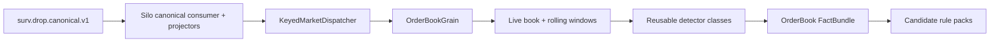

# Order Book Surveillance Core

> [!IMPORTANT]
> This core runs **after** the canonical Kafka boundary inside the Silo-side surveillance runtime. `OrderBookGrain` does not consume raw `mme.drop.*` topics and does not participate in global source-gap assembly.

See [[15 - Current Runtime Architecture and Fix Plan|Current Runtime Architecture and Fix Plan]].

## Purpose

The order-book surveillance core reconstructs market state and calculates reusable facts for spoofing, layering, quote stuffing, phantom liquidity and book-pressure abuse.

It is **not** the source sequence-gap detector. Source ordering/coverage belongs to `TheEye.Ingestion`.

## Input path

```text
raw DROP topics
→ TheEye.Ingestion / SourceAssembly
→ surv.drop.canonical.v1
→ TheEye.Silo canonical consumer
→ Silo reference/market/trade projectors
→ KeyedMarketDispatcher
→ OrderBookGrain
```

## State ownership

Use one `OrderBookGrain` per:

```text
venueId|orderBookId
```

The grain owns mutable state that must be ordered together for that market book.



## What OrderBookGrain owns

Starting state:

```text
ActiveOrdersById
BidLevels
AskLevels
BestBid / BestAsk
RecentExecutions
RecentAdds / Modifies / Cancels
Per-trader short windows
Per-account short windows when identity is available
Rolling depth snapshots / imbalance summaries
LastAppliedSourceSequence   // evidence/order aid only, not contiguous expectation
LastEventTime
CoverageEpoch reference
```

Do not write the full book to a database after every order. Canonical/source history is immutable evidence; grain state is the live working model.

## Important sequence rule

For one book the received source sequence can look like:

```text
1000 Order book A
1004 Order book A
1012 Trade book A
```

This is normal because source events for other books/types occurred between them.

`OrderBookGrain` may use `SourceSequence`/`EventId` for idempotency/evidence, but it must **not** treat `1000 -> 1004` as a global gap.

Global continuity belongs to [[01 - Global Sequence and Feed Continuity|Global Sequence and Feed Continuity]].

## Reference / Investor context

The grain receives already projected/resolved context from the Silo path where needed.

```text
Order/Trade account
→ ReferenceStateProjector
→ Account as-of source sequence
→ InvestorId / Investor context
→ dispatcher/grain/detector facts
```

The grain does not query mutable Redis to resolve Investor identity.

## "Order book watcher" implementation

Do not create a second state-owning `OrderBookWatcherGrain` for the first build.

Use normal .NET detector services/classes that receive current event + explicit grain/projector state:

```text
OrderBookGrain
  ├─ CancellationRatioDetector
  ├─ OrderLifetimeDetector
  ├─ DisplayedSizeAnomalyDetector
  ├─ MultiLevelDepthPressureDetector
  ├─ OppositeSideExecutionDetector
  ├─ PriceImpactDetector
  └─ OrderMessageBurstRateDetector
```

This keeps one owner of mutable book state.

## Detector responsibility

Detectors answer questions such as:

```text
How large is this order compared with normal visible size?
How close is it to the touch?
How much did it change book imbalance?
How long did it remain active?
Was it cancelled without meaningful execution?
Did the same trader repeat the behavior?
Did the price move after the pressure appeared?
Did the trader execute on the opposite side?
Was there a burst of order messages across several levels?
```

Detectors output facts, not legal conclusions.

Example fact:

```text
OrderBookPressureFact
- VenueId
- InstrumentId
- TraderId
- Side
- WindowStart
- WindowEnd
- AddedVisibleQuantity
- CancelledQuantity
- ExecutedQuantity
- CancellationRatio
- MaxDepthShare
- LevelsUsed
- BookImbalanceBefore
- BookImbalanceAfter
- PriceMoveTicks
- OppositeSideExecutedQuantity
- SourceSequenceMin
- SourceSequenceMax
- CoverageEpoch
```

## State update order

Keep processing deterministic:

```text
1. reject duplicate EventId / validate downstream envelope
2. capture pre-event state needed by detectors
3. apply event to authoritative OrderBookGrain state
4. capture post-event state
5. run relevant detectors
6. emit FactBundle
7. route relevant rule packs
8. update rolling windows
```

## Book consistency checks

Keep structural quality separate from fraud detection.

Examples:

- modify/cancel references unknown order;
- impossible remaining-quantity transition;
- duplicate lifecycle transition;
- trade references unknown order where protocol relationships should make it known;
- reconstructed depth contradicts an authoritative market-state event.

Emit a `BookConsistencyIssue`/quality fact. Do not automatically call it fraud.

## Concurrency

Starting rule:

- keep `OrderBookGrain` non-reentrant on the hot market-event path;
- one grain activation serializes changes for one book;
- detector code must be fast/deterministic/non-blocking;
- no synchronous DB/network calls inside the grain event path;
- cross-entity analysis happens outside or through explicit state/message ownership.

## Persistence / replay

For the first slice:

- canonical/source Kafka history remains source truth;
- grain state is rebuildable by deterministic replay;
- duplicate transport does not duplicate state because `EventId` application is idempotent;
- optional snapshots come later only if measured recovery targets justify them.

## Navigation

- [[15 - Current Runtime Architecture and Fix Plan|Current Runtime Architecture and Fix Plan]]
- [[00 - Implementation Start Home|Implementation Start Home]]
- [[01 - Global Sequence and Feed Continuity|Global Sequence and Feed Continuity]]
- [[02 - Canonical Event Contract|Canonical Event Contract]]
- [[06 - First Detector Specifications|First Detector Specifications]]
- [[04 - First Vertical Slice|First Vertical Slice]]
- [[MOCs/03 - Reusable Detector Map|Reusable Detector Map]]
