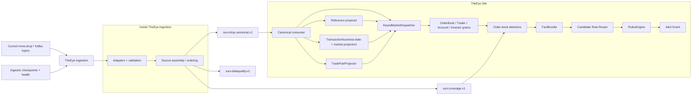

# First Vertical Slice

## Goal

Build one complete path from **current DROP evidence -> trustworthy canonical Kafka -> Silo projections/Orleans state -> reusable detector facts -> reproducible alert** before expanding toward all 540 cases.

The Ingestor/source contracts/adapters are already substantially built. The immediate first-slice work is therefore: **finish the P0 ingestion reliability corrections, then start the Silo.**

See [[15 - Current Runtime Architecture and Fix Plan|Current Runtime Architecture and Fix Plan]].

## First cases

Start with order-book manipulation because current DROP provides strong source coverage:

- [[Cases/CASE-001|Spoofing]]
- [[Cases/CASE-002|Layering]]
- [[Cases/CASE-123|Spoof-and-Trade]]
- [[Cases/CASE-124|Layer-and-Trade]]
- [[Cases/CASE-024|Quote Stuffing]]
- [[Cases/CASE-028|Phantom Liquidity]]
- [[Cases/CASE-030|Order-Book Imbalance Manipulation]]

## End-to-end slice



## Phase 0A - finish the Ingestor reliability gate

Before detector/Silo production logic depends on canonical order, prove/fix:

```text
real Kafka header encodings are confirmed
SequenceDomain is confirmed across the three families
SequenceEpoch/reset semantics are known
source offset commit cannot outrun durable released output
canonical topic preserves monotonic MME order per domain
safe watermark does not create false gaps
22/37 live topic inventory is classified Required/Optional/NotProvisioned
source conflicts become durable data-quality events
source-quality topics are wired when available
```

Detailed plan: [[15 - Current Runtime Architecture and Fix Plan|Current Runtime Architecture and Fix Plan]].

## Phase 0B - crash/replay acceptance

Required tests:

- crash after raw consume;
- crash after buffer insert;
- crash after canonical publish but before source commit;
- restart and prove no canonical event is missing;
- duplicate/replay input produces one downstream state effect by `EventId`;
- delayed family does not create a false gap;
- Redis outage stalls at an unresolved hole rather than skipping it;
- source-partition commits advance only across contiguous durable records;
- canonical sequence is monotonic per `SequenceDomain`.

## Phase 1 - canonical source boundary

Deliver/prove:

- `DropEventEnvelope<T>`;
- all documented DROP payload adapters;
- deterministic `EventId`;
- `SequenceDomain` + verified `SequenceEpoch`;
- ordered `surv.drop.canonical.v1`;
- forensic `surv.feed.audit.v1`;
- `surv.coverage.v1` and `surv.dataquality.v1`;
- exact source + Kafka evidence coordinates.

**Do not put reference enrichment, transaction projection, business-date projection or trade pairing into the Ingestor canonicalization stage.** Those are rebuilt after the Kafka boundary.

## Phase 2 - Silo canonical consumer + reference state

Deliver:

```text
CanonicalEnvelopeDeserializer
CanonicalMarketConsumer
ReferenceStateProjector
```

Reference coverage:

```text
Participant
Actor
Asset
OrderBook
Account
AccountType
AccountGroup
Investor
Custodian
CorporateAction
```

Build the critical identity path:

```text
Order/Trade account
      ↓
Account reference as-of source sequence
      ↓
InvestorId
      ↓
Investor reference/state
```

The Ingestor transports Investor/Account source events; the Silo resolves them.

See [[10 - Reference State and Enrichment Strategy|Reference State and Enrichment Strategy]].

## Phase 3 - Silo context/projectors

Deliver:

```text
TransactionContextProjector
BusinessDateProjector
MarketStateProjector
TradePairProjector
```

`TradeSideEvent` pairing to `MatchedTradeEvent` happens here, not in SourceAssembly.

## Phase 4 - reconstruct one live order book

Deliver:

- `KeyedMarketDispatcher` in/with the Silo;
- `OrderBookGrain` keyed by `venueId|orderBookId`;
- full native Order lifecycle application;
- best bid/ask and depth levels;
- matched-trade application where required;
- BBO cross-checks;
- market/session context;
- deterministic replay producing the same final book.

Important: a book sees a sparse subset of the global MME sequence; never require `last + 1` inside the grain.

## Phase 5 - subject state

Build the minimum subject state needed by first rules:

```text
TraderGrain
AccountGrain
InvestorGrain / Investor state
```

This is where investor-level behavior can aggregate across accounts after as-of Account → Investor resolution.

## Phase 6 - first reusable detectors

Implement:

1. [[Detectors/DETECTOR-02|Order Lifetime]]
2. [[Detectors/DETECTOR-01|Cancellation Ratio]]
3. [[Detectors/DETECTOR-03|Displayed-Size Anomaly]]
4. [[Detectors/DETECTOR-04|Multi-Level Depth Pressure]]
5. [[Detectors/DETECTOR-05|Opposite-Side Execution]]
6. [[Detectors/DETECTOR-09|Price Impact]]
7. [[Detectors/DETECTOR-21|Order-Message Burst Rate]]

Detectors consume explicit grain/projector state and output immutable facts. They do not fetch Kafka/Redis/DB data directly.

## Phase 7 - candidate routing + rules

Do not execute all 540 rules for every event.

```text
Order lifecycle
  -> spoof/layer
  -> book pressure
  -> cancellation/lifetime
  -> message burst

MatchedTrade / trade facts
  -> opposite-side execution
  -> price impact
  -> wash/self/matched candidates

Auction/market state
  -> auction manipulation packs
```

Rules consume immutable facts, not grain internals.

## Phase 8 - alert evidence

Minimum alert evidence:

```text
AlertId
CaseId
RuleVersion
DetectorVersion
ThresholdProfileVersion
SubjectIds
VenueId / OrderBookId / InstrumentId
WindowStart / WindowEnd
Score / Severity
Source EventIds
MME sequence range/list
Original Kafka topic/partition/offset evidence
CoverageEpoch / CoverageDegraded
DataDomain availability
Evidence summary
ReplayRunId?
```

## Definition of done

- source offset durability is crash-tested;
- canonical source ordering is proven;
- no false gaps from sparse per-topic sequences;
- one order book reconstructs deterministically;
- Account → Investor resolution works as-of source sequence;
- trade pairing is deterministic;
- first detector facts are explainable;
- spoof/layer candidates are reproducible;
- replay duplicates do not double-apply state;
- no DB/network call blocks the `OrderBookGrain` hot path.

## Expansion after first slice

```text
wash/self/matched trading
price/volume/tape manipulation
auction/open/close manipulation
position/concentration patterns
related-account/investor patterns
then external-domain-dependent cases
```

See [[12 - Case Family Event Coverage Matrix|Case Family Event Coverage Matrix]].

## Navigation

- [[15 - Current Runtime Architecture and Fix Plan|Current Runtime Architecture and Fix Plan]]
- [[00 - Implementation Start Home|Implementation Start Home]]
- [[09 - Source Assembly and Ordering Logic|Source Assembly and Ordering Logic]]
- [[10 - Reference State and Enrichment Strategy|Reference State and Enrichment Strategy]]
- [[03 - Order Book Surveillance Core|Order Book Surveillance Core]]
- [[05 - Dotnet Solution Starting Structure|.NET Solution Starting Structure]]
