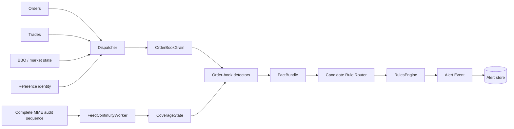

# First Vertical Slice

## Goal

Build one complete, testable path from DROP evidence to surveillance alert before expanding to hundreds of cases.

## First cases

Start with closely related order-book manipulation scenarios:

- [[Cases/CASE-001|Spoofing]]
- [[Cases/CASE-002|Layering]]
- [[Cases/CASE-123|Spoof-and-Trade]]
- [[Cases/CASE-124|Layer-and-Trade]]
- [[Cases/CASE-024|Quote Stuffing]]
- [[Cases/CASE-028|Phantom Liquidity]]
- [[Cases/CASE-030|Order-Book Imbalance Manipulation]]

They reuse the same state and detector family, so they give high architectural value without building unrelated domains too early.

## End-to-end slice



## Phase 1 - prove source correctness

Deliver:

- canonical envelope;
- deterministic `EventId`;
- `SequenceDomain` handling;
- complete sequence/audit consumer;
- real gap detection;
- duplicate/replay handling;
- exact Kafka coordinates in evidence.

Acceptance examples:

```text
audit: 1000,1001,1002,1003 -> no gap
audit: 1000,1001,1004      -> gap 1002..1003
orders: 1000,1004           -> NOT a global gap
```

## Phase 2 - reconstruct one live order book

Deliver:

- `OrderBookGrain` keyed by `venueId|instrumentId`;
- new/modify/cancel lifecycle;
- trade application where source data supports association;
- best bid/ask and depth levels;
- book consistency checks;
- deterministic replay test producing the same final book.

## Phase 3 - first reusable detector facts

Implement:

1. [[Detectors/DETECTOR-02|Order Lifetime]]
2. [[Detectors/DETECTOR-01|Cancellation Ratio]]
3. [[Detectors/DETECTOR-03|Displayed-Size Anomaly]]
4. [[Detectors/DETECTOR-04|Multi-Level Depth Pressure]]
5. [[Detectors/DETECTOR-05|Opposite-Side Execution]]
6. [[Detectors/DETECTOR-09|Price Impact]]
7. [[Detectors/DETECTOR-21|Order-Message Burst Rate]]

Detailed starting specs: [[06 - First Detector Specifications|First Detector Specifications]].

## Phase 4 - candidate routing + rules

Do not run all 540 cases for each event.

Starter routing:

```text
Order New/Modify/Cancel
  -> spoof/layer
  -> book pressure
  -> cancellation/lifetime
  -> message burst

Trade
  -> opposite-side execution
  -> price impact
  -> spoof-and-trade/layer-and-trade
```

Rules should consume immutable typed facts, not reach into grain internals.

## Phase 5 - alert evidence

Minimum alert evidence:

```text
AlertId
CaseId
RuleVersion
DetectorVersion
SubjectIds
VenueId / InstrumentId
WindowStart / WindowEnd
Score / Severity
Source event ids
SourceSequenceMin / SourceSequenceMax
Kafka topic/partition/offset evidence
CoverageEpoch / CoverageDegraded
Evidence summary
ReplayRunId?
```

## Phase 6 - replay tests

For every seeded case, maintain:

- positive deterministic scenario;
- negative/normal scenario;
- boundary scenario;
- duplicate-input scenario;
- source-gap/degraded-coverage scenario;
- out-of-order/replay scenario where applicable.

The same input replay must produce the same facts and alert result for the same rule/detector versions.

## Definition of done for the first slice

- real global gaps detected only from complete source sequence;
- one instrument order book reconstructs correctly;
- first detector facts are explainable;
- spoofing/layering candidate alerts are reproducible;
- alerts show exact evidence and coverage state;
- duplicate Kafka delivery does not double-apply state;
- replay produces the same result;
- no DB/network call blocks the `OrderBookGrain` hot path.

## Navigation

- [[00 - Implementation Start Home|Implementation Start Home]]
- [[03 - Order Book Surveillance Core|Order Book Surveillance Core]]
- [[05 - Dotnet Solution Starting Structure|.NET Solution Starting Structure]]
- [[06 - First Detector Specifications|First Detector Specifications]]
- [[MOCs/01 - Surveillance Case Map|Surveillance Case Map]]
