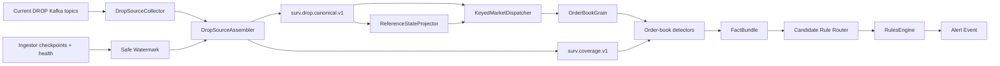

# First Vertical Slice

## Goal

Build one complete path from **current DROP evidence -> globally ordered canonical events -> Orleans state -> reusable detector facts -> reproducible alert** before expanding toward all 540 cases.

## First cases

Start with order-book manipulation because current DROP provides the strongest required event coverage:

- [[Cases/CASE-001|Spoofing]]
- [[Cases/CASE-002|Layering]]
- [[Cases/CASE-123|Spoof-and-Trade]]
- [[Cases/CASE-124|Layer-and-Trade]]
- [[Cases/CASE-024|Quote Stuffing]]
- [[Cases/CASE-028|Phantom Liquidity]]
- [[Cases/CASE-030|Order-Book Imbalance Manipulation]]

## End-to-end slice



## Phase 0 - prove source assembly

Before detector coding depends on exact source ordering, prove:

```text
mme-sequence-number exists on all required source records
Kafka DROP headers agree with payload
orders/trades/rest/reference + source-quality topics can be assembled deterministically
replay duplicates are deduped
sequence epoch/reset behavior is known
safe watermark does not create false gaps
```

Detailed design: [[09 - Source Assembly and Ordering Logic|Source Assembly and Ordering Logic]].

## Phase 1 - canonical source model

Deliver:

- `DropEventEnvelope<T>`;
- all 37 official DROP payload adapters;
- deterministic `EventId`;
- `SequenceDomain` + `SequenceEpoch`;
- transaction/business-date context;
- globally ordered `surv.feed.audit.v1` and `surv.drop.canonical.v1`;
- source-quality and coverage topics;
- exact source + Kafka evidence coordinates.

Event definitions: [[07 - Complete Surveillance Event Catalog|Complete Surveillance Event Catalog]].

## Phase 2 - reference state

Deliver versioned/as-of projection for:

```text
Participant
Actor
Asset
OrderBook
Account
AccountType
AccountGroup
Investor
Custodian
CorporateAction
```

Use source sequence for historical resolution. Do not rely on today's Redis value during replay.

See [[10 - Reference State and Enrichment Strategy|Reference State and Enrichment Strategy]].

## Phase 3 - reconstruct one live order book

Deliver:

- `OrderBookGrain` keyed by `venueId|orderBookId`;
- full native Order lifecycle application;
- best bid/ask and depth levels;
- trade application where protocol relationships permit;
- BBO cross-checks;
- market/session context;
- book consistency issues;
- deterministic replay producing the same final book.

Important: book sequence values are sparse globally; never require `last + 1` inside the grain.

## Phase 4 - first reusable detectors

Implement:

1. [[Detectors/DETECTOR-02|Order Lifetime]]
2. [[Detectors/DETECTOR-01|Cancellation Ratio]]
3. [[Detectors/DETECTOR-03|Displayed-Size Anomaly]]
4. [[Detectors/DETECTOR-04|Multi-Level Depth Pressure]]
5. [[Detectors/DETECTOR-05|Opposite-Side Execution]]
6. [[Detectors/DETECTOR-09|Price Impact]]
7. [[Detectors/DETECTOR-21|Order-Message Burst Rate]]

Detailed starting specs: [[06 - First Detector Specifications|First Detector Specifications]].

## Phase 5 - candidate routing + rules

Do not execute all 540 rules for every event.

```text
Order lifecycle
  -> spoof/layer
  -> book pressure
  -> cancellation/lifetime
  -> message burst

Trade / MatchedTrade
  -> opposite-side execution
  -> price impact
  -> wash/matched candidates later

Auction/market state
  -> auction manipulation packs later
```

Rules consume immutable facts, not grain internals.

## Phase 6 - alert evidence

Minimum alert evidence:

```text
AlertId
CaseId
RuleVersion
DetectorVersion
ThresholdProfileVersion
SubjectIds
VenueId / OrderBookId / InstrumentId
WindowStart / WindowEnd
Score / Severity
Source EventIds
MME sequence range/list
Original Kafka topic/partition/offset evidence
CoverageEpoch / CoverageDegraded
DataDomain availability
Evidence summary
ReplayRunId?
```

## Phase 7 - replay tests

For each seeded case maintain:

- positive scenario;
- normal/negative scenario;
- boundary scenario;
- duplicate source delivery scenario;
- delayed family source scenario;
- confirmed source-gap scenario;
- reference update/replay scenario.

Same canonical input + same versions must produce the same facts and alert result.

## Definition of done

- exact source assembly is proven against the current three-ingestor topology;
- no false gaps are produced from sparse per-topic sequences;
- all first-slice source events retain forensic identity;
- one order book reconstructs deterministically;
- first detector facts are explainable;
- spoof/layer candidates are reproducible;
- alerts expose coverage state;
- replay duplicates do not double-apply state;
- no DB/network call blocks the `OrderBookGrain` hot path.

## Expansion after the first slice

Next expand by event-domain strength:

```text
wash/self/matched trading
price/volume/tape manipulation
auction/open/close manipulation
position/concentration patterns
related-account patterns
then external-domain-dependent cases
```

See [[12 - Case Family Event Coverage Matrix|Case Family Event Coverage Matrix]].

## Navigation

- [[00 - Implementation Start Home|Implementation Start Home]]
- [[07 - Complete Surveillance Event Catalog|Complete Surveillance Event Catalog]]
- [[09 - Source Assembly and Ordering Logic|Source Assembly and Ordering Logic]]
- [[03 - Order Book Surveillance Core|Order Book Surveillance Core]]
- [[05 - Dotnet Solution Starting Structure|.NET Solution Starting Structure]]
- [[12 - Case Family Event Coverage Matrix|Case Family Event Coverage Matrix]]
