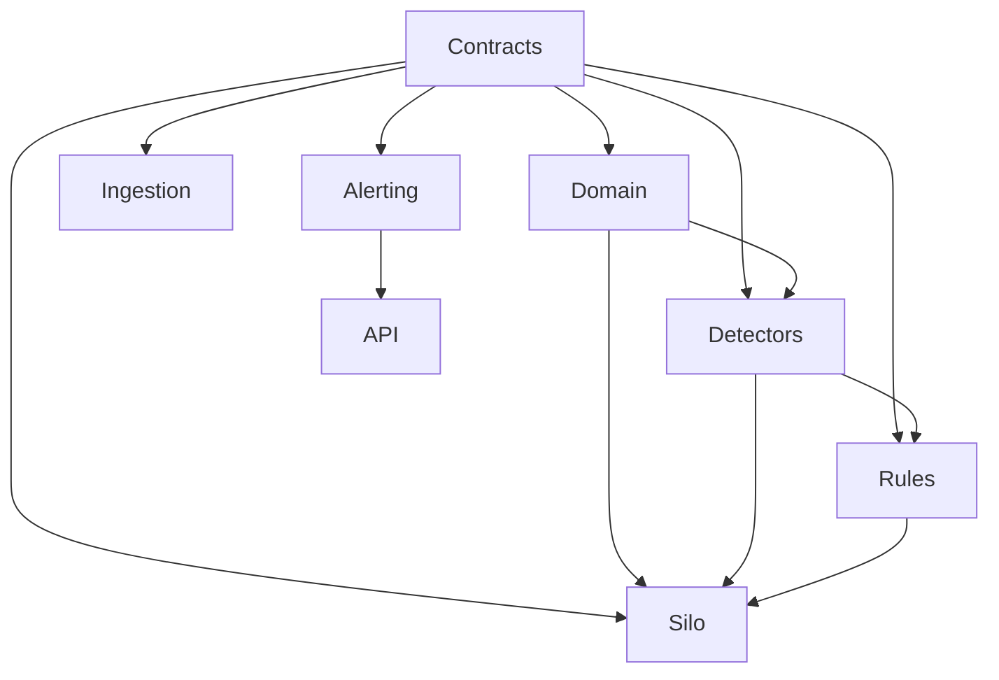

# Dotnet Solution Starting Structure

## Goal

Start with a clean .NET 10 solution where contracts, state ownership, detector calculations and rule policy cannot easily become mixed together.

## Recommended solution

```text
TheEye.Surveillance.sln

src/
  TheEye.Contracts/
  TheEye.Domain/
  TheEye.Ingestion/
  TheEye.Silo/
  TheEye.Detectors/
  TheEye.Rules/
  TheEye.Alerting/
  TheEye.Api/

 tests/
  TheEye.UnitTests/
  TheEye.IntegrationTests/
  TheEye.ReplayTests/

 deploy/
  compose/
  config/
  rules/
```

## Project responsibilities

### `TheEye.Contracts`

Only stable transport/contracts:

- `MarketEventEnvelope<T>`
- `OrderEvent`
- `ExecutionEvent`
- `MarketStateEvent`
- `CoverageGapEvent`
- fact contracts
- alert contracts

No Kafka client, Orleans grain implementation or database logic.

### `TheEye.Domain`

Pure domain types and calculations shared without infrastructure coupling:

- order side/type/value objects;
- book level models;
- event identity helpers;
- time-window primitives;
- deterministic math helpers.

### `TheEye.Ingestion`

Hosted workers/adapters:

```text
FeedContinuityWorker
OrderConsumerWorker
TradeConsumerWorker
MarketStateConsumerWorker
ReferenceConsumerWorker
MarketEventDispatcher
```

Responsibilities:

- consume current Kafka inputs;
- create/validate canonical envelopes;
- preserve Kafka evidence coordinates;
- dedupe where appropriate;
- dispatch business events to the correct Orleans state owner;
- never infer global sequence from filtered topics.

### `TheEye.Silo`

Orleans state owners:

First slice:

```text
OrderBookGrain
CoverageStateGrain
TraderGrain          // add when first rules need trader-level windows
AccountGrain         // add when account-level aggregation becomes necessary
AlertCorrelationGrain
RuleEvaluationWorkerGrain [StatelessWorker] // optional after routing path is proven
```

Do not create a grain for every event or every detector.

### `TheEye.Detectors`

Normal deterministic .NET classes:

```text
CancellationRatioDetector
OrderLifetimeDetector
DisplayedSizeAnomalyDetector
MultiLevelDepthPressureDetector
OppositeSideExecutionDetector
PriceImpactDetector
OrderMessageBurstRateDetector
BookConsistencyDetector
```

Detector inputs are current event + explicit state snapshot/context. Detector outputs are immutable facts.

### `TheEye.Rules`

- candidate rule router;
- Microsoft RulesEngine adapter;
- versioned workflows/rule packs;
- threshold profiles;
- allow-listed typed fact model.

Keep rule definitions outside compiled detector code.

### `TheEye.Alerting`

- alert correlation;
- evidence builder;
- Kafka alert producer;
- persistence writer separated from hot state processing.

### `TheEye.Api`

Later-facing query/admin surface:

- alerts;
- rule versions;
- detector calibration profiles;
- coverage/gap status;
- replay runs.

Do not make the API part of the market-event hot path.

## Project dependency direction



Keep infrastructure references pointing inward toward contracts/domain, never let the domain depend on Kafka/Orleans/database packages.

## Runtime containers for the first slice

```text
Kafka / existing DROP Kafka
PostgreSQL              // alert/rule/config persistence when required
TheEye.Ingestion
TheEye.Silo-1
TheEye.Silo-2            // add early for clustering/failover tests
TheEye.AlertWriter
TheEye.Api               // optional until alerts exist
Observability stack
```

Use existing DROP topics read-only. The surveillance branch must not change existing consumer groups or persistence behavior.

If `surv.feed.audit.v1` must be added, produce it at the complete ordered source point without changing the semantics of current orders/trades/reference topics.

## Configuration starting points

Externalize:

```text
Kafka brokers
consumer group names
source topic names
SequenceDomain mapping
Orleans cluster/service ids
rule directory / rule version
threshold profile
window sizes
alert topic
coverage topic
```

Never hard-code instrument-specific thresholds in grain classes.

## First coding order

```text
1. Contracts
2. FeedContinuityWorker + tests
3. OrderBookGrain + lifecycle tests
4. Detector interfaces + first detectors
5. FactBundle + candidate router
6. Spoof/layer starter rule pack
7. Alert evidence builder
8. Integration/replay tests
9. HA/performance measurement
```

## Navigation

- [[00 - Implementation Start Home|Implementation Start Home]]
- [[02 - Canonical Event Contract|Canonical Event Contract]]
- [[03 - Order Book Surveillance Core|Order Book Surveillance Core]]
- [[04 - First Vertical Slice|First Vertical Slice]]
- [[06 - First Detector Specifications|First Detector Specifications]]
