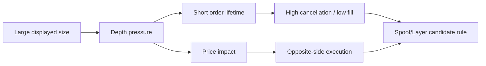

# First Detector Specifications

## Purpose

Seed the first reusable order-book detectors with enough detail to start coding without pretending the final thresholds are already calibrated.

> [!IMPORTANT]
> Threshold numbers are not frozen here. Implement the measurements first, then calibrate by instrument liquidity, session phase, participant type and volatility regime using EGX history.

## Shared detector input

All first-slice detectors should receive a deterministic context rather than reaching into infrastructure directly.

```text
DetectorContext
- CurrentEvent
- PreEventBookSnapshot
- PostEventBookSnapshot
- TraderWindow
- AccountWindow?             // when available
- InstrumentProfile
- MarketPhase
- CoverageState
- EventTime
- SourceSequence
```

Common output metadata:

```text
DetectorId
DetectorVersion
VenueId
InstrumentId
SubjectIds
WindowStart
WindowEnd
SourceSequenceMin
SourceSequenceMax
CoverageEpoch
CoverageDegraded
```

---

## [[Detectors/DETECTOR-02|DETECTOR-02 Order Lifetime]]

### Inputs

- order id;
- trader/account identity;
- instrument/book;
- new/modify/cancel/execute timestamps;
- order quantity and executed quantity;
- distance from best bid/ask when entered/modified.

### State/window

`OrderBookGrain` stores per-active-order:

```text
CreatedAt
LastModifiedAt
LastPrice
OriginalQuantity
RemainingQuantity
ExecutedQuantity
TraderId
AccountId
```

Keep recently completed order lifecycles in a short rolling window for aggregation.

### Output fact

```text
OrderLifetimeFact
- OrderId
- LifetimeMs
- WasCancelled
- FillRatio
- EntryDistanceFromTouchTicks
- MaxDisplayedQuantity
```

### Calibration

Compare lifetime percentiles by instrument liquidity, market phase, order type and distance from touch. Very short lifetime is only suspicious when combined with other facts.

---

## [[Detectors/DETECTOR-01|DETECTOR-01 Cancellation Ratio]]

### Inputs

- order add/modify/cancel events;
- executed quantity;
- trader/account identity;
- side and instrument;
- market phase.

### State/window

Maintain rolling counters per trader + instrument and optionally account + instrument:

```text
1s / 5s / 30s / 1m
AddedQuantity
CancelledQuantity
ExecutedQuantity
AddedOrderCount
CancelledOrderCount
```

### Output fact

```text
CancellationRatioFact
- AddedQuantity
- CancelledQuantity
- ExecutedQuantity
- CancelledQtyRatio
- CancelledOrderRatio
- Window
```

### Calibration

Use peer/liquidity percentiles. Market makers and high-message strategies require separate profiles from normal agency flow.

---

## [[Detectors/DETECTOR-03|DETECTOR-03 Displayed-Size Anomaly]]

### Inputs

- displayed order quantity;
- visible depth at same/nearby price levels before the event;
- normal order-size distribution for instrument/session;
- trader historical size distribution when enough history exists.

### State/window

Keep lightweight rolling statistics, not all historical orders:

```text
median / percentile order size
visible depth near touch
trader recent size distribution summary
```

### Output fact

```text
DisplayedSizeAnomalyFact
- DisplayedQuantity
- QuantityVsInstrumentMedian
- QuantityPercentile
- ShareOfVisibleDepth
- DistanceFromTouchTicks
```

### Calibration

Prefer percentile/rank features over a hard global quantity threshold.

---

## [[Detectors/DETECTOR-04|DETECTOR-04 Multi-Level Depth Pressure]]

### Inputs

- pre/post bid/ask depth;
- new/modify/cancel events;
- trader identity;
- price levels used;
- best bid/ask;
- market phase.

### State/window

`OrderBookGrain` already owns live levels. Add short summaries per trader/side:

```text
quantity added by level
quantity removed by level
number of levels touched
max share of side depth
book imbalance before/after
```

### Output fact

```text
MultiLevelDepthPressureFact
- Side
- LevelsUsed
- AddedVisibleQuantity
- RemovedVisibleQuantity
- MaxDepthShare
- BookImbalanceBefore
- BookImbalanceAfter
- DistanceRangeFromTouchTicks
```

### Calibration

Separate continuous trading from auctions. Calibrate depth-share and level-count thresholds by instrument liquidity.

---

## [[Detectors/DETECTOR-05|DETECTOR-05 Opposite-Side Execution]]

### Inputs

- trader/account identity on orders;
- executions;
- side;
- timestamps;
- suspicious pressure window produced by other detectors.

### State/window

Keep recent executions by trader/account + instrument around the pressure window.

### Output fact

```text
OppositeSideExecutionFact
- PressureSide
- ExecutedSide
- ExecutedQuantity
- ExecutedValue
- TimeFromPressureStartMs
- TimeFromPressureRemovalMs
```

### Calibration

Do not treat every opposite-side execution as manipulation. This fact becomes powerful when combined with large artificial pressure, low fill ratio and rapid cancellation.

---

## [[Detectors/DETECTOR-09|DETECTOR-09 Price Impact]]

### Inputs

- best bid/ask or reference mid before event/window;
- trade prices;
- best bid/ask after event/window;
- instrument tick size;
- event/pressure window.

### State/window

Maintain small price snapshots around important behavior boundaries:

```text
price before pressure
max/min price during window
price at cancellation/removal
price after window
```

### Output fact

```text
PriceImpactFact
- ReferencePriceBefore
- MaxMoveTicks
- SignedMoveTicks
- MoveBps
- ReversionTicks
- ObservationWindowMs
```

### Calibration

Normalize using tick size, spread, volatility and liquidity. A three-tick move can be very different across instruments.

---

## [[Detectors/DETECTOR-21|DETECTOR-21 Order-Message Burst Rate]]

### Inputs

- order new/modify/cancel events;
- trader/account identity;
- instrument;
- event time;
- price level.

### State/window

Rolling counters:

```text
100ms / 1s / 5s
new count
modify count
cancel count
distinct levels
distinct orders
```

Use bounded ring buffers/counters rather than unbounded event lists.

### Output fact

```text
OrderMessageBurstFact
- NewCount
- ModifyCount
- CancelCount
- TotalMessageRate
- DistinctOrders
- DistinctLevels
- WindowMs
```

### Calibration

Calibrate by participant role, instrument liquidity, session phase and normal peak message-rate distribution.

---

## First combined fact bundle

The first spoof/layer workflow can consume:

```text
SpoofLayerFactBundle
- OrderLifetimeFact
- CancellationRatioFact
- DisplayedSizeAnomalyFact
- MultiLevelDepthPressureFact
- OppositeSideExecutionFact?
- PriceImpactFact?
- OrderMessageBurstFact?
- CoverageState
```

Not every field must exist for every candidate. Candidate routing should identify which rule variants can be evaluated from currently available facts.

## Example suspicion chain



## Implementation rule

Detectors should be:

- deterministic;
- side-effect free where possible;
- fast enough for the grain hot path;
- unit-testable without Kafka/Orleans;
- versioned so historical alerts are reproducible.

## Navigation

- [[00 - Implementation Start Home|Implementation Start Home]]
- [[03 - Order Book Surveillance Core|Order Book Surveillance Core]]
- [[04 - First Vertical Slice|First Vertical Slice]]
- [[MOCs/03 - Reusable Detector Map|Reusable Detector Map]]
- [[Architecture/Implementation Workspace Guide|Implementation Workspace Guide]]
