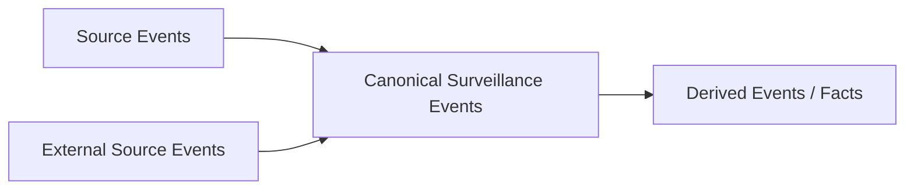

# Complete Surveillance Event Catalog

## Purpose

This is the **complete starting event model** for THE EYE.

The event model has three layers:



1. **Source events** preserve the official/current source message exactly.
2. **Canonical events** add stable identity, ordering evidence, business date, transaction context and resolved join keys without erasing the source payload.
3. **Derived events/facts** are deterministic calculations such as matched trade pairs, order-book pressure and position changes.

> [!IMPORTANT]
> Do not force every surveillance scenario into `OrderEvent`, `ExecutionEvent` and `MarketStateEvent`. That is not sufficient for all 540 cases. The full case set also needs identity, positions, auctions, reference prices, corporate events and several external data domains.

## DROP-native source events - all 37 official messages

Every official DROP message is a first-class source event and must remain replayable.

### Transaction boundaries

| Canonical event | Official source | Meaning |
|---|---|---|
| `TransactionStartedEvent` | [[DROP-Current-System/Protocol Messages/18 - StartOfTransaction|StartOfTransaction [18]]] | Opens a matching transaction/round and supplies `transactionId`. |
| `TransactionCommittedEvent` | [[DROP-Current-System/Protocol Messages/19 - Commit|Commit [19]]] | Closes the matching transaction and supplies transaction timing. |

### Reference and identity

| Canonical event | Official source | Meaning |
|---|---|---|
| `ReferenceDataCompletedEvent` | [[DROP-Current-System/Protocol Messages/06 - EndOfReferenceData|EndOfReferenceData [6]]] | Marks completion of the initial reference-data publication. |
| `ParticipantReferenceEvent` | [[DROP-Current-System/Protocol Messages/04 - Participant|Participant [4]]] | Trading member / participant reference state. |
| `ActorReferenceEvent` | [[DROP-Current-System/Protocol Messages/05 - Actor|Actor [5]]] | Trading user/actor and participant relationship. |
| `AssetReferenceEvent` | [[DROP-Current-System/Protocol Messages/03 - Asset|Asset [3]]] | Security/product identity, ISIN and product classification. |
| `OrderBookReferenceEvent` | [[DROP-Current-System/Protocol Messages/02 - OrderBook|OrderBook [2]]] | Tradable book definition, asset linkage, tick/quantity conventions and instrument attributes. |
| `CorporateActionEvent` | [[DROP-Current-System/Protocol Messages/25 - CorporateAction|CorporateAction [25]]] | Corporate-action state tied to an order book. |

### Account and ownership reference

| Canonical event | Official source | Meaning |
|---|---|---|
| `AccountReferenceEvent` | [[DROP-Current-System/Protocol Messages/33 - Account|Account [33]]] | Trading account linked to participant, type and investor. |
| `AccountTypeReferenceEvent` | [[DROP-Current-System/Protocol Messages/36 - AccountType|AccountType [36]]] | Account-type classification including legal/omnibus attributes. |
| `AccountGroupReferenceEvent` | [[DROP-Current-System/Protocol Messages/37 - AccountGroup|AccountGroup [37]]] | Group of related/allowed account IDs. |
| `InvestorReferenceEvent` | [[DROP-Current-System/Protocol Messages/34 - Investor|Investor [34]]] | Investor identity/status. |
| `CustodianReferenceEvent` | [[DROP-Current-System/Protocol Messages/35 - Custodian|Custodian [35]]] | Custodian identity and omnibus context. |

### Orders, trades and quoting

| Canonical event | Official source | Meaning |
|---|---|---|
| `OrderLifecycleEvent` | [[DROP-Current-System/Protocol Messages/01 - Order|Order [1]]] | Native order/quote/bait lifecycle update. Preserve `orderStatus`, `orderStatusBefore`, `changeReason`, quantities, ownership and order-type fields. |
| `RejectedOrderEvent` | [[DROP-Current-System/Protocol Messages/14 - RejectedOrder|RejectedOrder [14]]] | Rejected insert/update/cancel/MassQuote request with error context. |
| `OffExchangeTradeEvent` | [[DROP-Current-System/Protocol Messages/23 - OffExchangeTrade|OffExchangeTrade [23]]] | Reported/manually matched off-exchange trade-side/report lifecycle. |
| `TradeSideEvent` | [[DROP-Current-System/Protocol Messages/20 - Trade|Trade [20]]] | **One side** of an automatically or manually matched trade. Pair by `matchId` only in a derived stage. |
| `TradeStatisticsEvent` | [[DROP-Current-System/Protocol Messages/26 - TradeStatistics|TradeStatistics [26]]] | OHLC/last/VWAP/quantity/value/trade-count statistics for one order book. |
| `CircuitBreakerEvent` | [[DROP-Current-System/Protocol Messages/08 - CircuitBreakerInformation|CircuitBreakerInformation [8]]] | Circuit-breaker trigger and related order/condition context. |
| `QuoteRequestEvent` | [[DROP-Current-System/Protocol Messages/12 - QuoteRequest|QuoteRequest [12]]] | RFQ received by the system. |
| `QuoteRequestResponseEvent` | [[DROP-Current-System/Protocol Messages/21 - QuoteRequestResponse|QuoteRequestResponse [21]]] | Response to RFQ. |
| `IndicativeQuoteEvent` | [[DROP-Current-System/Protocol Messages/30 - IndicativeQuote|IndicativeQuote [30]]] | Indicative quote lifecycle. |
| `IndicativeQuoteOfferEvent` | [[DROP-Current-System/Protocol Messages/31 - IndicativeQuoteOffer|IndicativeQuoteOffer [31]]] | Offer against an indicative quote. |

### Price and market-state events

| Canonical event | Official source | Meaning |
|---|---|---|
| `BestBidOfferEvent` | [[DROP-Current-System/Protocol Messages/22 - BestBidOffer|BestBidOffer [22]]] | Best bid/offer price and quantity change. |
| `EquilibriumPriceEvent` | [[DROP-Current-System/Protocol Messages/11 - EquilibriumPrice|EquilibriumPrice [11]]] | Auction/equilibrium price, quantities and imbalance. |
| `IndexPriceEvent` | [[DROP-Current-System/Protocol Messages/09 - IndexPrice|IndexPrice [9]]] | Index-price recalculation. |
| `PriceLimitsEvent` | [[DROP-Current-System/Protocol Messages/07 - PriceLimits|PriceLimits [7]]] | Static/dynamic price/circuit-breaker limits. |
| `ReferencePriceEvent` | [[DROP-Current-System/Protocol Messages/10 - ReferencePrice|ReferencePrice [10]]] | Reference-price change and source. |
| `ExchangeRateEvent` | [[DROP-Current-System/Protocol Messages/27 - ExchangeRate|ExchangeRate [27]]] | Currency-pair exchange-rate change. |
| `AwayMarketBestBidOfferEvent` | [[DROP-Current-System/Protocol Messages/28 - AwayMarketBestBidOffer|AwayMarketBestBidOffer [28]]] | Top-of-book from an away/other market. |
| `DelayedLastMatchPriceEvent` | [[DROP-Current-System/Protocol Messages/32 - DelayedLastMatchPrice|DelayedLastMatchPrice [32]]] | Delayed last-match price with actual execution time. |

### Session, business-date and position events

| Canonical event | Official source | Meaning |
|---|---|---|
| `SessionChangeEvent` | [[DROP-Current-System/Protocol Messages/15 - SessionChange|SessionChange [15]]] | Order-book session/matching-phase change. |
| `MarketAnnouncementEvent` | [[DROP-Current-System/Protocol Messages/16 - MarketAnnouncement|MarketAnnouncement [16]]] | Market announcement and classification. Its payload `sequenceNumber` is **not** the global MME transport sequence. |
| `BusinessDateChangedEvent` | [[DROP-Current-System/Protocol Messages/24 - BusinessDateChange|BusinessDateChange [24]]] | Market business-date transition. |
| `InitialBusinessDateEvent` | [[DROP-Current-System/Protocol Messages/17 - InitialBusinessDate|InitialBusinessDate [17]]] | Initial business-date state. |
| `RepoOrderbookStatusEvent` | [[DROP-Current-System/Protocol Messages/29 - RepoOrderbookStatus|RepoOrderbookStatus [29]]] | Repo-order-book creation/status response. |
| `AccountPositionEvent` | [[DROP-Current-System/Protocol Messages/38 - AccountPositionUpdate|AccountPositionUpdate [38]]] | Available long/loan quantity state for asset/participant/account/investor. Do not silently reinterpret this as a complete settlement ledger. |

## Current implementation-only source event

`mme.drop.parsed.systemevents` currently exists with DTO `SystemEvent`, but `SystemEvent` is not one of the 37 messages in protocol revision 3.0.11.

Represent it as:

```text
ImplementationSystemEvent
SourceAuthority = CurrentImplementationOnly
```

Keep it isolated until the source/version discrepancy is reconciled. See [[DROP-Current-System/02 - DROP Message Catalog|DROP Message Catalog]].

## Derived surveillance events from DROP

These are calculated by THE EYE. They are **not additional exchange messages**.

| Derived event | Built from | Purpose |
|---|---|---|
| `MatchedTradeEvent` | Two `TradeSideEvent`s sharing `matchId` with compatible sides/context | Complete buy/sell execution view. |
| `ResolvedOrderEvent` | `OrderLifecycleEvent` + as-of reference state | Adds participant/actor/account/investor/instrument context without changing raw evidence. |
| `ResolvedTradeEvent` | `TradeSideEvent`/`MatchedTradeEvent` + as-of reference state | Identity/instrument enrichment under surveillance control. |
| `OrderBookStateChangedEvent` | Order lifecycle + trades + BBO | Deterministic book-state transition for detectors. |
| `AuctionStateEvent` | SessionChange + EquilibriumPrice + orders/trades/BBO | Auction phase, imbalance and indicative-price context. |
| `PositionStateChangedEvent` | AccountPositionUpdate + optional execution-derived deltas | Position/availability state. |
| `CoverageGapEvent` | Global source assembly/continuity logic | Missing source sequence range. |
| `SourceMetadataMismatchEvent` | Kafka headers vs DROP payload | Header/payload identity disagreement. |
| `UnknownDropMessageEvent` | `mme.drop.parsed.unhandled` | Source message received but not mapped to a supported DTO. |
| `SourceParseFailureEvent` | `mme.drop.raw.messages.dlq` when sequence evidence is available | Raw source message failed parsing. |
| `BookConsistencyIssue` | Book-state validation | Structural/data-quality problem; never automatically fraud. |
| `FactBundle` | Reusable detectors | Immutable measurements consumed by rules. |
| `SurveillanceAlertEvent` | Rules + evidence builder | Reproducible surveillance alert. |

## External source events required for full 540-case coverage

DROP is a strong market-feed core, but the 540-case catalog contains scenarios that need data that DROP does not prove it carries.

| Event contract | Required data domain | Typical cases/families |
|---|---|---|
| `ClientOrderInstructionEvent` | Broker OMS/client instruction history | Front-running, trading ahead, client/proprietary conflicts. |
| `RoutingDecisionEvent` | OMS/EMS/smart-order-router | Routing bias, internalization, venue conflict. |
| `BorrowLocateEvent` | Short-sale locate/borrow system | Locate abuse, naked/unsupported short patterns. |
| `SecuritiesLoanEvent` | Securities lending | Loan rate/fee/availability manipulation. |
| `SettlementObligationEvent` | CSD/settlement system | Fails, settlement manipulation, delivery pressure. |
| `BeneficialOwnershipRelationshipEvent` | KYC/CRM/ownership master | Nominee/related-account/group coordination. |
| `InsiderAccessEvent` | HR/compliance/restricted-list/MNPI controls | Insider dealing/MNPI misuse. |
| `MaterialIssuerEvent` | Issuer/regulatory disclosure source | Earnings/M&A/tender/material-event timing. |
| `OfferingAllocationEvent` | IPO/book-building/allocation system | IPO/new-issue/allocation/stabilization abuse. |
| `MarketMakerObligationEvent` | Exchange/member role configuration | Quote obligation/exemption abuse. |
| `ExternalVenueMarketEvent` | Other venue order/trade/BBO feeds | Cross-venue/cross-market manipulation. |
| `InstrumentRelationshipEvent` | Instrument master/index/ETF/derivative relationships | Cross-product, ETF/index/derivative manipulation. |
| `BenchmarkDefinitionEvent` | Benchmark/NAV/fixing definitions | VWAP/TWAP/NAV/settlement benchmark manipulation. |
| `TradeReportSubmissionEvent` | Trade-report submission/publication audit | Late/inaccurate/misleading reporting. |
| `NewsPromotionEvent` | News/social/promotion source | Pump-and-dump, rumor/promotion-linked abuse. |
| `AccountSecurityEvent` | IAM/device/session/security telemetry | Account takeover/hacked-account manipulation. |
| `PositionLimitEvent` | Regulatory/product limit master | Position-limit/corner/squeeze cases. |
| `TenderOfferEvent` | Corporate-action/tender master | Tender/restricted-period/record-date cases. |

Definitions and acquisition rules are in [[11 - External Event Contracts|External Event Contracts]].

## Sufficiency rule

The complete event catalog is sufficient as an **architecture contract** for the 540-case program only when each required source is actually connected.

```text
Event contract exists != data source exists
```

The case-coverage matrix records which families are DROP-native, partially supported or externally dependent: [[12 - Case Family Event Coverage Matrix|Case Family Event Coverage Matrix]].

## Source basis

- [[DROP-Current-System/01 - DROP Protocol Overview|DROP Protocol Overview]]
- [[DROP-Current-System/02 - DROP Message Catalog|DROP Message Catalog]]
- [[DROP-Current-System/05 - Business Data Dictionary and Join Keys|Business Data Dictionary and Join Keys]]
- [[DROP-Current-System/08 - Kafka Topic Catalog|Kafka Topic Catalog]]
- [[DROP-Current-System/15 - Source Classification and Reliability|Source Classification and Reliability]]
- [[MOCs/01 - Surveillance Case Map|540 Surveillance Cases]]

## Navigation

- [[00 - Implementation Start Home|Implementation Start Home]]
- [[02 - Canonical Event Contract|Canonical Event Contract]]
- [[08 - DROP Event Acquisition Matrix|DROP Event Acquisition Matrix]]
- [[09 - Source Assembly and Ordering Logic|Source Assembly and Ordering Logic]]
- [[10 - Reference State and Enrichment Strategy|Reference State and Enrichment Strategy]]
- [[11 - External Event Contracts|External Event Contracts]]
- [[12 - Case Family Event Coverage Matrix|Case Family Event Coverage Matrix]]
