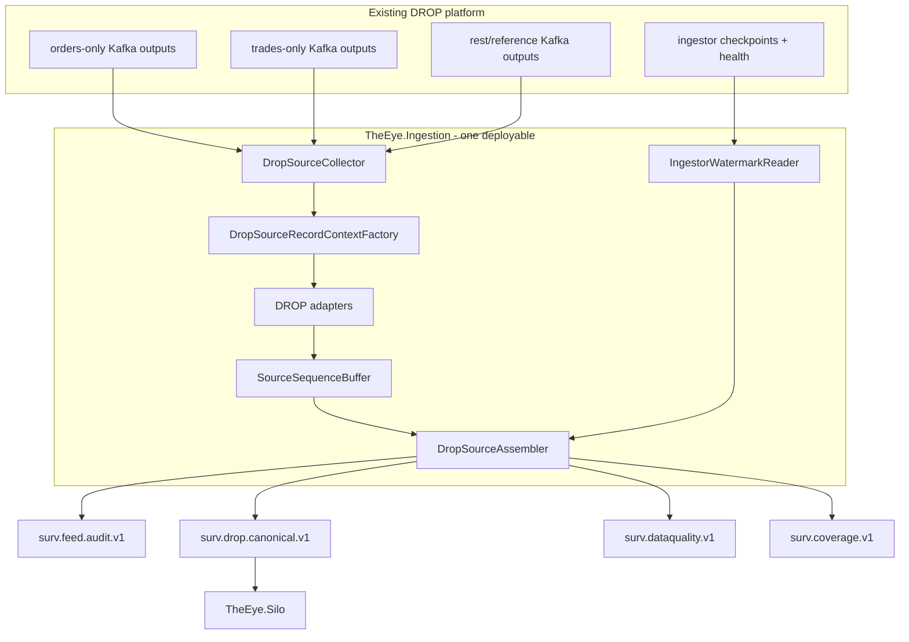
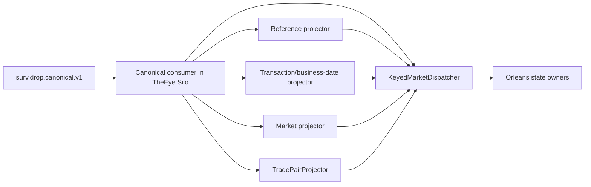

# Source Assembly and Ordering Logic

> [!IMPORTANT]
> `TheEye.SourceAssembly` is a **library inside the `TheEye.Ingestion` process**. Its responsibility ends when source events are durably represented in the canonical/audit/coverage/data-quality outputs. Reference projection, transaction/business-date context, market state and trade pairing are Silo-side work.

See [[15 - Current Runtime Architecture and Fix Plan|Current Runtime Architecture and Fix Plan]].

## Why source assembly exists

The current DROP application splits one MME feed into three Kafka source families:

```text
trades-only
orders-only
rest-messages
```

The MME source sequence is treated as global across message types inside its real source domain, while each Kafka topic contains a sparse subset. Kafka does not order records across topics.

Therefore THE EYE must assemble one trustworthy sequence **before** Orleans state processing.

## Runtime location



`mme.drop.parsed.unhandled` and `mme.drop.raw.messages.dlq` are planned source-quality inputs when available; they are **not yet wired** in the current Ingestor build.

## Kafka header contract - important correction

The Nasdaq DROP protocol defines the binary **payload** representation. It does not define how the existing MME application serializes Kafka headers.

The current Ingestor reads:

```text
mme-sequence-number
drop-partition-id
drop-message-id
drop-group-id
```

The first live record disproved the original assumption that every Kafka header uses the DROP payload's fixed binary width.

Therefore:

- confirm the real producer encoding from live evidence and preferably source code;
- keep all header decoding in `DropSourceRecordContextFactory`;
- add fixtures for every confirmed representation;
- quarantine unknown/invalid encodings with hex + text evidence;
- never infer a Kafka-header encoding from the Nasdaq payload specification.

## Deterministic source identity

Starting identity:

```text
Source
+ SequenceDomain
+ SequenceEpoch
+ MmeSequenceNumber
+ MessageGroup
+ MessageId
+ DropPartitionId
```

Kafka topic/partition/offset is delivery evidence, not source identity.

`SequenceEpoch` remains unverified until the actual reset rule is proven.

## Header/payload integrity

For a typed payload:

```text
header drop-group-id     == payload.messageGroup
header drop-message-id   == payload.messageId
header drop-partition-id == payload.partitionId
```

Mismatch => `SourceMetadataMismatchEvent`, quarantine, no canonical state application.

Do not manufacture missing values from Kafka offsets.

## SourceSequenceBuffer

Conceptually:

```text
SortedDictionary<ulong, SourceSlot>

SourceSlot
- MmeSequenceNumber
- CandidateRecords[]
- FirstSeenAt
- MessageIdentities
```

At one source sequence:

- same deterministic identity => replay/duplicate;
- distinct identities => source conflict.

A conflict must become durable `SourceSequenceConflictEvent` evidence in `surv.dataquality.v1`; log-only handling is temporary and must be removed before production.

## Safe watermark

Candidate model, still requiring Phase-0 validation:

```text
tradesPublishedThrough = tradesNextCheckpoint - 1
ordersPublishedThrough = ordersNextCheckpoint - 1
restPublishedThrough   = restNextCheckpoint - 1

safeWatermark = min(active published-through values)
```

A source family that has never published in the current epoch may be excluded only according to an explicit validated rule. Idle-family behavior must be measured.

A missing sequence is a gap only when:

```text
sequence absent
AND
sequence <= proven safeWatermark
```

If Redis/watermark proof disappears:

```text
contiguous already-known records -> may release
first unresolved hole            -> stop
new unproven gap                  -> never invent
```

## Assembly algorithm

For each `SequenceDomain + SequenceEpoch`:

```text
1. Consume an available documented source record.
2. Decode real Kafka source metadata.
3. Adapt payload without changing business meaning.
4. Validate header/payload identity.
5. Insert valid record into SourceSequenceBuffer by MmeSequenceNumber.
6. Classify deterministic replay duplicates.
7. Detect distinct same-sequence identities -> data-quality conflict.
8. Refresh trustworthy watermark when available.
9. From nextExpectedSequence:
     a. slot present, one identity -> release canonical/audit output
     b. slot absent and <= safeWatermark -> emit CoverageGapEvent and advance
     c. slot absent and > safeWatermark -> wait
10. Mark source Kafka records safe only after their durable terminal outcome.
11. Commit only the highest contiguous safe offset per source topic-partition.
```

## P0 offset-durability rule

Wrong:

```text
consume
→ put only in RAM buffer
→ commit source Kafka offset
→ publish canonical later
```

A crash after the commit can permanently hide an event from surveillance.

Target:

```text
consume
→ validate/buffer
→ release safely
→ publish durable output
→ mark source record safe
→ commit contiguous safe source offset
```

Consequences:

- restart may replay records;
- replay duplicates are expected and handled by deterministic `EventId`;
- do not commit a later Kafka offset past an earlier unresolved record in the same Kafka partition;
- malformed records become safe only after durable data-quality publication;
- prolonged unresolved gaps require buffer limits/backpressure/metrics, not early acknowledgement.

## Output topics

### `surv.drop.canonical.v1`

The full typed canonical source stream in released MME sequence order.

Initial production rule:

```text
one Kafka partition per SequenceDomain
```

This is intentionally serial at the source-integrity boundary. Parallelism begins inside the Silo after ordered consumption.

### `surv.feed.audit.v1`

Forensic ledger/copy of released source evidence.

### `surv.coverage.v1`

Confirmed coverage transitions/gaps. Sparse per-topic jumps are never enough.

### `surv.dataquality.v1`

Malformed headers, parse failures, metadata mismatches, unknown messages and same-sequence conflicts.

## Silo boundary

After publication:



### Important ownership correction

SourceAssembly does **not**:

- resolve Account → Investor;
- maintain surveillance reference projections;
- stamp transaction/business-date by maintaining downstream state;
- build `MatchedTradeEvent`;
- maintain order-book state;
- call Orleans grains.

Those responsibilities belong after the canonical Kafka boundary in `TheEye.Silo`.

The Ingestor may extract natural routing fields already present in the source payload, but it must not perform cross-event enrichment.

## Canonical ordering in the Silo

The Silo canonical consumer reads each sequence-domain lane sequentially. It may then dispatch to keyed state owners while preserving the relative source order of events routed to the same key.

Suggested book key:

```text
venueId|orderBookId
```

Do not add canonical partitions without an explicit design that preserves the ordering contract.

## Topic reconciliation

The Ingestor asks Kafka for the real topic inventory and intersects it with the documented registry.

The first live run found **22/37 documented topics present**.

Registry entries must be classified:

```text
Required
Optional
NotProvisioned
```

Missing Required => coverage degraded.

Missing Optional/NotProvisioned => visible warning, not automatic permanent false degradation.

## Failure/replay model

```text
at-least-once transport
+ deterministic EventId
+ idempotent Silo state application
+ replayable canonical history
```

Do not claim exactly-once across Kafka + Orleans + databases.

## Phase-0/P0 proof required

Before production Silo logic depends on this boundary, prove:

1. real Kafka header encoding for all source families;
2. `SequenceDomain` scope and `SequenceEpoch` reset semantics;
3. source offsets cannot outrun durable released output;
4. canonical sequence is monotonic per domain;
5. idle-family watermark behavior;
6. Redis outage stalls at unproven holes rather than inventing gaps;
7. Required/Optional/NotProvisioned topic classification;
8. crash/restart produces no silent canonical event loss.

## Navigation

- [[15 - Current Runtime Architecture and Fix Plan|Current Runtime Architecture and Fix Plan]]
- [[01 - Global Sequence and Feed Continuity|Global Sequence and Feed Continuity]]
- [[02 - Canonical Event Contract|Canonical Event Contract]]
- [[08 - DROP Event Acquisition Matrix|DROP Event Acquisition Matrix]]
- [[10 - Reference State and Enrichment Strategy|Reference State and Enrichment Strategy]]
- [[13 - Event Processing Blocks|Event Processing Blocks]]
