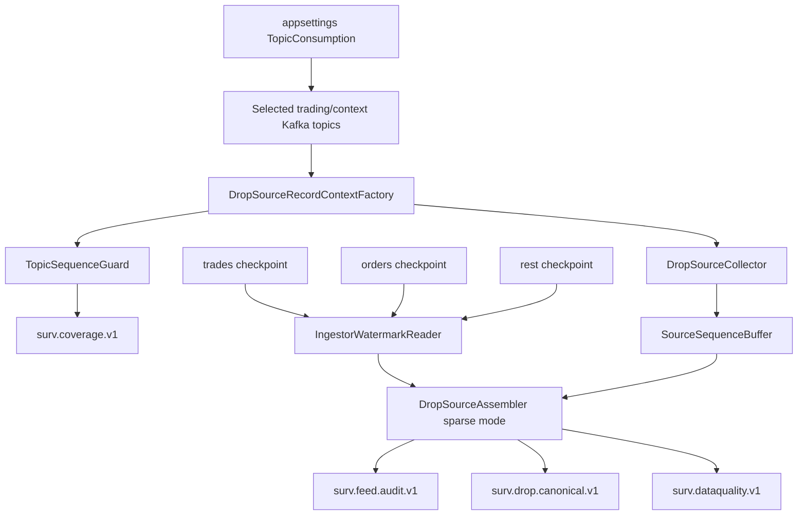

# Source Assembly and Ordering Logic

## Why this component exists

The current DROP platform splits events across Kafka topics and three ingestor instances. Kafka preserves order inside a partition, not across different topics.

THE EYE therefore still needs a source-assembly stage before Orleans/state processing.

The current runtime, however, intentionally consumes only trading/live-context topics. Reference master topics are resolved from Redis.

That creates two separate correctness problems:

```text
1. preserve relative MME source order across selected topics
2. detect missing records inside each selected topic
```

They use different sequence metadata.

## Current metadata contract

```text
mme-sequence-number
    8-byte little-endian UInt64
    global/source ordering evidence

topic-sequence-number
    8-byte little-endian UInt64
    per-topic continuity number

topic-sequence-epoch
    32 lowercase hex ASCII/UTF-8 chars
    per-topic sequence lifetime

drop-group-id / drop-message-id / drop-partition-id
    ASCII decimal transport metadata
```

See [[15 - MME Sequence Header Encoding Verification|Kafka Sequence Header Encoding Verification]].

## Starting architecture



## TopicSequenceGuard - fast coverage check

State is maintained per:

```text
(KafkaTopic, TopicSequenceEpoch)
```

Algorithm:

```text
no previous state
    -> establish baseline

sequence == last + 1
    -> continuous

sequence > last + 1
    -> emit TopicSequenceGapEvent(last + 1 .. sequence - 1)

sequence <= last
    -> replay/duplicate, do not move frontier backward
```

This is an O(1) in-memory check and happens immediately when the Kafka record is consumed.

The guard keeps separate frontiers for separate epochs even if they appear on the same topic.

## SourceSequenceBuffer - relative global ordering

Selected events are still buffered by `MmeSequenceNumber`:

```text
SortedDictionary<ulong, SourceSlot>
```

But the assembler now runs with:

```text
RequireContiguousMmeSequence = false
```

because omitted reference topics create intentional MME holes.

Example:

```text
1405 Order selected
1406 Investor excluded
1407 Account excluded
1408 Participant excluded
1409 Trade selected
```

The canonical selected stream must be:

```text
1405 Order
1409 Trade
```

with **no false global coverage gap for 1406..1408**.

## Safe global release watermark

Current source ingestors expose:

```text
mme.drop.ingestor:trades-only:next_mme_sequence_number
mme.drop.ingestor:orders-only:next_mme_sequence_number
mme.drop.ingestor:rest-messages:next_mme_sequence_number
```

Starting conservative release watermark:

```text
safeWatermark = min(
    tradesNext - 1,
    ordersNext - 1,
    restNext - 1)
```

Its job in the trading-only profile is **not selected-topic gap detection**.

Its job is to avoid releasing a later selected MME event before the upstream source has progressed far enough that an earlier selected event is unlikely still to arrive from another source family.

The Redis checkpoint/health reads are issued concurrently/pipelined rather than as serial round trips, allowing a low configured refresh interval without unnecessarily slowing the hot loop.

> [!CAUTION]
> The exact watermark semantics remain dependent on the current ingestor checkpoint behavior. A conservative stall is preferable to weakening cross-topic ordering without evidence.

## Full processing algorithm

```text
1. Subscribe only to TopicConsumption:Topics.
2. Validate configured topic exists in DropSourceTopicRegistry.
3. Validate broker topic/partition assumptions.
4. Consume a record.
5. Decode/validate all required Kafka source headers.
6. Run TopicSequenceGuard immediately.
7. If topic sequence jumps forward -> publish TopicSequenceGapEvent.
8. Map payload through its DROP adapter.
9. Validate header group/message/partition against payload.
10. Build deterministic EventId.
11. Insert selected event into SourceSequenceBuffer by MmeSequenceNumber.
12. Refresh global release watermark at configured interval.
13. Release selected events in increasing MME order using sparse mode.
14. Publish canonical + audit outputs.
15. Commit source Kafka offset only after the record has a durable output/result representation.
```

## Deterministic source identity

Starting EventId identity remains:

```text
SequenceDomain
+ SequenceEpoch
+ MmeSequenceNumber
+ MessageGroup
+ MessageId
+ DropPartitionId
```

Topic sequence does not replace source EventId. It is additional continuity evidence.

Kafka topic/partition/offset remains delivery evidence, not source identity.

## Header/payload integrity

For typed DROP records:

```text
header drop-group-id     == payload.messageGroup
header drop-message-id   == payload.messageId
header drop-partition-id == payload.partitionId
```

Mismatch:

```text
-> SourceMetadataMismatchEvent
-> preserve Kafka coordinates/payload evidence
-> do not silently canonicalize the record as valid
```

## Output topics

All are configurable in `appsettings.json`:

```text
surv.drop.canonical.v1
surv.feed.audit.v1
surv.coverage.v1
surv.dataquality.v1
```

Canonical and audit publishing can run concurrently because both represent the same already-finalized selected candidate and Kafka offset safety waits for completion.

## Topic sequence gap event

Current derived coverage record:

```text
TopicSequenceGapEvent
- KafkaTopic
- KafkaPartition
- TopicSequenceEpoch
- MissingTopicSequenceStart
- MissingTopicSequenceEnd
- ObservedTopicSequenceNumber
- MmeSequenceNumber
- DetectedAt
- Evidence
```

This is intentionally distinct from a global `CoverageGapEvent`.

## Transaction context

Start/Commit remain selected because matching-round context can matter to exact market-state reconstruction.

Transaction state is still maintained per DROP partition when attached to canonical events.

If multiple producer epochs share the same transaction topic, topic continuity remains tracked independently by `(topic, epoch)`.

## Business/reference context

Business-date changes and live market state remain selected where required by the current profile.

Identity/reference master values are resolved through Redis, as described in [[10 - Reference State and Enrichment Strategy|Reference State and Enrichment Strategy]].

## Failure/replay model

```text
at-least-once transport
+ deterministic EventId
+ idempotent application
+ explicit topic coverage events
```

Do not claim distributed exactly-once across Kafka, Redis, Orleans and databases.

Replay/duplicates must not advance a topic frontier backward and must not update surveillance state twice.

## Performance knobs

All starting values are configuration-owned:

```text
Kafka.Consumer.FetchWaitMaxMs
Kafka.Consumer.FetchMinBytes
Kafka.Consumer.FetchMaxBytes
Kafka.Consumer.QueuedMinMessages
Kafka.Consumer.QueuedMaxMessagesKbytes
SourceAssembly.ConsumeTimeoutMs
SourceAssembly.WatermarkRefreshIntervalMs
Kafka.Producer.LingerMs
Kafka.Producer.BatchNumMessages
Kafka.Producer.CompressionType
```

See [[16 - Trading-Only Acquisition and Topic Sequence Guard|Trading-Only Acquisition and Topic Sequence Guard]] for the starting values and rationale.

## Restart boundary

The current `TopicSequenceGuard` is in-process state. First record after a fresh process start establishes a baseline for that `(topic, epoch)`.

If strict continuity proof across a THE EYE restart is required without replaying a previous source record, add a measured asynchronous/persisted topic-frontier mechanism. Avoid a synchronous Redis write per market message unless benchmark results justify it.

## Navigation

- [[01 - Global Sequence and Feed Continuity|Global Sequence and Feed Continuity]]
- [[08 - DROP Event Acquisition Matrix|DROP Event Acquisition Matrix]]
- [[10 - Reference State and Enrichment Strategy|Reference State and Enrichment Strategy]]
- [[15 - MME Sequence Header Encoding Verification|Kafka Sequence Header Encoding Verification]]
- [[16 - Trading-Only Acquisition and Topic Sequence Guard|Trading-Only Acquisition and Topic Sequence Guard]]
