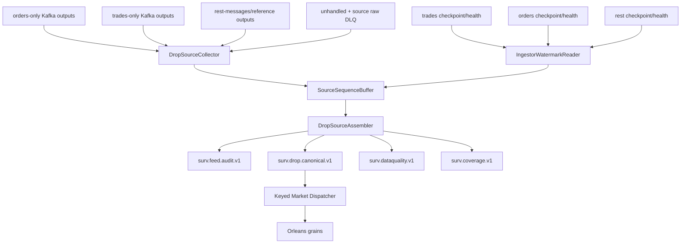
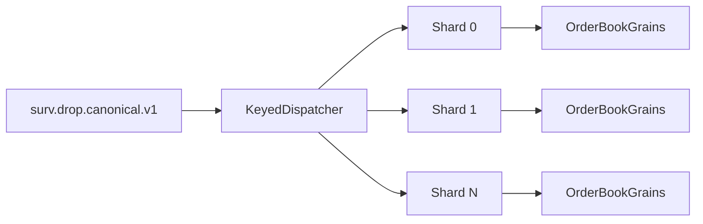

# Source Assembly and Ordering Logic

## Why this component exists

The current DROP application deliberately splits one MME feed into multiple Kafka topic families and three ingestor instances:

```text
trades-only
orders-only
rest-messages
```

The MME source sequence is global across message types, while each Kafka topic sees only a sparse subset. Kafka also does not order records across different topics.

Therefore THE EYE needs a **source assembly stage before Orleans state processing**.

## Current evidence available

Current implementation documentation proves that `MME.Drop.Persistence` can read these Kafka headers:

```text
mme-sequence-number

drop-partition-id

drop-message-id

drop-group-id
```

The current ingestors also maintain Redis checkpoints:

```text
mme.drop.ingestor:trades-only:next_mme_sequence_number
mme.drop.ingestor:orders-only:next_mme_sequence_number
mme.drop.ingestor:rest-messages:next_mme_sequence_number
```

and runtime-health hashes:

```text
mme.drop.ingestor:{instance}:health
```

The checkpoint is written **after a completed Kafka batch publish**. Replay can therefore duplicate already-published source records if Kafka succeeds and the Redis checkpoint write fails.

That naturally leads to **at-least-once source assembly + deterministic dedupe**.

## Starting architecture



## Do not merge by arrival time

Wrong:

```text
orders record arrives first
trade record arrives second
reference record arrives third
=> assume that is exchange order
```

Correct:

```text
collect records from all source topics
read their MME source sequence
buffer/reorder by source sequence
use validated progress/watermarks before declaring a sequence missing
```

## SourceSequenceBuffer

Conceptual structure:

```text
SortedDictionary<ulong, SourceSlot>

SourceSlot
- SourceSequence
- CandidateRecords[]
- FirstSeenAt
- MessageIdentities
```

Multiple records may temporarily occupy one sequence because:

- reconnect/replay can duplicate records;
- StartOfTransaction/Commit are currently documented as produced by all ingestor instances;
- consumers may see duplicate delivery after failure.

The assembler must classify duplicates rather than applying them twice.

## Deterministic source identity

Use the strongest source identity that validation proves.

Starting identity:

```text
SequenceDomain
+ SequenceEpoch
+ MmeSequenceNumber
+ MessageGroup
+ MessageId
+ DropPartitionId
```

`SequenceEpoch` prevents collision if source sequence values reset. Do not assume that `BusinessDate` is the epoch until the actual sequence reset rule is verified.

Kafka topic/partition/offset is evidence of **delivery**, not source identity.

## Header/payload integrity check

For every typed DROP payload:

```text
header drop-group-id     == payload.messageGroup
header drop-message-id   == payload.messageId
header drop-partition-id == payload.partitionId
```

If not:

```text
emit SourceMetadataMismatchEvent
mark source record invalid for strict canonical application
preserve the original Kafka coordinates and payload for investigation
```

Do not manufacture fallback source metadata from Kafka offset.

## Watermark model

A later event arriving does not by itself prove an earlier sequence is missing; another source topic/ingestor may simply be behind.

Use a **validated safe watermark**.

Candidate starting model after Phase-0 proof:

```text
tradesPublishedThrough = tradesNextCheckpoint - 1
ordersPublishedThrough = ordersNextCheckpoint - 1
restPublishedThrough   = restNextCheckpoint - 1

safeWatermark = min(
    tradesPublishedThrough,
    ordersPublishedThrough,
    restPublishedThrough)
```

Only sequences `<= safeWatermark` are eligible to be finalized as present/missing.

> [!CAUTION]
> This watermark formula is a design candidate based on the documented checkpoint timing. It must be validated against the actual family-filter behavior. If a family checkpoint does not advance across periods containing no events for that family, the formula may be conservative and stall; that is acceptable compared with false gap declarations. Do not weaken it until measured.

Runtime-health TTL/status must also be checked. A dead/stale ingestor should produce a **source-stalled** condition, not false gap alarms.

## Assembly algorithm

For each `SequenceDomain + SequenceEpoch`:

```text
1. Consume all authoritative current source topics.
2. Read and validate MME source metadata.
3. Insert record into SourceSequenceBuffer by MmeSequenceNumber.
4. Deduplicate exact source identity.
5. Detect conflicting payload/message identity for the same sequence -> critical data-quality event.
6. Refresh ingestor checkpoints + health.
7. Calculate safeWatermark.
8. Starting from nextExpectedSequence:
     a. if sequence exists -> canonicalize and emit
     b. if sequence does not exist and sequence <= safeWatermark -> emit CoverageGapEvent and advance
     c. if sequence > safeWatermark -> wait; do not call it a gap
9. Commit Kafka offsets only after the record is safely represented in the assembler output/checkpoint strategy.
```

## Output topics

### `surv.feed.audit.v1`

One compact record per finalized source sequence, including unknown/parse-failed records when source identity is known.

Purpose:

- continuity proof;
- replay coordinates;
- gap investigation;
- source-message inventory.

Recommended one partition per global `SequenceDomain` so the audit ledger itself preserves source order.

### `surv.drop.canonical.v1`

The full canonical source event stream, in source-sequence order.

For current expected volume, keeping one ordered partition per global source sequence domain is a good starting point. It is a serialization point by design because the source sequence itself is serial.

Parallelism begins **after** this stage.

### `surv.coverage.v1`

Contains:

```text
CoverageHealthy
CoverageGapEvent
SourceStalledEvent
RecoveryStartedEvent
RecoveryCompletedEvent
```

### `surv.dataquality.v1`

Contains source integrity issues such as:

```text
MissingSequenceHeader
MissingSourceMetadata
SourceMetadataMismatch
ConflictingSameSequencePayload
UnknownDropMessage
SourceParseFailure
ReferenceNotReady
UnmatchedTradeSideTimeout
```

## Canonical dispatch without losing per-book order

After the globally ordered canonical topic:



The dispatcher reads canonical events sequentially and appends each event to the target shard/key queue in that same order.

Suggested market key:

```text
venueId|orderBookId
```

This gives parallel processing across books while preserving relative source order for events routed to the same book.

Events that are not book-specific route to their own state owner/reference projector.

## Transaction context

DROP groups orders/trades into matching rounds using `StartOfTransaction` and `Commit`.

The source assembler/canonicalizer should maintain transaction context **per DROP partition**, conceptually:

```text
CurrentTransaction[partitionId] = transactionId
```

For source events between Start and Commit, attach:

```text
TransactionId = current transaction id for that DROP partition
```

Do not invent a transaction id for messages outside a transaction.

## Business-date context

Maintain business date from:

- `InitialBusinessDateEvent`
- `BusinessDateChangedEvent`

Do not derive official business date from server local clock.

If a record arrives before business date can be resolved, retain source evidence and mark the contextual field unresolved instead of inventing a date.

## Event time

Each payload has its own protocol time semantics (`timeChanged`, `tradeTime`, `timestamp`, etc.). The adapter maps the appropriate source field to canonical `EventTime` and keeps the native payload field unchanged.

All DROP timestamps/date fields are protocol `Long` nanoseconds-since-epoch according to the official specification.

## Trade pairing

Do not depend on `mme.drop.enriched.trades` for authoritative surveillance pairing.

Starting deterministic pairing:

```text
TradeSideEvent A
TradeSideEvent B
same matchId
compatible opposite sides / orderBook / tradePrice / quantity context
        ↓
MatchedTradeEvent
```

If only one side is observed past an appropriate source watermark/window, keep the side and emit a data-quality condition. Never discard it.

## Reference resolution

Do not resolve identities using only today's latest Redis hash.

The canonical sequence must be able to resolve the reference state **as of the source sequence**. See [[10 - Reference State and Enrichment Strategy|Reference State and Enrichment Strategy]].

## Failure/replay rule

Default end-to-end model:

```text
at-least-once transport
+ deterministic EventId
+ idempotent state application
+ replayable source history
```

Do not claim exactly-once across Kafka + Orleans + PostgreSQL.

Kafka transactions may later be used inside the pure Kafka assembler stage if justified, but they do not make external Orleans state globally transactional.

## When an ingestor change becomes necessary

The first implementation should prefer **read-only consumption of the existing DROP platform**.

Modify/add source-side audit emission only if Phase-0 validation proves that existing topics/headers/watermarks cannot reconstruct a complete sequence safely.

Examples requiring an ingestor/source change:

- `mme-sequence-number` missing on some authoritative source records;
- a source sequence can be consumed without any normal/unhandled/raw-DLQ Kafka representation;
- per-instance checkpoints cannot serve as safe progress evidence;
- sequence domain/reset semantics cannot be identified downstream;
- current sessions do not collectively expose all source messages.

A fourth DROP session must **not** be assumed possible until EGX concurrent-session/replay policy is confirmed.

## Source basis

- [[DROP-Current-System/03 - Current DROP Runtime Architecture|Current DROP Runtime Architecture]]
- [[DROP-Current-System/08 - Kafka Topic Catalog|Kafka Topic Catalog]]
- [[DROP-Current-System/12 - Runtime Guarantees and Known Gaps|Runtime Guarantees and Known Gaps]]
- [[DROP-Current-System/15 - Source Classification and Reliability|Source Classification and Reliability]]

## Navigation

- [[01 - Global Sequence and Feed Continuity|Global Sequence and Feed Continuity]]
- [[02 - Canonical Event Contract|Canonical Event Contract]]
- [[08 - DROP Event Acquisition Matrix|DROP Event Acquisition Matrix]]
- [[10 - Reference State and Enrichment Strategy|Reference State and Enrichment Strategy]]
- [[13 - Event Processing Blocks|Event Processing Blocks]]
