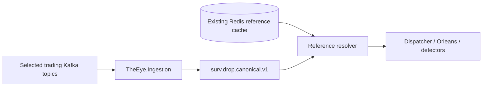
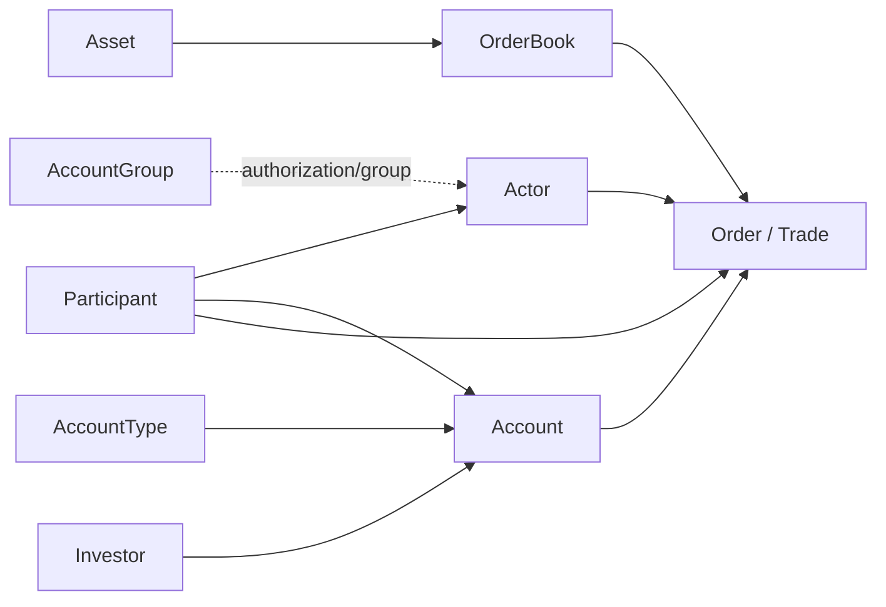

# Reference State and Enrichment Strategy

## Current runtime decision

The active THE EYE ingestion worker does **not** consume the pure reference/identity Kafka topics in its real-time hot path.

The current DROP platform already runs `ReferenceDataCacheService`, which projects the latest reference state into Redis. THE EYE uses that existing cache for live identity/reference lookup.

This keeps the ingestion worker focused on trading and live market-context data and avoids parsing/reference duplication on every surveillance run.

See [[16 - Trading-Only Acquisition and Topic Sequence Guard|Trading-Only Acquisition and Topic Sequence Guard]].

## Existing Redis reference keys

The current platform documents keys such as:

```text
asset:{id}
orderbook:{id}
participant:{id}
actor:{id}
account:{id}
accounttype:{id}
accountgroup:{id}
investor:{id}
custodian:{id}
corporateaction:{id}
exchangerate:{currency}
accountpos:{asset}:{participant}:{account}:{investor}
```

This is the starting live lookup source for participant/actor/account/investor/instrument context.

## Live enrichment flow



The ingestion adapter preserves raw numeric/source IDs. Reference resolution enriches those IDs for downstream use; it must not replace or erase the original evidence.

## What stays in the selected Kafka stream

Some messages have names that sound like reference data but are live market context and stay selected, for example:

```text
ReferencePriceEvent
PriceLimitsEvent
BestBidOfferEvent
EquilibriumPriceEvent
SessionChangeEvent
BusinessDateChangedEvent
CircuitBreakerEvent
```

These affect current market state and manipulation detection directly.

## What is excluded from the ingestion worker

Current pure/cache-supplied set includes:

```text
ParticipantReferenceEvent
ActorReferenceEvent
AssetReferenceEvent
OrderBookReferenceEvent
AccountReferenceEvent
AccountTypeReferenceEvent
AccountGroupReferenceEvent
InvestorReferenceEvent
CustodianReferenceEvent
ReferenceDataCompletedEvent
InitialBusinessDateEvent
CorporateActionEvent
ExchangeRateEvent
AccountPositionEvent
```

If a real-time detector later requires one excluded domain as a first-class event transition rather than a latest-value lookup, add the corresponding topic explicitly to `TopicConsumption:Topics` and update the architecture note. Do not silently broaden the worker back to all topics.

## Identity graph used by surveillance

The main current relationships remain:



The Redis representation is an operational cache of these current relationships.

## Important forensic limitation

Redis is mutable **latest state**. That is ideal for live low-latency resolution, but by itself it is not enough to prove what a reference value was at an arbitrary historical MME sequence.

Therefore keep these two requirements separate:

```text
live surveillance
    -> use existing Redis reference cache

historical/as-of replay and regulatory reproducibility
    -> requires preserved/versioned reference history or a reproducible reference snapshot/archive
```

The current ingestion optimization chooses Redis for the live path. It does **not** claim that today's Redis value is automatically the historically correct value for every old alert.

A later hardening phase can provide one of:

- versioned reference-event archive outside the hot ingestion worker;
- periodic immutable reference snapshots plus update history;
- a surveillance reference projection built from archived source data.

Do not add those costs to the live path until the forensic requirement is implemented deliberately.

## Order resolution

Starting live model:

```text
OrderLifecycleEvent
      +
current Redis reference values
      ↓
ResolvedOrderContext
```

Useful context includes:

```text
orderBook / asset
participant
actor
account
account type
investor
custodian when available
```

Keep both raw IDs and resolved descriptive/classification data.

## Trade resolution

Starting model:

```text
TradeSideEvent
      ↓ deterministic matchId pairing when needed
MatchedTradeEvent
      +
current Redis reference values
      ↓
ResolvedTradeContext
```

Do not make current enriched trade/order topics the only evidence source. Raw parsed lifecycle/trade-side semantics remain the authoritative surveillance event evidence.

## Beneficial owner meaning

DROP `Investor` and Account -> Investor relationships provide the platform's investor identity. Use them as provided.

Do not automatically claim they represent every legal beneficial-ownership/related-party relationship required for all 540 cases. External KYC/ownership relationships can be added through the external event contracts when needed.

## Hot-path cache rule

Downstream market-state processing should avoid repeated network lookups for the same entity on every low-level book update.

Recommended pattern:

```text
Redis
  -> small local immutable/read-through reference cache
  -> dispatcher/resolved event context
  -> grains/detectors
```

This keeps Redis as the operational source while removing unnecessary per-event network latency from grain hot paths.

## Failure behavior

If a required Redis reference value is missing/unavailable:

```text
preserve the raw market event
mark reference context unresolved/degraded
continue according to detector capability
never invent investor/account identity
```

A detector that requires the missing identity should return a not-evaluable/degraded result rather than "no manipulation".

## Source basis

- [[DROP-Current-System/04 - Entity and Identity Model|Entity and Identity Model]]
- [[DROP-Current-System/05 - Business Data Dictionary and Join Keys|Business Data Dictionary and Join Keys]]
- [[DROP-Current-System/08 - Kafka Topic Catalog|Kafka Topic Catalog]]
- [[DROP-Current-System/09 - Redis State and Reference Cache|Redis State and Reference Cache]]

## Navigation

- [[08 - DROP Event Acquisition Matrix|DROP Event Acquisition Matrix]]
- [[09 - Source Assembly and Ordering Logic|Source Assembly and Ordering Logic]]
- [[11 - External Event Contracts|External Event Contracts]]
- [[16 - Trading-Only Acquisition and Topic Sequence Guard|Trading-Only Acquisition and Topic Sequence Guard]]
