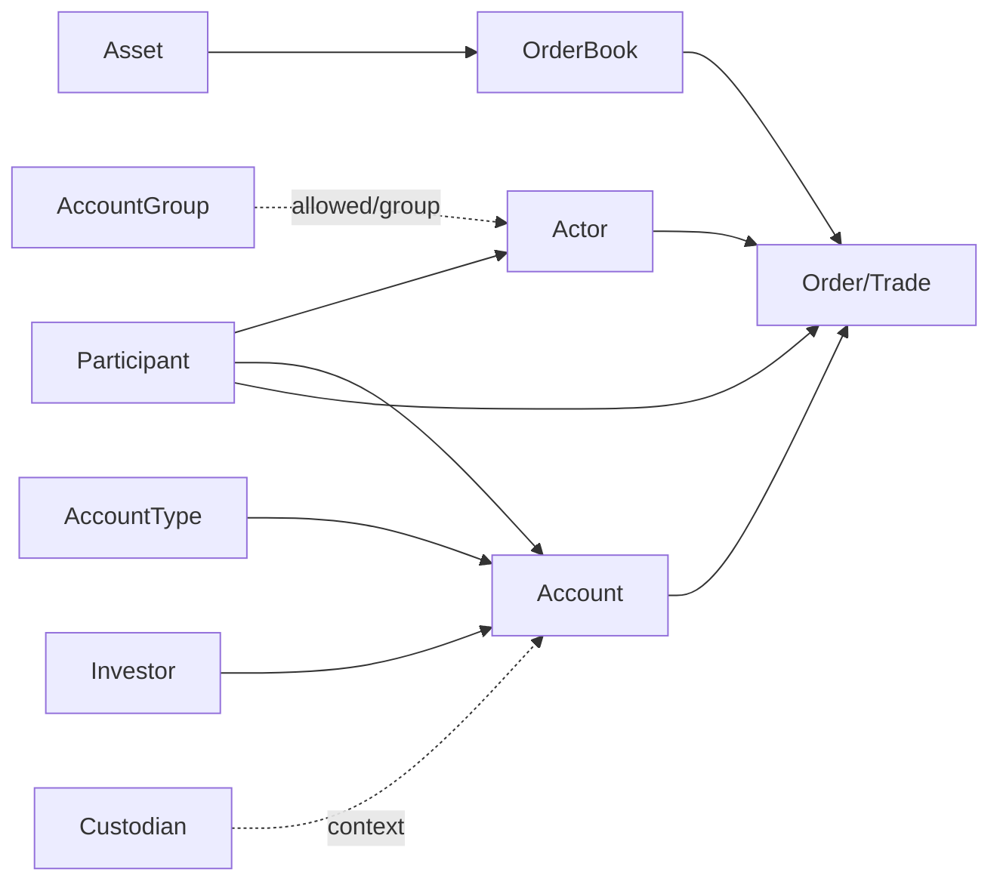
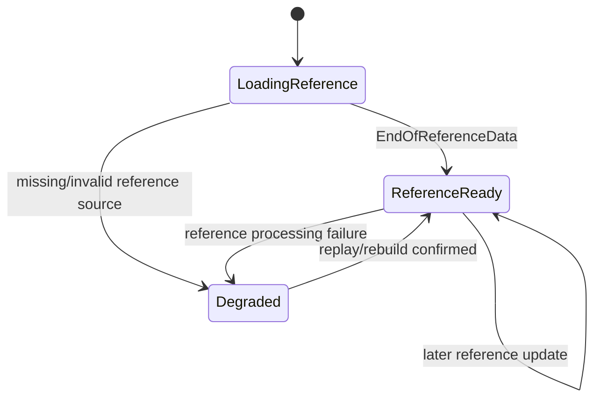

# Reference State and Enrichment Strategy

## Why THE EYE needs its own reference projection

The current DROP platform already has `ReferenceDataCacheService` and Redis hashes, but surveillance needs **historically reproducible as-of identity resolution**.

The official protocol flow is:

```text
initial reference publication
    ↓
EndOfReferenceData
    ↓
real-time messages
    ↓
reference updates may still occur at any time
```

Therefore reference data is not a one-time startup lookup.

## Authoritative inputs

Consume these source events directly through the canonical source stream:

```text
ParticipantReferenceEvent
ActorReferenceEvent
AssetReferenceEvent
OrderBookReferenceEvent
AccountReferenceEvent
AccountTypeReferenceEvent
AccountGroupReferenceEvent
InvestorReferenceEvent
CustodianReferenceEvent
CorporateActionEvent
ReferenceDataCompletedEvent
ExchangeRateEvent
InitialBusinessDateEvent
AccountPositionEvent
```

Current topic mappings are in [[08 - DROP Event Acquisition Matrix|DROP Event Acquisition Matrix]].

## Current Redis cache - role in THE EYE

Current keys include:

```text
asset:{id}
orderbook:{id}
participant:{id}
actor:{id}
account:{id}
accounttype:{id}
accountgroup:{id}
investor:{id}
custodian:{id}
corporateaction:{id}
exchangerate:{currency}
accountpos:{asset}:{participant}:{account}:{investor}
```

THE EYE may use current Redis for diagnostics or optional fast bootstrap, but must not treat today's Redis values as the only forensic truth because:

- Redis contains mutable latest state;
- replay/historical analysis needs the value valid at the historical source sequence;
- current reference consumer failure/restart semantics are not a complete historical version store.

## ReferenceStateProjector

Build a surveillance-owned projector from canonical reference events.

Conceptual key/value:

```text
ReferenceEntityKey
- EntityType
- EntityId

ReferenceVersion
- ValidFromSourceSequence
- ValidToSourceSequence?
- Action
- SourceEventId
- RawPayload
- NormalizedFields
```

For hot processing, keep current/latest values in memory/Orleans/local cache. For replay/forensics, retain version history in a durable projection store or rebuild from `surv.drop.canonical.v1`.

## Action semantics

Several reference messages carry an `action` such as create/update/delete.

The projector should apply the source action exactly and keep tombstones/version history instead of physically forgetting that the entity once existed.

```text
Create -> new version
Update -> close previous version + open new version
Delete -> close previous version + tombstone
```

## Core identity graph

Starting relationships from DROP:



Preserve raw IDs even after names/descriptions are resolved.

## As-of resolution

For a market event with source sequence `S`:

```text
resolve entity version where
ValidFromSourceSequence <= S
and (ValidToSourceSequence is null or S < ValidToSourceSequence)
```

This prevents a later participant/account/instrument update from changing the interpretation of an older alert during replay.

## Order enrichment - recommended surveillance model

Current `mme.drop.enriched.orders` is not authoritative for THE EYE because current Redis lookup failures can publish degraded/missing fields and replay can duplicate output.

Use:

```text
OrderLifecycleEvent
      +
ReferenceState as-of SourceSequence
      ↓
ResolvedOrderEvent
```

Suggested resolved context:

```text
orderBook / asset
participant
actor
account
accountType
investor
custodian when available
instrument product/classification
session/market context
```

Keep both:

```text
Raw source IDs
Resolved names/classifications
```

Never replace the raw IDs with only resolved text.

## Trade enrichment/pairing - recommended surveillance model

Current `mme.drop.enriched.trades` can be useful as a comparison view but the current Redis pending-list flow has documented duplicate/race windows.

THE EYE should derive:

```text
TradeSideEvent
      ↓ matchId pairing
MatchedTradeEvent
      ↓ as-of reference resolution
ResolvedTradeEvent
```

The individual source trade sides remain evidence even after pairing.

## Beneficial owner meaning

DROP provides an `Investor` entity and Account -> Investor relationship. Treat this as the **DROP-provided investor identity**.

Do not automatically claim it is the complete legal beneficial-ownership graph required for every nominee/related-party surveillance case.

For wider relationship surveillance, merge additional KYC/ownership data through `BeneficialOwnershipRelationshipEvent` from [[11 - External Event Contracts|External Event Contracts]].

## Instrument relationships

DROP `Asset` and `OrderBook` provide strong instrument/product attributes including option/repo-related fields.

For cross-product surveillance, derive what can be proven from DROP, but use external `InstrumentRelationshipEvent` when full relationships such as these are not present:

```text
option -> underlying
future -> underlying
ETF -> basket constituents
index -> constituents/weights
depositary receipt -> underlying
related cash/derivative instruments
```

## Session and market context

Keep market/session state separately from static reference:

```text
SessionChangeEvent
PriceLimitsEvent
ReferencePriceEvent
CircuitBreakerEvent
BestBidOfferEvent
EquilibriumPriceEvent
BusinessDateChangedEvent
```

A detector asks for explicit context as-of event sequence/time; it should not query mutable infrastructure directly.

## Position state

`AccountPositionUpdate` provides available long/loan quantities for asset/participant/account/investor.

Use it as one position/availability input:

```text
AccountPositionState
- AssetId
- ParticipantId
- AccountId/Name
- InvestorId
- AvailableLongQty
- AvailableLoanQty
- EffectiveSourceSequence
```

Do not silently equate it to:

- full settled holdings history;
- all open obligations;
- all borrowed securities;
- all regulatory position-limit calculations.

Those may require external settlement/lending/position sources.

## Reference readiness

Starting state machine:



Business processing can be configured to wait for `ReferenceReady` on live startup, matching the protocol's initial-reference-before-real-time contract.

## Cache design

Keep the hot lookup simple:

```text
ReferenceSnapshotCache
- latest entity versions
- immutable value objects
- keyed by numeric source ID
- no network call from OrderBookGrain hot path
```

A background projector updates the cache; grains receive already-resolved context or a local immutable snapshot service.

## Replay

Replay must rebuild reference state from the same source sequence before applying dependent business events.

Correct:

```text
source seq 100 Participant update
source seq 101 Account update
source seq 102 Order
=> Order resolves reference state after 100/101
```

Incorrect:

```text
replay source seq 102 Order
=> look up today's Redis value
```

## Source basis

- [[DROP-Current-System/01 - DROP Protocol Overview|DROP Protocol Overview]]
- [[DROP-Current-System/04 - Entity and Identity Model|Entity and Identity Model]]
- [[DROP-Current-System/05 - Business Data Dictionary and Join Keys|Business Data Dictionary and Join Keys]]
- [[DROP-Current-System/08 - Kafka Topic Catalog|Kafka Topic Catalog]]
- [[DROP-Current-System/12 - Runtime Guarantees and Known Gaps|Runtime Guarantees and Known Gaps]]

## Navigation

- [[07 - Complete Surveillance Event Catalog|Complete Surveillance Event Catalog]]
- [[08 - DROP Event Acquisition Matrix|DROP Event Acquisition Matrix]]
- [[09 - Source Assembly and Ordering Logic|Source Assembly and Ordering Logic]]
- [[11 - External Event Contracts|External Event Contracts]]
- [[03 - Order Book Surveillance Core|Order Book Surveillance Core]]
