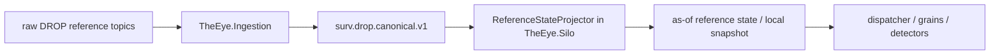
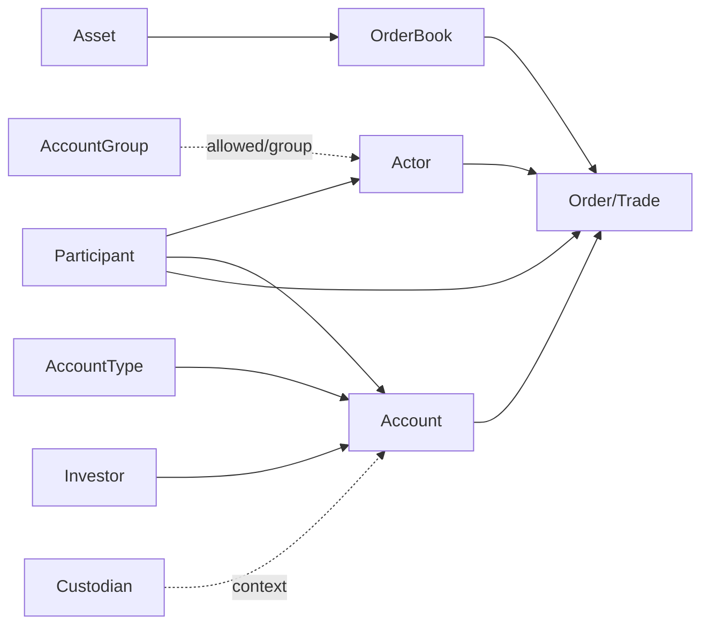
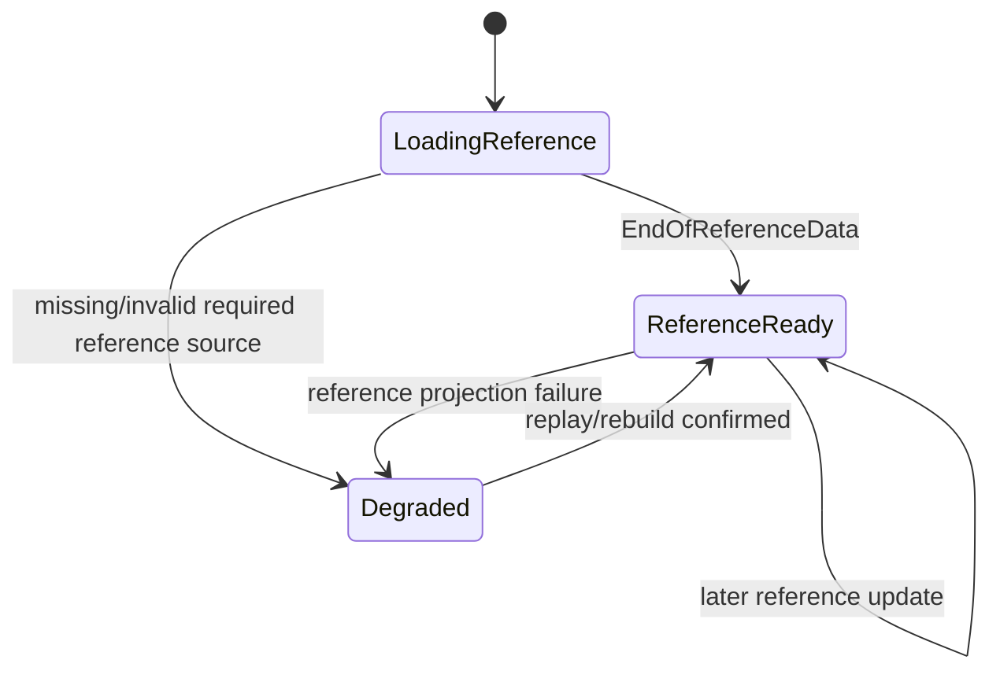

# Reference State and Enrichment Strategy

> [!IMPORTANT]
> Reference projection and Account → Investor resolution are **Silo-side responsibilities**. `TheEye.Ingestion` transports the native reference events through `surv.drop.canonical.v1`; it does not query Redis to enrich Orders/Trades.

See [[15 - Current Runtime Architecture and Fix Plan|Current Runtime Architecture and Fix Plan]].

## Why THE EYE needs its own reference projection

The current DROP platform has `ReferenceDataCacheService` and Redis hashes, but surveillance needs historically reproducible **as-of source-sequence identity resolution**.

Protocol flow:

```text
initial reference publication
    ↓
EndOfReferenceData
    ↓
real-time messages
    ↓
reference updates may still occur later
```

Reference data is therefore versioned state, not one startup lookup.

## Runtime ownership



### Ingestor owns

- source adaptation/validation/order;
- publishing `InvestorReferenceEvent`, `AccountReferenceEvent`, `ActorReferenceEvent`, etc. unchanged in business meaning.

### Silo owns

- applying reference actions;
- versioning as-of source sequence;
- Account → Investor resolution;
- resolved Order/Trade context;
- readiness/degraded reference state.

## Authoritative canonical reference inputs

Consume from `surv.drop.canonical.v1`:

```text
ParticipantReferenceEvent
ActorReferenceEvent
AssetReferenceEvent
OrderBookReferenceEvent
AccountReferenceEvent
AccountTypeReferenceEvent
AccountGroupReferenceEvent
InvestorReferenceEvent
CustodianReferenceEvent
CorporateActionEvent
ReferenceDataCompletedEvent
ExchangeRateEvent
InitialBusinessDateEvent
AccountPositionEvent
```

## Investor source semantics

The official DROP Investor source message is message group `31`, message ID `34` and carries its native Investor identity/status/action fields.

The Ingestor publishes this as an independent canonical reference event.

The official Account source message is message ID `33` and carries the important Account relationships including:

```text
accountId
externalAccount
accountTypeId
investorId
participantId
```

That gives the Silo the critical identity path:

```text
Order / Trade account
        ↓
Account reference version as-of source sequence
        ↓
InvestorId
        ↓
Investor reference/state
```

This join must **not** move into `TheEye.Ingestion`.

## Current Redis cache - role in THE EYE

Current keys may include:

```text
asset:{id}
orderbook:{id}
participant:{id}
actor:{id}
account:{id}
accounttype:{id}
accountgroup:{id}
investor:{id}
custodian:{id}
corporateaction:{id}
exchangerate:{currency}
accountpos:{asset}:{participant}:{account}:{investor}
```

THE EYE may use current Redis for diagnostics or an explicitly validated bootstrap optimization, but never as the only forensic truth because Redis is mutable latest state.

Replay/historical evaluation must reconstruct the reference state valid at the historical source sequence.

## ReferenceStateProjector

Build this in/with `TheEye.Silo` from canonical reference events.

Conceptual version model:

```text
ReferenceEntityKey
- EntityType
- EntityId

ReferenceVersion
- ValidFromSourceSequence
- ValidToSourceSequence?
- Action
- SourceEventId
- RawPayload
- NormalizedFields
```

For hot processing, keep latest immutable snapshots locally/in Orleans/cache. For replay/forensics, retain version history in a durable projection store or rebuild from canonical history.

## Action semantics

Apply native source actions exactly:

```text
Create -> open first version
Update -> close prior version + open new version
Delete -> close prior version + tombstone
```

Do not physically erase historical meaning.

## Core identity graph



Preserve raw source IDs after names/classifications are resolved.

## As-of resolution

For a market event at source sequence `S`:

```text
resolve version where
ValidFromSourceSequence <= S
and (ValidToSourceSequence is null or S < ValidToSourceSequence)
```

This prevents a later account/investor/participant update from rewriting the interpretation of an older alert during replay.

## Order resolution - Silo model

Authoritative path:

```text
canonical OrderLifecycleEvent
      +
Silo ReferenceState as-of SourceSequence
      ↓
ResolvedOrderEvent / resolved processing context
```

Suggested resolved context:

```text
orderBook / asset
participant
actor
account
accountType
investor
custodian when available
instrument classification
session/market context
```

Keep both raw source IDs and resolved business context.

The current `mme.drop.enriched.orders` may be used as a comparison view, not authoritative evidence.

## Trade resolution/pairing - Silo model

```text
canonical TradeSideEvent
      ↓
TradePairProjector by matchId
      ↓
MatchedTradeEvent
      ↓
ReferenceState as-of source sequence
      ↓
ResolvedTradeEvent / resolved processing context
```

The individual canonical trade sides remain source evidence.

Current `mme.drop.enriched.trades` may be used only as an optional cross-check because the existing enrichment/pending-list path has known replay/race concerns.

## Beneficial-owner meaning

DROP supplies an `Investor` entity and Account → Investor relationship. Treat this as the **DROP-provided investor identity**.

Do not automatically claim it is the complete legal beneficial-ownership graph for all nominee/related-party cases.

Wider relationships come through validated KYC/ownership external events.

## Instrument relationships

DROP `Asset` and `OrderBook` provide useful instrument/product attributes. Full cross-product relationship graphs may still require external `InstrumentRelationshipEvent` data.

## Session and market context

Keep dynamic market/session context in separate Silo-side projectors:

```text
SessionChangeEvent
PriceLimitsEvent
ReferencePriceEvent
CircuitBreakerEvent
BestBidOfferEvent
EquilibriumPriceEvent
BusinessDateChangedEvent
```

Detectors consume explicit projected context; they do not query mutable Redis/Kafka directly.

## Position state

`AccountPositionUpdate` supplies available long/loan quantities by asset/participant/account/investor.

Use it according to its documented meaning. Do not silently equate it with full settled holdings, all obligations, all borrowed securities or regulatory position-limit calculations.

## Reference readiness

Silo-side state machine:



## Hot cache design

```text
ReferenceSnapshotCache
- latest immutable entity versions
- keyed by source IDs / natural lookup keys
- local to the surveillance runtime
- no remote network lookup from OrderBookGrain hot path
```

A background/projector path updates it in canonical source order.

## Replay

Correct:

```text
seq 100 Investor/Participant update
seq 101 Account update
seq 102 Order
=> Order resolves state after seq 100/101
```

Incorrect:

```text
replay seq 102 Order
=> look up today's Redis values
```

## Navigation

- [[15 - Current Runtime Architecture and Fix Plan|Current Runtime Architecture and Fix Plan]]
- [[07 - Complete Surveillance Event Catalog|Complete Surveillance Event Catalog]]
- [[08 - DROP Event Acquisition Matrix|DROP Event Acquisition Matrix]]
- [[09 - Source Assembly and Ordering Logic|Source Assembly and Ordering Logic]]
- [[11 - External Event Contracts|External Event Contracts]]
- [[03 - Order Book Surveillance Core|Order Book Surveillance Core]]
