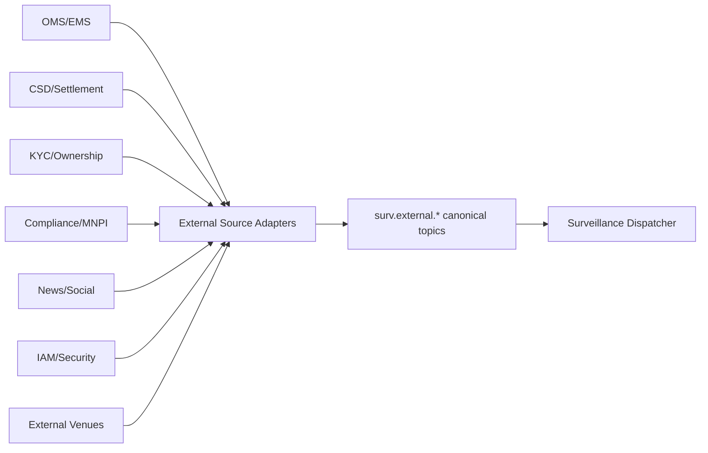

# External Event Contracts

## Purpose

DROP provides the core exchange market/order/trade/reference feed. It does **not prove availability of every data domain required by the 540 surveillance cases**.

This note defines the additional event contracts THE EYE should support when those source systems are connected.

> [!IMPORTANT]
> These contracts describe what THE EYE needs. They do not claim the current DROP platform already provides the data.

## Common external envelope

External events use the same evidence principles as DROP events:

```text
EventId
EventType
SchemaVersion
SourceSystem
SourceRecordId / SourceSequence when available
EventTime
ReceiveTime
BusinessDate?
SubjectIds
InstrumentIds
CorrelationIds
RawSourceReference / hash when appropriate
Kafka topic/partition/offset after ingestion
ReplayRunId?
```

Every adapter must preserve the original source identifiers and source timestamp.

---

## 1. ClientOrderInstructionEvent

### Why

Required for front-running, trading ahead, misuse of client-order information and client/proprietary conflict cases.

### Minimum fields

```text
ClientInstructionId
ParentOrderId?
ClientAccountId
Investor/BeneficialOwnerId when available
Broker/ParticipantId
Trader/ActorId receiving instruction
InstrumentId
Side
OrderType
LimitPrice?
Quantity
InstructionTime
Amend/CancelTime?
Channel
Agency/Principal classification
Confidentiality/restriction flags?
```

### Gather from

Broker OMS/client-order capture system. Ingest the original instruction **before** child exchange orders are generated where possible.

### Join to DROP

```text
ClientOrderInstruction
 -> clientOrderId / parent order / broker mapping
 -> DROP Order.orderId / clientOrderId / orderToken / actor/account
```

Do not infer the original client instruction only from the resulting exchange order when the case requires knowledge of what the broker knew earlier.

---

## 2. RoutingDecisionEvent

### Why

Required for routing bias, internalization, venue conflict and execution-quality cases.

### Minimum fields

```text
RoutingDecisionId
ParentClientOrderId
ChildOrderId
DecisionTime
InstrumentId
Side
Quantity
LimitPrice?
ChosenVenue
CandidateVenues?
RoutingAlgorithm/version
ReasonCode?
Broker/Desk/Trader
Internalized flag
Expected market snapshot reference
```

### Gather from

OMS/EMS/smart-order-router audit stream.

### Join to DROP

Child exchange order ID/client token and timestamp.

---

## 3. BorrowLocateEvent

### Why

Required for short-sale locate/availability abuse.

### Minimum fields

```text
LocateId
RequestTime
DecisionTime
AccountId
InvestorId?
ParticipantId
InstrumentId
RequestedQty
ApprovedQty
Status
BorrowSource
Rate/Fee?
ExpiryTime?
```

### Gather from

Broker short-sale locate/borrow system.

### DROP relationship

Combine with:

```text
OrderLifecycleEvent
TradeSideEvent
AccountPositionEvent.AvailableLoanQty
```

`AccountPositionUpdate.availableLoanQty` is useful context but is not by itself a full locate audit trail.

---

## 4. SecuritiesLoanEvent

### Why

Required for securities-lending rate/fee/availability and return abuse.

### Minimum fields

```text
LoanId
EventAction = Open|Modify|Return|Recall|Close
EventTime
LenderId
BorrowerId
Account/Investor/Participant ids
InstrumentId
Quantity
Rate
Fee
CollateralType/Value?
SettlementDate
RecallDate?
ReturnDate?
```

### Gather from

Securities-lending platform / CSD lending records.

---

## 5. SettlementObligationEvent

### Why

Required for settlement manipulation, fails-to-deliver, delivery pressure and squeeze cases.

### Minimum fields

```text
ObligationId
Trade/Match reference
Account/Participant/Investor
InstrumentId
Quantity
CashValue
TradeDate
SettlementDate
Status
SettledQuantity
FailedQuantity
FailureReason?
Counterparty
LastUpdated
```

### Gather from

CSD/settlement system.

### Derived

`FailToDeliverFact` should be calculated from obligation history rather than inventing a fail solely from trading data.

---

## 6. BeneficialOwnershipRelationshipEvent

### Why

DROP supplies Investor and Account relationships, but coordinated/nominee surveillance may need a broader legal/relationship graph.

### Minimum fields

```text
RelationshipId
EntityAType/Id
EntityBType/Id
RelationshipType
OwnershipPercent?
ControlType?
NomineeFlag?
Family/Corporate/AuthorizedTrader relationship?
ValidFrom
ValidTo?
Source/verification level
```

### Gather from

KYC/CRM/beneficial-owner master, member records and compliance reference systems.

### Rule

Keep source confidence/effective dates. Relationship data is often historical and must be resolved as-of alert time.

---

## 7. InsiderAccessEvent

### Why

Required for insider dealing and misuse of material non-public information.

### Minimum fields

```text
AccessEventId
Person/Employee/RelatedEntityId
Issuer/InstrumentId
InformationCaseId
AccessStart
AccessEnd?
Role
RestrictionType
Watch/RestrictedListStatus
Reason/ProjectCode?
```

### Gather from

Compliance restricted/watch lists, HR/person-role master, deal-room/MNPI access controls where legally permitted.

### Important

Trading around a corporate event is not enough to prove insider access. This event supplies the missing relationship/context leg.

---

## 8. MaterialIssuerEvent

### Why

Needed for event-driven trading, insider and corporate-news scenarios beyond the limited DROP corporate/announcement payload.

### Minimum fields

```text
IssuerEventId
IssuerId
InstrumentIds
EventType
AnnouncementTime
EffectiveTime?
Public/NonPublic transition time?
Materiality classification
SourceDocumentId/hash
```

### Gather from

Official issuer/regulatory disclosure systems and internal compliance event master.

### Relationship to DROP

Cross-check with `CorporateActionEvent` and `MarketAnnouncementEvent`; do not discard richer external terms.

---

## 9. OfferingAllocationEvent

### Why

Required for IPO/new issue/allocation/stabilization cases.

### Minimum fields

```text
OfferingId
Issuer/Instrument
EventAction
BookOpen/Close times
PricingTime
OfferPrice
AllocationAccount/Investor
RequestedQty
AllocatedQty
Participant/Bookrunner
RestrictedPeriodStart/End
StabilizationMandate?
```

### Gather from

Primary-market/book-building/allocation systems.

---

## 10. MarketMakerObligationEvent

### Why

Required to distinguish normal market-making from obligation/exemption abuse.

### Minimum fields

```text
AssignmentId
ParticipantId
ActorId?
InstrumentId
Role
EffectiveFrom/To
RequiredSpread?
RequiredSize?
RequiredPresencePercent?
Exemptions
```

### Gather from

Exchange participant/market-maker configuration and obligation master.

---

## 11. ExternalVenueMarketEvent

### Why

AwayMarketBestBidOffer only supplies top-of-book context. Some cross-venue/cross-market cases require full external orders/trades or richer market data.

### Minimum fields

Use the same normalized market contracts where possible:

```text
ExternalOrderEvent
ExternalTradeEvent
ExternalBboEvent
ExternalMarketStateEvent
```

with:

```text
VenueId
NativeSourceId/Sequence
Instrument mapping
EventTime
Order/trade/price/quantity fields
Source evidence
```

### Gather from

Authorized external venue feeds / consolidated data sources.

### Rule

Maintain explicit instrument and clock-normalization mappings; never assume two venues use the same instrument ID or timestamp convention.

---

## 12. InstrumentRelationshipEvent

### Why

Required for cross-product, derivative, ETF/index and related-instrument manipulation.

### Minimum fields

```text
RelationshipId
InstrumentId
RelatedInstrumentId
RelationshipType = Underlying|Derivative|ETFConstituent|IndexConstituent|DRUnderlying|Hedge|Other
Weight/Ratio?
ValidFrom/To
```

### Gather from

Instrument master, derivatives master, ETF basket and index-constituent sources.

### DROP contribution

`Asset` + `OrderBook` provide product and option/repo attributes. Use them first; add this event only for relationships not represented by DROP.

---

## 13. BenchmarkDefinitionEvent

### Why

Required for benchmark/VWAP/TWAP/NAV/settlement fixing cases where the benchmark methodology/window is not fully encoded in DROP.

### Minimum fields

```text
BenchmarkId
BenchmarkType
Instrument/Constituents
CalculationWindow
FixingTime
MethodologyVersion
Weights?
EligibleTradeRules?
PublicationTime
```

### Gather from

Official benchmark/index/NAV configuration source.

### DROP contribution

Use `TradeStatisticsEvent`, `IndexPriceEvent`, `ReferencePriceEvent` and executions as observed market inputs.

---

## 14. TradeReportSubmissionEvent

### Why

Required when surveillance must compare what was submitted, corrected and published rather than only the resulting trade record.

### Minimum fields

```text
SubmissionId
SubmissionTime
TradeReference
Participant/Actor
Instrument
Price
Quantity
Side/Counterparty
ReportType
Status
CorrectionOf?
PublicationTime?
Reject/ErrorCode?
```

### Gather from

Trade-reporting gateway/audit system.

### DROP contribution

`OffExchangeTradeEvent` and Trade report fields may cover part of this domain. Use the external source only where the original submission/publication lifecycle is not fully represented.

---

## 15. NewsPromotionEvent

### Why

Required for social-media pump-and-dump, rumor and promotional manipulation cases.

### Minimum fields

```text
ContentId
PublishTime
SourcePlatform/Publisher
Author/Account
Text/ContentHash
MentionedIssuer/InstrumentIds
URL/source reference
Edit/Delete timestamps?
Promotion/Sponsorship metadata?
```

Optional derived NLP fields:

```text
ExtractedClaims
Sentiment
Topic
EntityMentions
RiskScore
```

### Gather from

Authorized news/social/regulatory/public information feeds.

### Rule

Keep original content hash/reference. NLP/AI interpretation is derived and versioned; it must not replace source evidence.

---

## 16. AccountSecurityEvent

### Why

Required for account takeover / hacked-account manipulation.

### Minimum fields

```text
SecurityEventId
Account/UserId
EventTime
EventType = Login|Logout|PasswordReset|MFAChange|DeviceChange|SessionRisk|Lock|Unlock|CredentialCompromise
DeviceId/hash?
IP/network indicator?
Geo/Channel?
Risk flags
```

### Gather from

IAM/authentication/fraud-security telemetry subject to security/privacy controls.

### Join

Map security identity to trading Account/Investor/Actor before correlating suspicious trading.

---

## 17. PositionLimitEvent

### Why

Required for position-limit, corner and squeeze scenarios.

### Minimum fields

```text
LimitId
Instrument/Product
Participant/Account/Investor scope
LongLimit
ShortLimit
Net/Gross rule
EffectiveFrom/To
Exemption?
```

### Gather from

Regulatory/exchange risk and position-limit master.

### Combine with

`AccountPositionEvent`, executions, settlement and lending positions.

---

## 18. TenderOfferEvent

### Why

Required for tender, record-date and restricted-period cases where generic corporate-action codes are insufficient.

### Minimum fields

```text
TenderId
Issuer/Instrument
Offeror
AnnouncementTime
Start/End
RecordDate?
OfferPrice/Consideration
Eligibility rules
Restricted periods
Amendments
```

### Gather from

Corporate-action/tender master or official regulatory source.

---

## Optional supporting event: CommunicationEvent

Where legally available, internal broker/trader communications may help investigate collusion or misuse of client information.

This is **not required to start deterministic market-pattern detection** and should be integrated only with explicit governance, retention and access controls.

## Acquisition architecture

External sources should enter through isolated adapters:



Do not put external API/network calls inside Orleans grain hot paths.

## Event-time and history rule

For every external source:

- keep source event time and receive time separately;
- preserve correction/cancel/version history;
- use effective-from/effective-to for reference/relationship data;
- make replay deterministic;
- record source adapter/schema version;
- do not silently overwrite historical values with current values.

## Availability states

Each external event domain must be explicitly labeled:

```text
NotConnected
ConnectedUnvalidated
ValidatedLive
ValidatedReplay
Degraded
```

Rules requiring unavailable domains must not evaluate as if the missing data were false. Candidate routing should mark them `NotEvaluableMissingDomain`.

## Navigation

- [[07 - Complete Surveillance Event Catalog|Complete Surveillance Event Catalog]]
- [[12 - Case Family Event Coverage Matrix|Case Family Event Coverage Matrix]]
- [[13 - Event Processing Blocks|Event Processing Blocks]]
- [[14 - Data Quality and Capability Gaps|Data Quality and Capability Gaps]]
- [[MOCs/01 - Surveillance Case Map|540 Surveillance Cases]]
