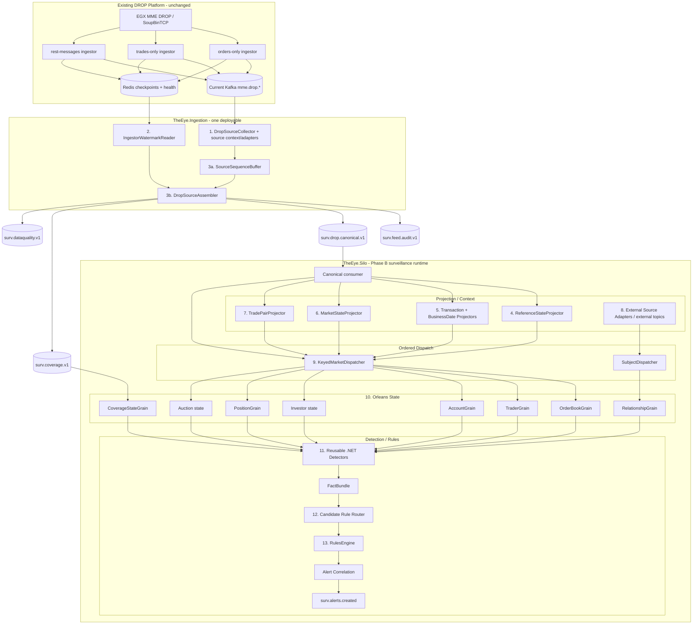

# Event Processing Blocks

> [!IMPORTANT]
> Deployment ownership has changed from the earlier diagram. Blocks 1–3 run inside **one `TheEye.Ingestion` deployable**. Blocks 4–13 are Silo/downstream surveillance responsibilities. Kafka `surv.drop.canonical.v1` is the hard boundary.

See [[15 - Current Runtime Architecture and Fix Plan|Current Runtime Architecture and Fix Plan]].

## Full current flow



## Block 1 - Source collection/context/adapters

**Runs inside `TheEye.Ingestion`.**

Inputs: documented current `mme.drop.*` topics that actually exist after broker topic reconciliation.

Responsibilities:

- consume with `theeye-source-assembly-v1`;
- keep exact Kafka coordinates;
- decode the existing MME application's Kafka header encoding;
- map through the typed DROP adapter;
- validate header/payload identity;
- quarantine malformed/lying records;
- push valid records to source-sequence assembly.

Source-quality inputs `mme.drop.parsed.unhandled` and raw DLQ are planned but not wired yet.

Must not:

- detect gaps independently per topic;
- query Oracle for the hot path;
- resolve Account → Investor;
- call Orleans grains.

---

## Block 2 - IngestorWatermarkReader

**Runs inside `TheEye.Ingestion`.**

Reads the three current Redis checkpoint/health records and supplies conservative progress proof to the assembler.

If Redis is unavailable, it must not invent progress/gaps. Contiguous known data may release; an unresolved hole must stall.

---

## Block 3 - SourceSequenceBuffer / DropSourceAssembler

**Runs inside `TheEye.Ingestion`.**

Responsibilities:

- global source-sequence reorder;
- deterministic replay/duplicate classification;
- source identity validation;
- source-gap declaration only after proven safe watermark;
- canonical/audit/coverage/data-quality publication.

It does **not** own:

```text
reference projection
Account → Investor enrichment
transaction/business-date projection
market state
trade pairing
Orleans dispatch
```

### Source offset safety

The source Kafka offset is not safe simply because the record entered `SourceSequenceBuffer` in RAM.

A record becomes commit-safe only after its durable terminal output is published. Commit only the highest contiguous safe source offset per topic-partition.

Detailed logic: [[09 - Source Assembly and Ordering Logic|Source Assembly and Ordering Logic]].

---

## Canonical Kafka boundary

`surv.drop.canonical.v1` is the Silo's normal DROP market/reference input.

Initial ordering contract:

```text
one partition per SequenceDomain
producer emits increasing MmeSequenceNumber
Silo consumes each domain lane sequentially
```

Parallelism begins after ordered canonical consumption.

---

## Block 4 - ReferenceStateProjector

**Silo-side.** Consumes canonical reference events in source order.

Builds as-of state for:

```text
participant
actor
account / account type / account group
investor
asset / order book
custodian
corporate action
other reference messages
```

### Investor ownership

The Ingestor only transports `InvestorReferenceEvent` and `AccountReferenceEvent`.

The projector resolves:

```text
Order/Trade account → Account → InvestorId → Investor
```

Detailed design: [[10 - Reference State and Enrichment Strategy|Reference State and Enrichment Strategy]].

---

## Block 5 - Transaction / BusinessDate projectors

**Silo-side.** Maintain deterministic correlation/context from canonical source events:

```text
StartOfTransaction -> transaction open per DROP partition
Commit             -> transaction closed
InitialBusinessDate / BusinessDateChanged -> current business-date context
```

Do not require the raw Ingestor to mutate every canonical event with derived transaction/business-date state.

---

## Block 6 - MarketStateProjector

**Silo-side.** Maintains lightweight market context:

```text
SessionChange
BBO
EquilibriumPrice
ReferencePrice
PriceLimits
CircuitBreaker
IndexPrice
TradeStatistics
AwayMarketBBO
```

Detectors receive explicit context rather than fetching mutable infrastructure directly.

---

## Block 7 - TradePairProjector

**Silo-side.**

Input:

```text
TradeSideEvent
```

Output:

```text
MatchedTradeEvent
```

Key primarily by `matchId`, with consistency checks for side/order book/price/quantity/lifecycle. Keep both original source sides permanently addressable by EventId.

Trade pairing is not an Ingestor/SourceAssembly responsibility.

---

## Block 8 - External Source Adapters

Normalize OMS, settlement, lending, KYC, news, security, external venue and other domains to contracts from [[11 - External Event Contracts|External Event Contracts]].

External data remains separate from the raw DROP Ingestor boundary.

---

## Block 9 - KeyedMarketDispatcher

**Hosted with the Silo-side runtime.**

Reads already-ordered canonical/projected events and routes to state owners while preserving relative order per key.

Suggested keys:

```text
venueId|orderBookId
actorId
accountId
investorId
participantId
```

Do not use one global SurveillanceGrain.

---

## Block 10 - Orleans state owners

### OrderBookGrain

Owns live book/order lifecycle and short book windows.

### TraderGrain / AccountGrain / Investor state

Own subject-level rolling behavior across instruments where needed.

### PositionGrain

Owns position/availability state and position-derived windows.

### RelationshipGrain

Owns relationship state from canonical DROP + validated external KYC/ownership sources.

### Auction state

Start inside `OrderBookGrain` when ownership is naturally per book; split only if lifecycle/state warrants it.

### CoverageStateGrain

Owns compact coverage transitions/gaps only, not every market message.

---

## Block 11 - Reusable detectors

Normal .NET classes, not independent state owners by default.

```text
state/context in
facts out
no Kafka/DB/network side effects
```

Examples include order lifetime, cancellation ratio, displayed-size anomaly, depth pressure, opposite-side execution, price impact, wash/self relationships, auction impact and position/relationship coordination.

---

## Block 12 - Candidate Rule Router

Routes only relevant facts/rule packs using FactType, MarketPhase, instrument profile, subject type and available data domains.

Missing required data domain => `NotEvaluableMissingDomain`.

---

## Block 13 - Rules + Alert Correlation

Rules decide suspicious combinations; correlation prevents duplicate/noisy alerts.

Every alert keeps:

```text
CaseId
RuleVersion
DetectorVersion
ThresholdProfileVersion
SubjectIds
InstrumentIds
WindowStart/End
Source EventIds
MME sequence range/list
Kafka evidence coordinates
CoverageEpoch/degraded flag
External evidence refs when used
ReplayRunId?
```

## Hot-path rules

Do not put these in the market hot path:

```text
Oracle/PostgreSQL calls
remote APIs
synchronous news/KYC queries
long ML inference
full historical scans
```

## Live vs replay

Use the same canonical contracts and detector/rule logic:

```text
Live Ingestor → canonical Kafka → live Silo
Archive/canonical replay → replay Silo
```

Do not mix replay state into live grains.

## Navigation

- [[00 - Implementation Start Home|Implementation Start Home]]
- [[15 - Current Runtime Architecture and Fix Plan|Current Runtime Architecture and Fix Plan]]
- [[09 - Source Assembly and Ordering Logic|Source Assembly and Ordering Logic]]
- [[10 - Reference State and Enrichment Strategy|Reference State and Enrichment Strategy]]
- [[03 - Order Book Surveillance Core|Order Book Surveillance Core]]
- [[05 - Dotnet Solution Starting Structure|.NET Solution Starting Structure]]
