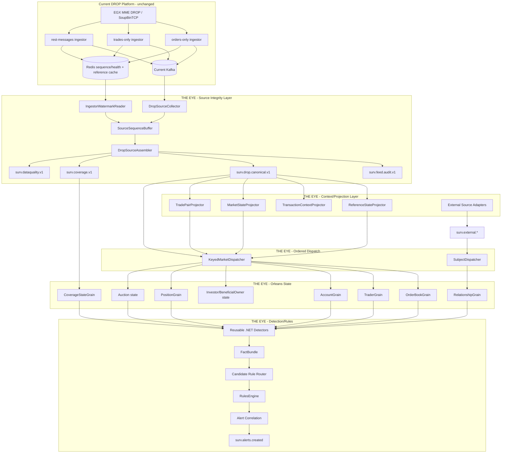

# Event Processing Blocks

## Full starting flow



## Block 1 - DropSourceCollector

### Inputs

All authoritative current DROP source topics from [[08 - DROP Event Acquisition Matrix|DROP Event Acquisition Matrix]], plus source-quality topics:

```text
mme.drop.parsed.unhandled
mme.drop.raw.messages.dlq
```

### Responsibilities

- consume with a dedicated surveillance consumer group;
- copy exact Kafka coordinates;
- read source headers;
- deserialize without changing source meaning;
- push records into sequence assembly.

### Must not

- detect gaps per topic;
- query Oracle for the live event path;
- use enriched events as authoritative source evidence.

---

## Block 2 - IngestorWatermarkReader

Reads the three current Redis checkpoint/health records.

Purpose:

```text
What source progress has each current ingestor safely published?
```

It supplies a conservative watermark to the assembler. It is not a fraud detector.

---

## Block 3 - SourceSequenceBuffer / DropSourceAssembler

Responsibilities:

- global source-sequence reorder;
- replay/duplicate classification;
- source identity validation;
- source gap declaration only after safe watermark;
- attach business-date/transaction context;
- emit globally ordered canonical source stream.

Detailed logic: [[09 - Source Assembly and Ordering Logic|Source Assembly and Ordering Logic]].

---

## Block 4 - ReferenceStateProjector

Consumes canonical reference events in source order.

Outputs:

```text
as-of participant state
as-of actor state
as-of account/investor state
as-of asset/orderbook state
as-of custodian/account type/group state
```

Detailed design: [[10 - Reference State and Enrichment Strategy|Reference State and Enrichment Strategy]].

---

## Block 5 - TransactionContextProjector

Maintains current transaction/matching-round state per DROP partition:

```text
StartOfTransaction -> transaction open
messages           -> stamp transactionId when applicable
Commit             -> transaction closed
```

This gives surveillance a correlation boundary without changing the raw payload.

---

## Block 6 - MarketStateProjector

Maintains lightweight current market context:

```text
SessionChange
BBO
EquilibriumPrice
ReferencePrice
PriceLimits
CircuitBreaker
IndexPrice
TradeStatistics
AwayMarketBBO
BusinessDate
```

This context is supplied to detectors; detectors do not fetch it from Kafka/Redis themselves.

---

## Block 7 - TradePairProjector

Input:

```text
TradeSideEvent
```

Output:

```text
MatchedTradeEvent
```

Key primarily by `matchId`, with source consistency checks around side, order book, price/quantity and trade lifecycle.

Keep both original source sides permanently addressable by event ID.

---

## Block 8 - External Source Adapters

Adapters for OMS, settlement, lending, KYC, news, security, external venue and other domains.

Rules:

- normalize to contracts from [[11 - External Event Contracts|External Event Contracts]];
- isolate source-specific APIs/protocols from Orleans;
- preserve original source identity;
- publish to `surv.external.*` topics;
- expose data-domain availability state.

---

## Block 9 - KeyedMarketDispatcher

Reads canonical source sequence in order, then sends events to state owners while preserving relative order per key.

Suggested book key:

```text
venueId|orderBookId
```

Suggested subject keys:

```text
trader/actorId
accountId
investorId
participantId
```

Do not use a single global SurveillanceGrain.

---

## Block 10 - Orleans state owners

### OrderBookGrain

Owns live book/order lifecycle and short book windows.

### TraderGrain / AccountGrain / Investor state

Owns subject-level rolling behavior across instruments where needed.

### PositionGrain

Owns position/availability state and position-derived windows.

### RelationshipGrain

Owns graph/relationship state from DROP + validated external KYC/ownership data.

### Auction state

Can be a dedicated `AuctionGrain` or partition of `OrderBookGrain` depending measured complexity. Start inside `OrderBookGrain` when the auction belongs cleanly to one book; split only when lifecycle/state warrants it.

### CoverageStateGrain

Owns compact coverage epochs/gaps only. It does not receive every market message.

---

## Block 11 - Reusable detectors

Normal .NET classes, not independent state owners by default.

Examples:

```text
OrderLifetimeDetector
CancellationRatioDetector
DisplayedSizeAnomalyDetector
MultiLevelDepthPressureDetector
OppositeSideExecutionDetector
PriceImpactDetector
TimePriceQuantityMatchDetector
SelfRelatedOwnerDetector
VolumeParticipationDetector
AuctionImpactDetector
PositionConcentrationDetector
RelationshipCoordinationDetector
```

Detector rule:

```text
state comes in
facts come out
no Kafka/DB/network side effects
```

---

## Block 12 - Candidate Rule Router

Does not evaluate 540 rules for every event.

Routing key can use:

```text
FactType
MarketPhase
InstrumentProfile
AvailableDataDomains
SubjectType
```

Missing required data domain => `NotEvaluableMissingDomain`, not a false negative.

---

## Block 13 - Rules + Alert Correlation

Rules decide suspicious combinations; alert correlation prevents noisy duplicates and combines related episodes.

Every alert must retain:

```text
CaseId
RuleVersion
DetectorVersion
ThresholdProfileVersion
SubjectIds
InstrumentIds
WindowStart/End
Source EventIds
MME sequence range/list
Kafka evidence coordinates
CoverageEpoch/degraded flag
External source evidence refs when used
ReplayRunId?
```

## Hot-path rules

The market hot path must not contain:

```text
Oracle calls
PostgreSQL calls
remote external API calls
synchronous news/KYC queries
long-running ML inference
full historical scans
```

Those are fed asynchronously or preprojected.

## Live vs replay

Use the same canonical contracts and detector/rule code.

```text
Live source -> live canonical stream -> live Orleans cluster
Archive/Kafka replay -> replay canonical stream -> replay Orleans cluster
```

Do not mix replay state into live grains.

## Navigation

- [[00 - Implementation Start Home|Implementation Start Home]]
- [[09 - Source Assembly and Ordering Logic|Source Assembly and Ordering Logic]]
- [[10 - Reference State and Enrichment Strategy|Reference State and Enrichment Strategy]]
- [[11 - External Event Contracts|External Event Contracts]]
- [[03 - Order Book Surveillance Core|Order Book Surveillance Core]]
- [[05 - Dotnet Solution Starting Structure|.NET Solution Starting Structure]]
