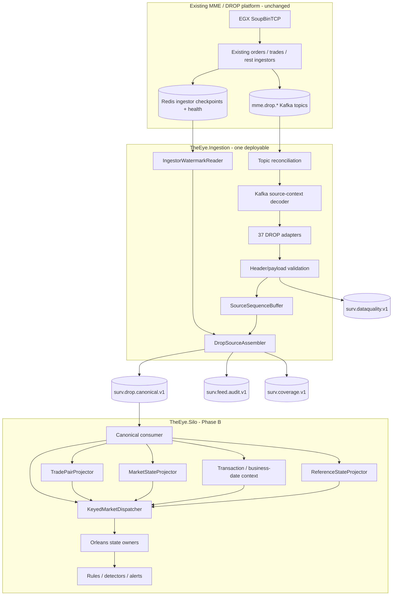

# Current Runtime Architecture and Fix Plan

> [!IMPORTANT]
> This note is the **current implementation authority for the Ingestor → Kafka → Silo boundary**. It reflects the built `TheEye.Ingestion` service and supersedes older diagrams that show SourceAssembly as a separate deployable, the Ingestor calling Orleans directly, or the Silo consuming the raw DROP topic set.

## Current architecture



## Hard boundary

### `TheEye.Ingestion` owns source correctness

It owns:

- source-topic discovery/reconciliation;
- Kafka source-header decoding;
- DROP adapter mapping without changing business meaning;
- header/payload identity validation;
- deterministic `EventId`;
- replay duplicate classification;
- source-sequence buffering/reordering;
- safe-watermark gap decisions;
- malformed-record quarantine;
- canonical/audit/coverage/data-quality publication.

`TheEye.SourceAssembly` remains a **C# library hosted inside `TheEye.Ingestion`**, not a separate Docker service.

### `TheEye.Silo` owns surveillance meaning

It owns:

- consuming `surv.drop.canonical.v1`;
- reference projections;
- account → investor resolution;
- transaction/business-date context;
- market/order-book state;
- trade-side pairing;
- Orleans routing/grain state;
- surveillance facts, rules, detectors and alerts.

The Silo does **not** consume the 37 raw DROP topics for normal market/reference processing and does not know source watermarks/header encoding/sparse-topic gap mechanics.

## Investor rule

The Ingestor publishes Investor and Account as independent canonical reference events.

```text
InvestorReferenceEvent ─┐
AccountReferenceEvent  ─┼─> surv.drop.canonical.v1 ─> Silo ReferenceStateProjector
ActorReferenceEvent    ─┤
ParticipantReferenceEvent┘
```

The Silo builds:

```text
Order/Trade account
      ↓
Account reference
      ↓
InvestorId
      ↓
Investor reference/state
```

Do not enrich Order/Trade with Investor by querying mutable Redis inside the Ingestor.

## Current implementation status

Built/live-observed behavior:

- `TheEye.Ingestion` hosts SourceAssembly in-process;
- canonical boundary is Kafka, not direct Orleans calls;
- deterministic source identity + replay dedupe are implemented;
- watermark-gated gap declaration is implemented;
- malformed/lying records are quarantined to `surv.dataquality.v1`;
- live topic reconciliation found only **22 of 37 documented topics** currently present;
- source-quality topics (`mme.drop.parsed.unhandled`, raw DLQ) are not wired yet;
- `SequenceEpoch` reset semantics remain unverified;
- first live record proved the assumed Kafka header-width contract was wrong.

## Fix plan

### P0.1 - Fix source-offset durability

Current risk:

```text
consume source record
→ store only in RAM reorder buffer
→ commit Kafka source offset
→ process crashes before canonical publication
```

That can create silent surveillance loss.

Target:

```text
consume
→ validate/buffer
→ release in safe MME order
→ durably publish canonical/audit/data-quality outcome
→ mark that source record safe
→ commit only the highest contiguous safe offset per Kafka topic-partition
```

Important implementation rules:

- do not commit a later offset past an earlier not-yet-durable record in the same Kafka partition;
- replay duplicates are acceptable and are removed by deterministic `EventId`;
- malformed records become safe only after their data-quality evidence is published;
- exact replay duplicates can become safe when the original durable identity is already known;
- if a sequence hole stalls release, apply bounded-buffer/backpressure rather than acknowledging volatile records.

### P0.2 - Prove canonical ordering contract

For the first production version:

- one `surv.drop.canonical.v1` partition per `SequenceDomain`;
- producer writes released events in increasing `MmeSequenceNumber` order;
- Silo canonical consumer applies that ordered lane sequentially before keyed parallel dispatch;
- integration test asserts monotonic sequence order per domain.

Do not add canonical partitions casually; that would undo the assembler's ordering work.

### P0.3 - Fix/confirm Kafka header contract

The Nasdaq DROP binary specification defines the **payload** layout, not the serialization used by the existing MME application for Kafka headers.

Confirm from live evidence and preferably producer source code:

- `mme-sequence-number`;
- `drop-group-id`;
- `drop-message-id`;
- `drop-partition-id`.

The live run already showed that assuming payload-style fixed widths for all Kafka headers is incorrect. Add fixtures for the confirmed real encodings and fail loudly/quarantine unknown encodings.

### P0.4 - Confirm `SequenceDomain` and `SequenceEpoch`

Prove:

- whether the three existing source families share one global MME sequence domain;
- exactly when/reset how MME sequence numbering restarts;
- the stable rule used to generate/configure `SequenceEpoch`.

Do not replace `unverified-epoch` until this is known.

### P1.1 - Classify source-topic availability

Every registry entry must be one of:

```text
Required
Optional
NotProvisioned
```

Missing `Required` topic => coverage degraded.

Missing `Optional` / `NotProvisioned` topic => warning/visibility, but not automatic permanent false degradation.

Reconcile the 15 currently absent documented topics against the real broker/topic configuration.

### P1.2 - Make sequence conflicts durable

Add `SourceSequenceConflictEvent` to `surv.dataquality.v1` when one sequence contains distinct source identities.

Evidence should include:

- SequenceDomain/Epoch/number;
- both EventIds/message identities;
- Kafka topic/partition/offset;
- payload hashes.

Do not leave this as log-only evidence.

### P1.3 - Wire source-quality topics

When present, consume:

```text
mme.drop.parsed.unhandled
mme.drop.raw.messages.dlq
```

and emit durable `UnknownDropMessageEvent` / parse-failure evidence so a source message cannot disappear from coverage merely because normal parsing failed.

### P1.4 - Redis/watermark outage behavior

When Redis watermark proof is unavailable:

- keep the last trustworthy watermark;
- release only already-contiguous known sequences;
- stop at the first unresolved hole;
- never invent a gap;
- expose buffer depth/stall metrics and apply backpressure if needed.

The phrase "canonical keeps flowing" must not be interpreted as "skip an unproven hole".

## Required crash/replay tests

Before Phase B is considered production-safe:

1. crash after source consume, before buffer insert;
2. crash after buffer insert, before release;
3. crash after canonical publish, before source offset commit;
4. restart and verify no canonical source event is missing;
5. replay duplicate input and verify final state applies once by `EventId`;
6. delay one source family and verify no false coverage gap;
7. remove Redis watermark access and verify unresolved holes stall rather than skip;
8. verify source-partition commits advance only across contiguous durable records;
9. verify canonical topic sequence is monotonic per domain.

## Phase B starting point

After P0 items pass, start Silo work in this order:

```text
Canonical consumer/deserializer
→ ReferenceStateProjector
→ account/investor resolution
→ transaction/business-date projector
→ market/order-book projector
→ TradePairProjector
→ KeyedMarketDispatcher
→ Orleans state owners
→ reusable detectors
→ RulesEngine
→ alerts
```

## Superseded architecture shapes

Do not use these as current runtime designs:

```text
raw DROP topics → Silo directly
Ingestor → Orleans grains directly
SourceAssembly as its own network/container service
Ingestor-side Account/Investor enrichment
Source assembler performing trade pairing/reference projection
```

Current shape is always:

```text
raw MME/DROP → TheEye.Ingestion (+ SourceAssembly library)
             → surv.drop.canonical.v1
             → TheEye.Silo
             → projectors / Orleans / rules / detectors
```

## Navigation

- [[00 - Implementation Start Home|Implementation Start Home]]
- [[01 - Global Sequence and Feed Continuity|Global Sequence and Feed Continuity]]
- [[02 - Canonical Event Contract|Canonical Event Contract]]
- [[05 - Dotnet Solution Starting Structure|.NET Solution Starting Structure]]
- [[08 - DROP Event Acquisition Matrix|DROP Event Acquisition Matrix]]
- [[09 - Source Assembly and Ordering Logic|Source Assembly and Ordering Logic]]
- [[10 - Reference State and Enrichment Strategy|Reference State and Enrichment Strategy]]
- [[13 - Event Processing Blocks|Event Processing Blocks]]
- [[14 - Data Quality and Capability Gaps|Data Quality and Capability Gaps]]
