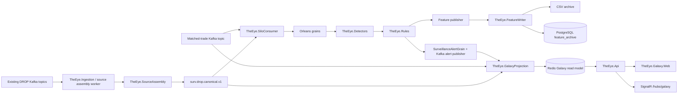

# Development Implementation Snapshot

> [!IMPORTANT]
> This is the **code-backed current implementation mirror** for `the-eye-v2/development` at commit `664cde8f30e9a2b5731520c394097d38d6262cae`. When a design note conflicts with this snapshot, this snapshot describes what is actually implemented at that commit.

Source commit: [the-eye-v2@664cde8f](https://github.com/adnanelhabashy/the-eye-v2/commit/664cde8f30e9a2b5731520c394097d38d6262cae)

## Status legend

- **Implemented** — executable code exists in the audited commit.
- **Partial** — code exists but the intended end-to-end behavior is incomplete or has a documented gap.
- **Planned** — described by architecture/design material but not implemented in the audited code.
- **Not found** — no implementation was found in the audited source tree.

## Actual runtime shape

> [!WARNING]
> The canonical and matched-trade lanes are still consumed independently before they mutate the same Orleans state. The repository itself documents this as a real cross-topic ordering defect. See [[21 - Current Implementation Gaps and Known Defects]].

## Physical project inventory

| Project | Current role | Status |
|---|---|---|
| `TheEye.Contracts` | Canonical envelopes, events, evidence, facts and coverage contracts | Implemented |
| `TheEye.Domain` | Domain/state/window primitives | Implemented |
| `TheEye.DropAdapters` | DROP message-to-canonical adapters | Implemented |
| `TheEye.SourceAssembly` | Source collection, sequence buffering/frontiers, watermarking, canonical production and coverage | Implemented |
| `TheEye.Ingestion` | Canonical deserialization, DROP source assembly worker, routing/settings and enriched-trade compatibility path | Implemented / Partial |
| `TheEye.GrainContracts` | Orleans commands, views and grain interfaces | Implemented |
| `TheEye.OrleansHosting` | Localhost or ADO.NET clustering, ADO.NET grain storage and reminders | Implemented |
| `TheEye.Silo` | Order-book, coordination/deep-scan, trader, actor and surveillance-alert grains | Implemented |
| `TheEye.SiloConsumer` | Orleans client + independent canonical/matched-trade Kafka consumers | Implemented / Partial |
| `TheEye.Detectors` | Reusable spoof/layer and wash/matched/circular detectors | Implemented |
| `TheEye.Rules` | Rule packs, case policies and evaluators | Implemented |
| `TheEye.FeatureStore` | Feature contracts, validation, revision/ranking, publication support | Implemented |
| `TheEye.FeatureWriter` | Durable Kafka-to-CSV/PostgreSQL feature archive and export | Implemented |
| `TheEye.GalaxyProjection` | Canonical/trade/alert projection into Redis + realtime delta buffer | Implemented |
| `TheEye.Galaxy.Web` | React/Three.js investigation UI | Implemented |
| `TheEye.GalaxyLoad` | Galaxy load scenario/runner | Implemented |
| `TheEye.Api` | ASP.NET Core API, co-hosted Orleans silo, auth, rate limiting, Galaxy queries, SignalR, dashboard, development ingestion endpoints | Implemented |
| `TheEye.SyntheticData` | Synthetic surveillance data generation | Implemented |
| test projects | unit, ingestion, source-assembly, silo, feature-writer, persistence and synthetic tests | Implemented |

The ASP.NET project targets `.NET 10` and currently references Orleans `10.2.2`, ASP.NET Core JWT bearer `10.0.10`, Confluent.Kafka `2.15.0`, and the Orleans dashboard. Source: [TheEye.Api.csproj](https://github.com/adnanelhabashy/the-eye-v2/blob/664cde8f30e9a2b5731520c394097d38d6262cae/TheEye.Api/TheEye.Api.csproj).

## Implemented Orleans state owners

The grain contracts in the audited code expose:

- `IOrderBookGrain`
- `ICoordinationWindowGrain`
- `ICoordinationDeepScanGrain`
- `ITraderGrain`
- `IActorGrain`
- `ISurveillanceAlertGrain`

Source: [GrainInterfaces.cs](https://github.com/adnanelhabashy/the-eye-v2/blob/664cde8f30e9a2b5731520c394097d38d6262cae/TheEye.GrainContracts/Grains/GrainInterfaces.cs).

The larger planned grain set in [[05 - Dotnet Solution Starting Structure]] — such as `CoverageStateGrain`, `AccountGrain`, `InvestorGrain`, `PositionGrain`, `RelationshipGrain`, auction/settlement/lending grains — is **not the current physical implementation** at this commit.

## Implemented surveillance scope

Two active rule packs are registered:

1. `SpoofLayer`
2. `WashMatched`

The active case policies in those packs are:

- Spoofing
- Self Trade
- Wash Trade
- Matched Trade
- Circular Trade

This means the repository contains the architectural catalog for hundreds of cases, but the active executable case implementation at this commit is a much smaller subset. See [[18 - Detectors Rules and Alerts Implementation]].

## Current implementation references

- [[17 - Runtime Pipeline and Orleans Implementation]]
- [[18 - Detectors Rules and Alerts Implementation]]
- [[19 - Feature Store and Archive Implementation]]
- [[20 - Galaxy Implementation]]
- [[21 - Current Implementation Gaps and Known Defects]]
- [[22 - Test and Verification Surface]]
- [[23 - Contracts and DROP Adapter Implementation]]
- [[24 - Local Runtime and Persistence Implementation]]
- [[DTO-Reference/00 - DTO and Data Structure Implementation Map|DTO and Data Structure Implementation Map]]

## Audit scope

Included: executable source, project files, runtime registrations, configuration-facing code, infrastructure/scripts, tests and the repository's own current-issue analysis.

Excluded: generated/build artifacts such as `bin`, `obj`, package caches and other non-source outputs.
