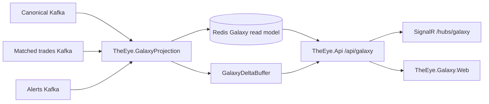

# Galaxy Implementation

Parent: [[16 - Development Implementation Snapshot]]

## Implemented architecture



## `TheEye.GalaxyProjection`

**Implemented.** The standalone host:

- binds `GalaxyOptions`;
- connects to Redis;
- registers `RedisGalaxyStore` as `IGalaxyStore`;
- registers `GalaxyProjector`;
- runs `GalaxyDeltaBuffer` as a hosted service;
- runs three independent Kafka consumers for:
  - canonical events;
  - matched trades;
  - alerts.

Each stream is projected into the Galaxy read model.

Source: [TheEye.GalaxyProjection/Program.cs](https://github.com/adnanelhabashy/the-eye-v2/blob/664cde8f30e9a2b5731520c394097d38d6262cae/TheEye.GalaxyProjection/Program.cs).

The project is physically separated into configuration, consumers, projection, read-model, realtime and storage folders.

## `TheEye.Api` Galaxy surface

**Implemented.** `/api/galaxy` is protected by the Surveillance Viewer policy and rate limiter. The API exposes read paths for:

- snapshot;
- actor and actor network;
- participant;
- actor accounts and actor activity;
- alerts;
- instruments and instrument actors;
- trade accounts;
- account actors;
- status;
- search.

Realtime updates are exposed over SignalR at `/hubs/galaxy`.

Source: [TheEye.Api/Program.cs](https://github.com/adnanelhabashy/the-eye-v2/blob/664cde8f30e9a2b5731520c394097d38d6262cae/TheEye.Api/Program.cs).

## `TheEye.Galaxy.Web`

**Implemented frontend.** The audited package is a Vite/TypeScript/React 19 application using:

- React `19.2.0`;
- React DOM `19.2.0`;
- Three.js `0.182.0`;
- `@react-three/fiber`;
- `@react-three/drei`;
- post-processing;
- Microsoft SignalR client `10.0.0`;
- Vitest.

Source: [package.json](https://github.com/adnanelhabashy/the-eye-v2/blob/664cde8f30e9a2b5731520c394097d38d6262cae/TheEye.Galaxy.Web/package.json).

The source tree includes the actual investigation UI components such as:

```text
App.tsx
GalaxyEye.tsx
GalaxyScene.tsx
FilterBar.tsx
InvestigationPanel.tsx
InvestigationScreen.tsx
SearchPalette.tsx
SelectedHud.tsx
api.ts
```

Source: [TheEye.Galaxy.Web/src](https://github.com/adnanelhabashy/the-eye-v2/tree/664cde8f30e9a2b5731520c394097d38d6262cae/TheEye.Galaxy.Web/src).

## `TheEye.GalaxyLoad`

**Implemented load harness.** The project contains `GalaxyLoadRunner`, `GalaxyLoadScenario`, a CLI entry point and README. It is intended to exercise the Galaxy API/read-model path under a defined load scenario.

Source: [TheEye.GalaxyLoad](https://github.com/adnanelhabashy/the-eye-v2/tree/664cde8f30e9a2b5731520c394097d38d6262cae/TheEye.GalaxyLoad).

## Important boundary

Galaxy is a **projection/read/investigation path**, not the authoritative surveillance state owner. Redis serves the Galaxy read model; Orleans remains the live mutable surveillance state path.

The Galaxy projector also consumes canonical and matched-trade topics independently. This is acceptable for a derived visualization only if revision/idempotency behavior keeps the projection coherent; it must not be mistaken for the authoritative grain ordering solution described in [[21 - Current Implementation Gaps and Known Defects]].
