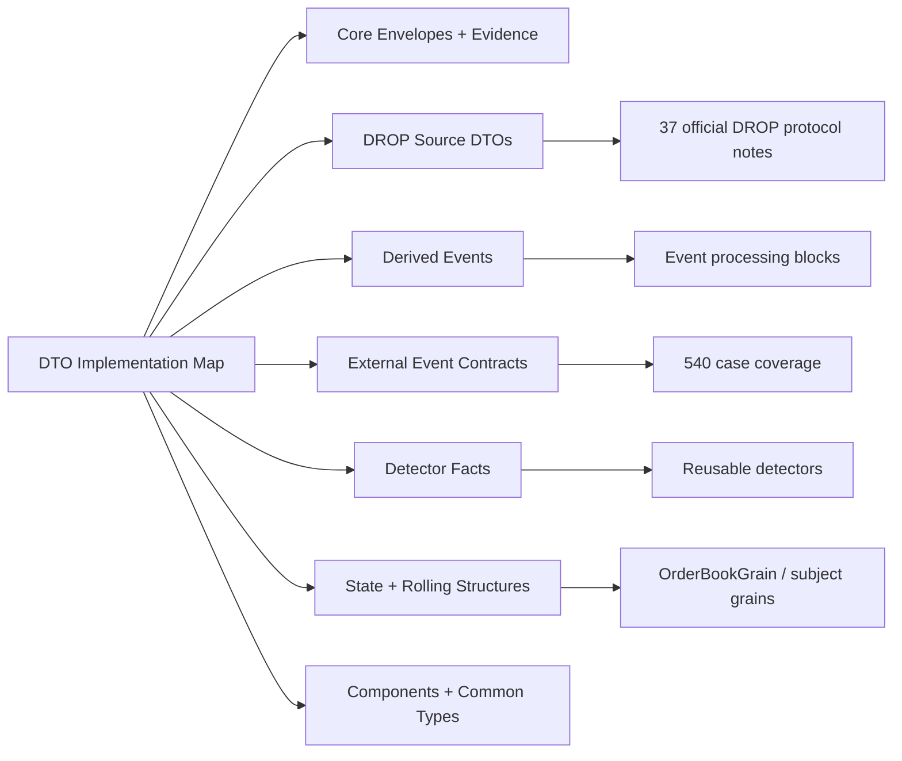

# DTO and Data Structure Implementation Map

> [!IMPORTANT]
> This is the implementation-reference hub for THE EYE contract and in-memory data model. It turns the active architecture into a code-facing map that can be browsed in Obsidian and followed during .NET 10 implementation.

## Scope

This map covers:

- canonical envelopes and forensic evidence structures;
- all 37 official Nasdaq DROP source DTOs;
- the current implementation-only `ImplementationSystemEvent`;
- nested source payload components;
- derived surveillance events;
- external-domain event contracts required by the 540-case program;
- detector fact contracts;
- coverage/evaluability contracts;
- order-book and rolling-window state structures used by Orleans/detectors.

The authoritative business/source semantics remain in the linked DROP protocol and active architecture notes. This implementation reference does not replace them.

## Contract-layer rule

The current codebase can keep the physical project named `Shared` while it plays the logical role documented as `TheEye.Contracts`.

```text
Shared / TheEye.Contracts
  = contracts + immutable evidence + small value objects
  != Kafka consumers
  != Orleans grain implementation
  != DB repositories
  != RulesEngine execution
```

See [[../05 - Dotnet Solution Starting Structure|.NET Solution Starting Structure]].

## Recommended code layout

```text
Shared/
├── Envelopes/
│   ├── DropEventEnvelope.cs
│   └── ExternalEventEnvelope.cs
├── Evidence/
│   ├── DerivedEventEvidence.cs
│   ├── SourceEventReference.cs
│   └── KafkaEvidence.cs
├── Events/
│   ├── Source/
│   │   ├── <37 official DROP event DTOs>
│   │   ├── ImplementationSystemEvent.cs
│   │   └── Components/
│   ├── Derived/
│   └── External/
├── Facts/
├── Coverage/
└── Common/
```

Namespaces may follow the actual solution convention; do not change namespace naming only to match this note. The **folder/ownership boundary** is the important decision.

## Implementation reference graph



## Reference pages

1. [[01 - Core Envelopes and Evidence Reference|Core Envelopes and Evidence Reference]]
2. [[02 - DROP Source DTO Implementation Reference|DROP Source DTO Implementation Reference]]
3. [[03 - Derived Event Implementation Reference|Derived Event Implementation Reference]]
4. [[04 - External Event Implementation Reference|External Event Implementation Reference]]
5. [[05 - Detector Fact Contract Reference|Detector Fact Contract Reference]]
6. [[06 - Orleans and Detector State Data Structures|Orleans and Detector State Data Structures]]
7. [[07 - Source Components Common Types and Enum Rules|Source Components, Common Types and Enum Rules]]

## Implementation status vocabulary

Use these values when tracking code against this map:

| Status | Meaning |
|---|---|
| `required` | Required by the active starting architecture. |
| `implemented-unverified` | Class exists locally but fields/types have not yet been checked against this reference. |
| `verified` | Class name, source fields/types and evidence rules have been checked. |
| `planned` | Contract is required later but does not need a live source in the first vertical slice. |
| `source-not-connected` | Contract exists but the external data source is not yet connected. |
| `implementation-specific` | Current platform DTO not defined by the supplied Nasdaq 3.0.11 protocol. |

## Verification rule for every DTO

A DTO is not considered complete just because a `.cs` file exists. Verification requires:

```text
1. Correct source/business meaning
2. Correct source field names and primitive types
3. No source field silently removed
4. No synthetic source identity invented
5. Correct EventTime mapping
6. Correct routing/join identifiers
7. SchemaVersion strategy defined
8. Replay identity deterministic where required
9. Source/Kafka evidence preserved
10. Unit serialization/deserialization test
```

## Layering rule

```text
Native DROP payload
      ↓ preserve exactly
DropEventEnvelope<TPayload>
      ↓ source assembly / ordering
Canonical source event
      ↓ projections
Resolved / derived event
      ↓ detectors
FactBundle
      ↓ rules
SurveillanceAlertEvent
```

External domains use the same evidence principle through `ExternalEventEnvelope<TPayload>`.

## Important source rules

- All 37 official DROP messages remain first-class replayable source events.
- `MmeSequenceNumber`, `DropPartitionId`, payload sequence-like fields and Kafka offsets are different concepts.
- `OrderLifecycleEvent` must retain native `changeReason`, `orderStatus`, `orderStatusBefore` and full quantity/ownership fields.
- `TradeSideEvent` is one side of a trade; `MatchedTradeEvent` is derived.
- Reference identities are resolved **as-of source sequence**, never by overwriting the raw source IDs.
- Missing external data means `NotEvaluableMissingDomain`, not a negative surveillance result.

See [[../02 - Canonical Event Contract|Canonical Event Contract]], [[../07 - Complete Surveillance Event Catalog|Complete Surveillance Event Catalog]] and [[../13 - Event Processing Blocks|Event Processing Blocks]].

## Definition of done for the contract layer

- all source DTOs verified against the protocol notes;
- envelope/evidence contracts implemented and serialization-tested;
- source component DTOs kept separate from top-level event DTOs;
- derived events retain explicit lineage to source event IDs;
- external contracts are represented even if their adapters are not connected;
- first detector facts are immutable and infrastructure-free;
- state models have bounded collections and deterministic update semantics;
- no contract project depends on Kafka, Orleans, PostgreSQL or RulesEngine packages.

## Navigation

- [[../00 - Implementation Start Home|Implementation Start Home]]
- [[../02 - Canonical Event Contract|Canonical Event Contract]]
- [[../05 - Dotnet Solution Starting Structure|.NET Solution Starting Structure]]
- [[../07 - Complete Surveillance Event Catalog|Complete Surveillance Event Catalog]]
- [[../11 - External Event Contracts|External Event Contracts]]
- [[../13 - Event Processing Blocks|Event Processing Blocks]]
- [[../../../MOCs/01 - Surveillance Case Map|540 Surveillance Cases]]
