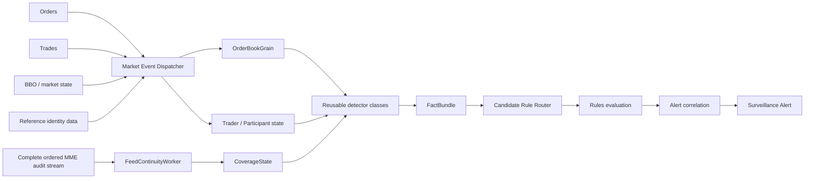

# Surveillance Detection Pipeline

> [!IMPORTANT]
> This is the **active starting pipeline**, not a claim that the final production design is frozen. It separates feed coverage from fraud detection and starts with the smallest reusable surveillance core.

## Separation of responsibilities

### 1. Feed continuity

`FeedContinuityWorker` watches the **complete global MME source sequence**. It does not detect fraud. It emits coverage-gap state/events when the real source sequence jumps.

See [[Architecture/Implementation-Start/01 - Global Sequence and Feed Continuity|Global Sequence and Feed Continuity]].

### 2. Order-book state

`OrderBookGrain`, keyed by `venueId|instrumentId`, owns the reconstructed live order book and short rolling market state needed for surveillance.

It does **not** expect its received source sequences to be contiguous because it only receives events relevant to that book.

See [[Architecture/Implementation-Start/03 - Order Book Surveillance Core|Order Book Surveillance Core]].

### 3. Fraud surveillance detectors

Normal .NET detector classes calculate reusable facts from grain state and the current event, for example:

- cancellation ratio;
- order lifetime;
- displayed-size anomaly;
- multi-level depth pressure;
- opposite-side execution;
- price impact;
- order-message burst rate.

These detectors are the "order-book watcher" concept: they continuously observe behavior around the live book and produce facts. They are not another state-owning `OrderBookWatcherGrain`.

### 4. Rules

Rules consume typed facts and decide whether a suspicious scenario is present. Do not execute all 540 case rules for every event; route only to relevant rule packs.

### 5. Coverage on alerts

Every alert must include whether evidence coverage was complete or degraded for the source sequence/time range used by the rule.

## Starting vertical slice

Implement first:

1. global feed continuity;
2. canonical event envelope;
3. `OrderBookGrain`;
4. first order-book detectors;
5. spoofing/layering starter rules;
6. alert evidence output;
7. deterministic replay tests.

See [[Architecture/Implementation-Start/04 - First Vertical Slice|First Vertical Slice]].

## Navigation

- [[Architecture/Implementation-Start/00 - Implementation Start Home|Implementation Start Home]]
- [[MOCs/03 - Reusable Detector Map|Reusable Detector Map]]
- [[MOCs/01 - Surveillance Case Map|Surveillance Case Map]]
- [[DROP-Current-System/06 - Surveillance Data Interface Boundary|Surveillance Data Interface Boundary]]
- [[00 - Project Home|Project Home]]
