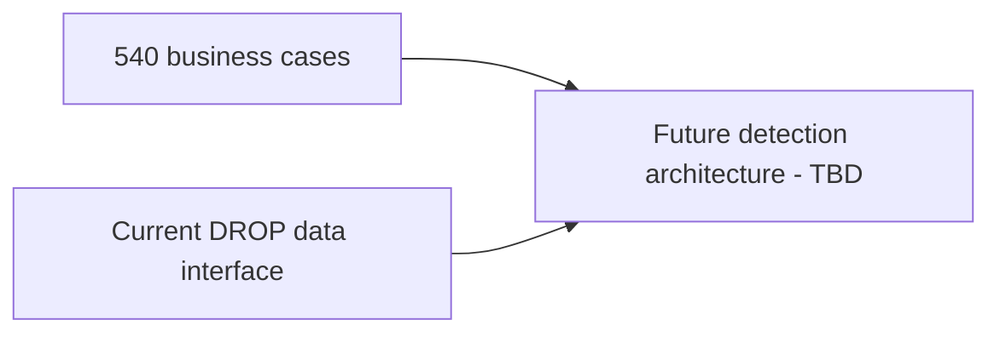

# Surveillance Detection Pipeline - Legacy Placeholder

> [!CAUTION]
> The previous Orleans + dynamic-rules pipeline is **not the active design**. The restarted project currently defines only the business case catalog and the data input boundary.

Use [[DROP-Current-System/06 - Surveillance Data Interface Boundary|Surveillance Data Interface Boundary]] and [[MOCs/01 - Surveillance Case Map|Surveillance Case Map]] as the current starting points.
