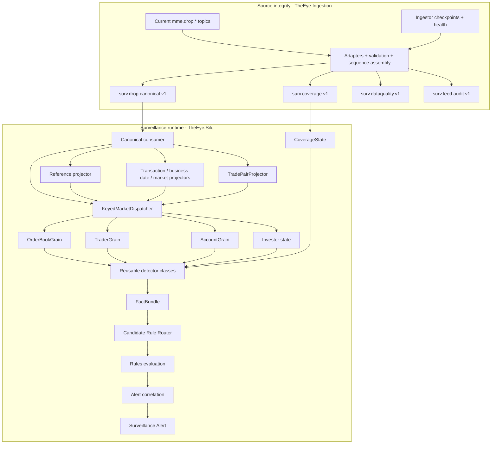

# Surveillance Detection Pipeline

> [!IMPORTANT]
> Current source boundary: `TheEye.Ingestion` converts the raw/sparse DROP topic set into the ordered `surv.drop.canonical.v1` stream. The surveillance runtime begins from that canonical topic.

See [[Architecture/Implementation-Start/15 - Current Runtime Architecture and Fix Plan|Current Runtime Architecture and Fix Plan]].

## Current pipeline



## Separation of responsibilities

### 1. Source integrity / feed continuity

`TheEye.Ingestion` owns:

```text
raw source topics
header/context decode
DROP adaptation + validation
MME source-sequence reorder
replay dedupe
watermark-proven gaps
source data-quality quarantine
canonical/audit/coverage publication
```

`TheEye.SourceAssembly` is an in-process library inside the Ingestor.

Feed continuity is not a separate post-audit `FeedContinuityWorker` in the current runtime design.

### 2. Canonical boundary

`surv.drop.canonical.v1` is the normal DROP input to `TheEye.Silo`.

Initial rule:

```text
one canonical Kafka partition per SequenceDomain
```

The Silo consumes that ordered lane sequentially before parallel keyed dispatch.

### 3. Reference/context projection

Silo-side projectors rebuild:

```text
reference state as-of source sequence
Account → Investor identity
transaction/business-date context
market/session context
trade-side pairing
```

The Ingestor does not perform these cross-event enrichments.

### 4. Order-book / subject state

`OrderBookGrain`, keyed by `venueId|orderBookId`, owns reconstructed book state and rolling market windows.

Trader/Account/Investor state owns subject behavior across books where required.

No grain expects globally contiguous sequence numbers because each grain receives only relevant events after keyed dispatch.

### 5. Fraud surveillance detectors

Normal .NET detector classes calculate reusable facts from explicit grain/projector state, for example:

- cancellation ratio;
- order lifetime;
- displayed-size anomaly;
- multi-level depth pressure;
- opposite-side execution;
- price impact;
- order-message burst rate;
- related-account/investor behavior.

Detectors do not query raw Kafka topics, mutable Redis reference state or databases directly.

### 6. Rules

Rules consume typed facts and decide whether a suspicious scenario is present. Do not execute all 540 case rules for every event; route only relevant rule packs.

### 7. Coverage on alerts

Every alert must include whether evidence coverage was complete/degraded for the sequence/time range used by the rule.

## Reliability gate before detectors

Before production detector logic relies on this path:

```text
fix source-offset durability
confirm real Kafka header encodings
confirm SequenceDomain / SequenceEpoch
prove canonical monotonic ordering
reconcile Required / Optional / NotProvisioned topics
prove Redis outage does not invent gaps
```

Prefer replay duplicates over silent source event loss; deterministic `EventId` makes state application idempotent.

## Starting vertical slice

Current order:

1. finish Ingestor P0 reliability fixes;
2. canonical consumer/deserializer in Silo;
3. ReferenceStateProjector + Account → Investor resolution;
4. transaction/business-date/market/trade-pair projectors;
5. `KeyedMarketDispatcher`;
6. `OrderBookGrain` + subject state;
7. first order-book detectors;
8. spoofing/layering starter rules;
9. alert evidence output;
10. deterministic crash/replay tests.

See [[Architecture/Implementation-Start/04 - First Vertical Slice|First Vertical Slice]].

## Navigation

- [[Architecture/Implementation-Start/15 - Current Runtime Architecture and Fix Plan|Current Runtime Architecture and Fix Plan]]
- [[Architecture/Implementation-Start/00 - Implementation Start Home|Implementation Start Home]]
- [[MOCs/03 - Reusable Detector Map|Reusable Detector Map]]
- [[MOCs/01 - Surveillance Case Map|Surveillance Case Map]]
- [[DROP-Current-System/06 - Surveillance Data Interface Boundary|Surveillance Data Interface Boundary]]
- [[00 - Project Home|Project Home]]
