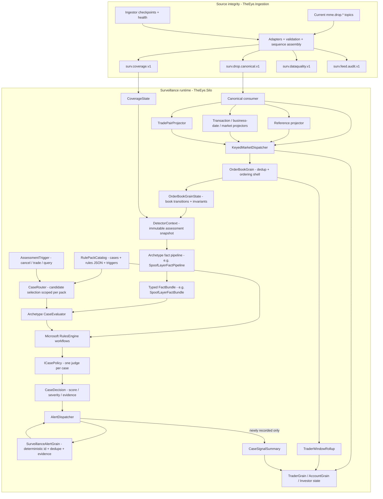

# Surveillance Detection Pipeline

> [!IMPORTANT]
> Current source boundary: `TheEye.Ingestion` converts the raw/sparse DROP topic set into the ordered `surv.drop.canonical.v1` stream. The surveillance runtime begins from that canonical topic.

See [[Architecture/Implementation-Start/15 - Current Runtime Architecture and Fix Plan|Current Runtime Architecture and Fix Plan]].

## Current pipeline



## Separation of responsibilities

### 1. Source integrity / feed continuity

`TheEye.Ingestion` owns:

```text
raw source topics
header/context decode
DROP adaptation + validation
MME source-sequence reorder
replay dedupe
watermark-proven gaps
source data-quality quarantine
canonical/audit/coverage publication
```

`TheEye.SourceAssembly` is an in-process library inside the Ingestor.

Feed continuity is not a separate post-audit `FeedContinuityWorker` in the current runtime design.

### 2. Canonical boundary

`surv.drop.canonical.v1` is the normal DROP input to `TheEye.Silo`.

Initial rule:

```text
one canonical Kafka partition per SequenceDomain
```

The Silo consumes that ordered lane sequentially before parallel keyed dispatch.

### 3. Reference/context projection

Silo-side projectors rebuild:

```text
reference state as-of source sequence
Account -> Investor identity
transaction/business-date context
market/session context
trade-side pairing
```

The Ingestor does not perform these cross-event enrichments.

### 4. Order-book / subject state

`OrderBookGrain`, keyed by `venueId|orderBookId`, owns reconstructed book state and rolling market windows.

Trader/Account/Investor state owns subject behavior across books where required.

No grain expects globally contiguous sequence numbers because each grain receives only relevant events after keyed dispatch.

### 5. Detector context and reusable facts

Detectors do not read mutable live state directly while rules are being evaluated. The grain freezes the required evidence into an immutable `DetectorContext` for the assessment.

Normal .NET detector/fact-pipeline classes then calculate reusable typed measurements, for example:

- cancellation ratio;
- order lifetime;
- displayed-size anomaly;
- multi-level depth pressure;
- opposite-side execution;
- price impact;
- order-message burst rate;
- related-account/investor behavior.

Detectors do not query raw Kafka topics, mutable Redis reference state or databases directly.

### 6. Archetype fact pipelines

Cases that need the same type of evidence share one typed archetype pipeline.

Example:

```text
DetectorContext
    -> SpoofLayerFactPipeline
    -> SpoofLayerFactBundle
    -> SpoofLayerCaseEvaluator
```

The fact pipeline calculates measurements. It does not decide whether a regulatory case should alert.

### 7. Candidate routing

Do not evaluate all 540 cases on every event.

`CaseRouter` selects only relevant packs using the trigger first, and later can include:

```text
FactType
MarketPhase
InstrumentProfile
AvailableDataDomains
```

Routing is scoped to the archetype pack. A spoof/layer fact bundle must never be evaluated against auction, wash-trade or unrelated workflows.

### 8. Rules and case policy

RulesEngine workflows evaluate the typed fact bundle. `ICasePolicy` is then the final case-specific judge that converts raw rule outcomes into a `CaseDecision`.

This keeps the responsibility split clear:

```text
grains own mutable state
detectors/fact pipelines calculate facts
RulesEngine evaluates declarative conditions
ICasePolicy owns the case verdict
```

A `CaseDecision` carries the case id, independent score/severity, rule version, threshold version, evidence and evaluability state.

### 9. Alert recording and subject signals

Only alerting `CaseDecision` results reach `AlertDispatcher`.

`SurveillanceAlertGrain` owns deterministic alert identity and deduplication. The dispatcher receives either `Recorded` or `Duplicate`.

Subject behavior is updated in two separate ways:

- every evaluated assessment can emit `TraderWindowRollup` style behavioral state;
- only a newly recorded alert emits a `CaseSignalSummary` so replay/duplicates do not inflate subject signals.

### 10. Coverage on alerts

Every alert and rule result must include whether evidence coverage was complete/degraded for the sequence/time range used by the rule.

Missing a required external domain means `NotEvaluableMissingDomain`, not a clean result.

## Adding a case in an existing archetype

Within an archetype, adding another case should not require grain or contract changes.

Example: adding another case to the Spoof/Layer archetype:

1. Add `XxxPolicy : ICasePolicy` in `src/TheEye.Rules/` with `CaseId`, `WorkflowName` and `Decide(outcomes) -> CaseDecision`.
2. Add the RulesEngine workflow to the archetype rules JSON, sharing the existing typed fact bundle.
3. Register the policy in the archetype pack, for example `RulePackCatalog.SpoofLayer.Cases`.
4. Add policy decision tests plus fact-pipeline characterization tests with golden measurements/decisions.

Normally there is **no change** to `OrderBookGrain`, canonical contracts, the fact pipeline, dispatcher or alert infrastructure.

## Adding a new archetype

A genuinely different evidence shape gets a parallel branch rather than modifying an unrelated one.

1. Add `XxxFactPipeline` + typed `XxxFactBundle`.
2. Reuse `DetectorContext` when possible; extend it only when the archetype genuinely needs more book/context state.
3. Add `XxxCaseEvaluator`, scoped only to `RulePackCatalog.Xxx`.
4. Add the new `RulePackCatalog` entry: `PackId`, `RulesFile`, `Triggers`, `Cases`.
5. Register the evaluator in DI and inject it into the relevant grain/runtime owner.
6. Add ingestion/triggers only if this archetype needs event types not already applied by the state owner.
7. Put mutable state where ownership belongs: book-level -> `OrderBookGrainState`; participant/trader across books -> `TraderGrain`; account-level -> `AccountGrain`. Do not create a per-case `XxxState` unless the domain genuinely requires independent state ownership.

## Reliability gate before detectors

Before production detector logic relies on this path:

```text
fix source-offset durability
confirm real Kafka header encodings
confirm SequenceDomain / SequenceEpoch
prove canonical monotonic ordering
reconcile Required / Optional / NotProvisioned topics
prove Redis outage does not invent gaps
```

Prefer replay duplicates over silent source event loss; deterministic `EventId` makes state application idempotent.

## Starting vertical slice

Current order:

1. finish Ingestor P0 reliability fixes;
2. canonical consumer/deserializer in Silo;
3. ReferenceStateProjector + Account -> Investor resolution;
4. transaction/business-date/market/trade-pair projectors;
5. `KeyedMarketDispatcher`;
6. `OrderBookGrain` + subject state;
7. immutable `DetectorContext` + first archetype fact pipeline;
8. scoped case routing + first case policies;
9. spoofing/layering starter rules;
10. deterministic alert recording + evidence output;
11. subject rollups/signals;
12. deterministic crash/replay tests.

See [[Architecture/Implementation-Start/04 - First Vertical Slice|First Vertical Slice]].

## Navigation

- [[Architecture/Implementation-Start/15 - Current Runtime Architecture and Fix Plan|Current Runtime Architecture and Fix Plan]]
- [[Architecture/Implementation-Start/00 - Implementation Start Home|Implementation Start Home]]
- [[Architecture/Implementation-Start/03 - Order Book Surveillance Core|Order Book Surveillance Core]]
- [[Architecture/Implementation-Start/06 - First Detector Specifications|First Detector Specifications]]
- [[MOCs/03 - Reusable Detector Map|Reusable Detector Map]]
- [[MOCs/01 - Surveillance Case Map|Surveillance Case Map]]
- [[DROP-Current-System/06 - Surveillance Data Interface Boundary|Surveillance Data Interface Boundary]]
- [[00 - Project Home|Project Home]]
