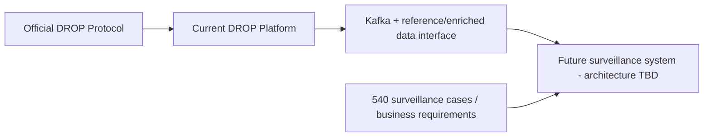

# Current DROP System - Source-of-Truth Home

> [!IMPORTANT]
> This folder documents the **current EGX Nasdaq MME DROP feed and the currently deployed DROP ingestion/enrichment/persistence platform**. It deliberately stops at the data boundary. It does **not** choose the new surveillance implementation architecture.

## Read in this order

1. [[DROP-Current-System/01 - DROP Protocol Overview|DROP Protocol Overview]]
2. [[DROP-Current-System/02 - DROP Message Catalog|DROP Message Catalog - all 37 protocol messages]]
3. [[DROP-Current-System/03 - Current DROP Runtime Architecture|Current DROP Runtime Architecture]]
4. [[DROP-Current-System/04 - Entity and Identity Model|Entity and Identity Model]]
5. [[DROP-Current-System/05 - Business Data Dictionary and Join Keys|Business Data Dictionary and Join Keys]]
6. [[DROP-Current-System/06 - Surveillance Data Interface Boundary|Surveillance Data Interface Boundary]]
7. [[DROP-Current-System/07 - Order and Transaction Lifecycle|Order and Transaction Lifecycle]]
8. [[DROP-Current-System/08 - Kafka Topic Catalog|Kafka Topic Catalog]]
9. [[DROP-Current-System/09 - Redis State and Reference Cache|Redis State and Reference Cache]]
10. [[DROP-Current-System/10 - Persistence and Database Model|Persistence and Database Model]]
11. [[DROP-Current-System/11 - Airflow Orchestration|Airflow Orchestration]]
12. [[DROP-Current-System/12 - Runtime Guarantees and Known Gaps|Runtime Guarantees and Known Gaps]]
13. [[DROP-Current-System/13 - Current Capacity HA and Deployment Baseline|Current Capacity, HA and Deployment Baseline]]
14. [[DROP-Current-System/14 - Proposed DROP HA and Hardware Target|Proposed DROP HA and Hardware Target]]
15. [[DROP-Current-System/15 - Source Classification and Reliability|Source Classification and Reliability]]

## Scope rule

- **Authoritative for protocol:** Nasdaq DROP Protocol Specification for MME EGX revision 3.0.11.
- **Authoritative for current deployment:** `ACTIVE_ARCHITECTURE.md` plus service/infrastructure references.
- **Proposals are labeled proposal-only.**
- **Legacy surveillance implementation material is not authoritative.** The new surveillance solution will be designed later from business requirements and this data interface.

