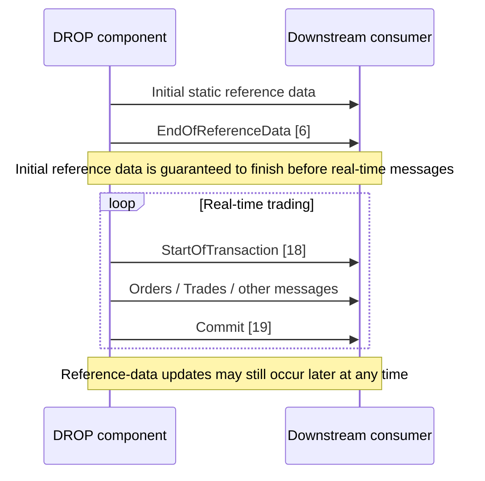

# DROP Protocol Overview

## Purpose

The Nasdaq DROP protocol is an internal high-throughput mirrored feed from the trading system toward a data platform / downstream persistent-storage consumer. It is **not** an inbound trading API and is intentionally close to the trading system's internal representations so stored/audited data can be compared with what gateways disseminate.

## Transport and encoding

- Transport: **SoupBinTCP**.
- All messages are prefixed by `messageGroup` (Short), `messageId` (Short), and `partitionId` (Byte).
- The protocol uses **little-endian** byte order.
- Timestamps and date fields are `Long` values expressed as **nanoseconds since epoch**.
- Strings are variable-length and prefixed by a two-byte length; string contents are one-byte ANSI characters.
- Single arrays are prefixed with a two-byte element count.

## Startup and live-flow contract

## Message families

- Transactional Data Messages
- Reference Data Messages
- Account Related Messages
- Order and Trade Messages
- Price Information Messages
- Miscellaneous Messages

See [[DROP-Current-System/02 - DROP Message Catalog|DROP Message Catalog]].

## Important protocol boundary

The specification explicitly de-scopes inbound messaging. It is dedicated to efficient internal transfer from trading to the data platform and should not be modified into a customer-specific integration protocol.

## Source

`NDAQ_MME_DROP_ProtSpec_EGX.pdf`, revision 3.0.11, especially pp. 9-11 and 52-53.
