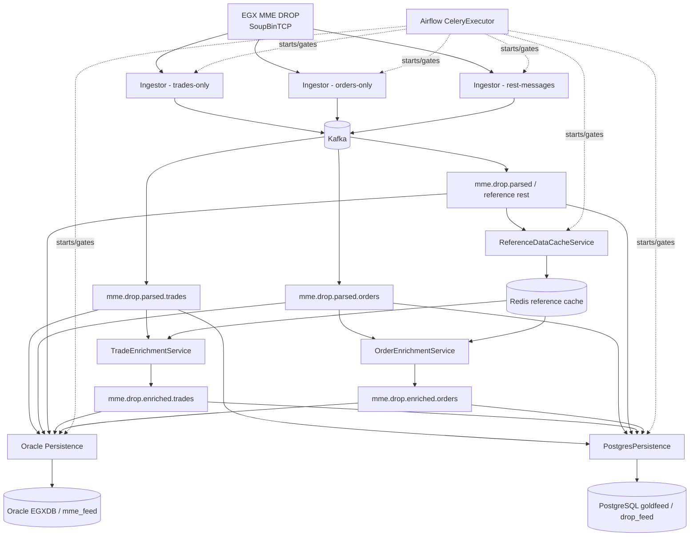
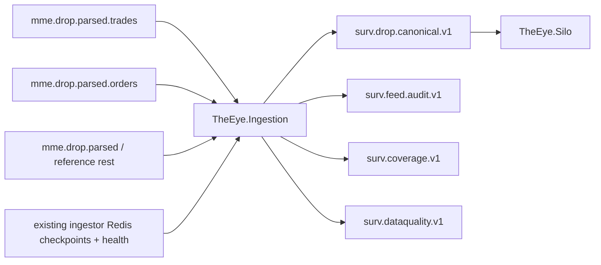

# Current DROP Runtime Architecture

> [!NOTE]
> This note describes the **existing DROP platform itself**, which remains unchanged. THE EYE's current downstream boundary is documented in [[Architecture/Implementation-Start/15 - Current Runtime Architecture and Fix Plan|Current Runtime Architecture and Fix Plan]].

## End-to-end current DROP flow

## Active C# services

| Service | Current role |
|---|---|
| `MME.Drop.Ingestor` | SoupBinTCP feed ingestion, binary DROP parsing, Kafka production. Deployed as three role-specific instances. |
| `ReferenceDataCacheService` | Consumes reference topics and materializes Redis hashes. |
| `TradeEnrichmentService` | Pairs trade sides using Redis pending lists and enriches trade data from reference state. |
| `OrderEnrichmentService` | Enriches each order using Redis reference state. |
| `MME.Drop.Persistence` | Multi-container Oracle raw/struct/summary persistence. |
| `PostgresPersistence` | Persists supported messages to PostgreSQL JSONB payload tables. |

`MMEDropGateway` and `MessageParserService` exist in source but are documented as **not part of the current five-DAG application deployment**.

## Current DROP architectural invariants

- Feed order is preserved within each Kafka partition by the existing ingestor's sequential production and `MaxInFlight=1`.
- Each ingestor stores its next MME sequence checkpoint in Redis and requests replay from that sequence after reconnect.
- The MME source sequence is treated operationally as **global across message types inside its real source sequence domain**.
- Because deployment publishes separate family/topic subsets, sequence values inside one orders/trades/reference topic are naturally sparse. A jump in one filtered topic is not by itself a source gap.
- Kafka does not establish global ordering across separate family topics.
- A pre-activation in-memory buffer holds up to 4096 messages; overflow is a possible source gap until upstream replay behavior is fully proven.
- Reference cache and structured persistence are explicitly gated during startup.
- Current trade matching uses Redis pending lists and has cross-system crash/race windows described in [[DROP-Current-System/12 - Runtime Guarantees and Known Gaps|Runtime Guarantees and Known Gaps]].

## Current THE EYE surveillance implication

Earlier planning considered adding or finding a complete pre-family-filter audit stream. **The current chosen implementation does not require a fourth DROP session or a new existing-platform producer.**

THE EYE now reconstructs the trustworthy source stream downstream:

`TheEye.Ingestion` hosts `TheEye.SourceAssembly` as a library and reorders the union of current source topics by validated MME sequence using conservative progress/watermark evidence.

This design remains valid only if Phase-0/P0 proves:

- real Kafka source header encoding;
- source-domain/epoch semantics;
- source topic union is sufficient for required coverage;
- current Redis checkpoints are safe enough as progress proof;
- source offsets are not committed before durable canonical/data-quality representation;
- canonical output preserves sequence-domain ordering.

The first live run found only **22/37 documented source topics** present, so required/optional/not-provisioned topic classification remains part of the validation gate.

If downstream proof eventually shows the current outputs cannot reconstruct required source coverage, then a source-side audit enhancement may be reconsidered. It is no longer the default architecture.

## Detail notes

- [[DROP-Current-System/Services/MME Drop Ingestor|MME Drop Ingestor]]
- [[DROP-Current-System/Services/Reference Data Cache Service|Reference Data Cache Service]]
- [[DROP-Current-System/Services/Order Enrichment Service|Order Enrichment Service]]
- [[DROP-Current-System/Services/Trade Enrichment Service|Trade Enrichment Service]]
- [[DROP-Current-System/Services/Oracle Persistence Service|Oracle Persistence Service]]
- [[DROP-Current-System/Services/Postgres Persistence Service|Postgres Persistence Service]]
- [[DROP-Current-System/06 - Surveillance Data Interface Boundary|Surveillance Data Interface Boundary]]
- [[Architecture/Implementation-Start/15 - Current Runtime Architecture and Fix Plan|Current Runtime Architecture and Fix Plan]]
