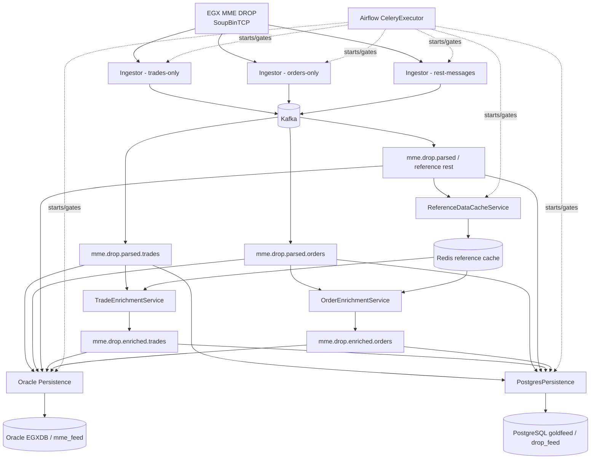

# Current DROP Runtime Architecture

## End-to-end current flow

## Active C# services

| Service | Current role |
|---|---|
| `MME.Drop.Ingestor` | SoupBinTCP feed ingestion, binary DROP parsing, Kafka production. Deployed as three role-specific instances. |
| `ReferenceDataCacheService` | Consumes reference topics and materializes Redis hashes. |
| `TradeEnrichmentService` | Pairs trade sides using Redis pending lists and enriches trade data from reference state. |
| `OrderEnrichmentService` | Enriches each order using Redis reference state. |
| `MME.Drop.Persistence` | Multi-container Oracle raw/struct/summary persistence. |
| `PostgresPersistence` | Persists supported messages to PostgreSQL JSONB payload tables. |

`MMEDropGateway` and `MessageParserService` exist in source but are documented as **not part of the current five-DAG application deployment**.

## Current architectural invariants

- Feed order is preserved within each Kafka partition by the ingestor's sequential production and `MaxInFlight=1`.
- Each ingestor stores its next MME sequence checkpoint in Redis and requests replay from that sequence after reconnect.
- The MME source sequence is treated operationally as **global across message types inside its real source sequence domain**.
- Because the current deployment publishes separate family/topic subsets, source sequence values inside a single orders/trades/reference topic are expected to be sparse. A jump inside one filtered topic is not by itself a source gap.
- Kafka does not establish global ordering across the separate family topics. A future surveillance consumer must not merge topic arrival order and call that MME source order.
- A pre-activation in-memory buffer holds up to 4096 messages; overflow is a possible data gap until upstream replay behavior is proven.
- Reference cache and structured persistence are explicitly gated during startup.
- Trade matching currently uses Redis pending lists and has cross-system crash/race windows described in [[DROP-Current-System/12 - Runtime Guarantees and Known Gaps|Runtime Guarantees and Known Gaps]].

## Surveillance implication

The current family topics are suitable as business payload inputs, but they are insufficient by themselves for exact global feed-gap detection.

The surveillance branch therefore requires either:

1. an existing stream that contains **every source message in exact MME sequence order**, or
2. a new lightweight audit/sequence stream emitted at the complete ordered source point before family filtering.

See [[Architecture/Implementation-Start/01 - Global Sequence and Feed Continuity|Global Sequence and Feed Continuity]].

## Detail notes

- [[DROP-Current-System/Services/MME Drop Ingestor|MME Drop Ingestor]]
- [[DROP-Current-System/Services/Reference Data Cache Service|Reference Data Cache Service]]
- [[DROP-Current-System/Services/Order Enrichment Service|Order Enrichment Service]]
- [[DROP-Current-System/Services/Trade Enrichment Service|Trade Enrichment Service]]
- [[DROP-Current-System/Services/Oracle Persistence Service|Oracle Persistence Service]]
- [[DROP-Current-System/Services/Postgres Persistence Service|Postgres Persistence Service]]
- [[DROP-Current-System/06 - Surveillance Data Interface Boundary|Surveillance Data Interface Boundary]]
