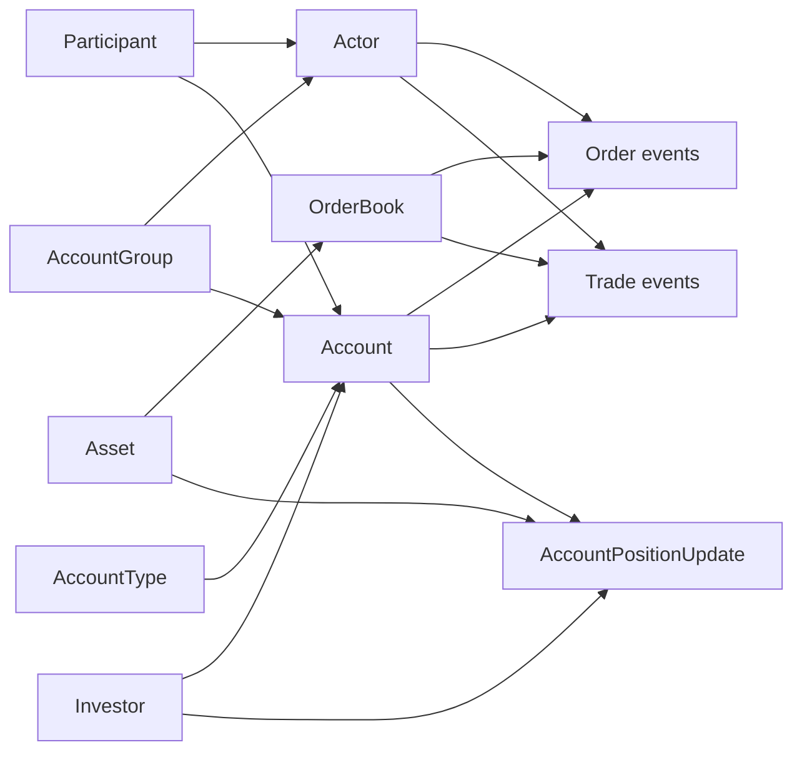

# Entity and Identity Model

This is the business identity graph directly supported by the DROP reference and transaction messages.

## Key links

- `Actor.participantId` -> `Participant.id`.
- `Actor.allowedAccounts` -> `AccountGroup.accountGroupId`.
- `Account.investorId` -> `Investor.investorId`.
- `Account.participantId` -> `Participant.id`.
- `Account.accountTypeId` -> `AccountType.accountTypeId`.
- `OrderBook.assetId` -> `Asset.id`.
- Orders carry `participantId`, `actorId`, submitter/on-behalf identities, account and custodian values.
- Trades carry participant/actor/account/custodian plus `counterPartyActorId`.
- `AccountPositionUpdate` can link asset + participant + account + investor in one position record.

## Why this matters for surveillance business requirements

The feed does not expose only prices and trades; it contains a usable identity chain from **participant (broker)** to **actor (trading user/session)** and, through accounts, to **investor**, plus instrument and custodian context. Any new surveillance design should preserve these identities as first-class business dimensions.
