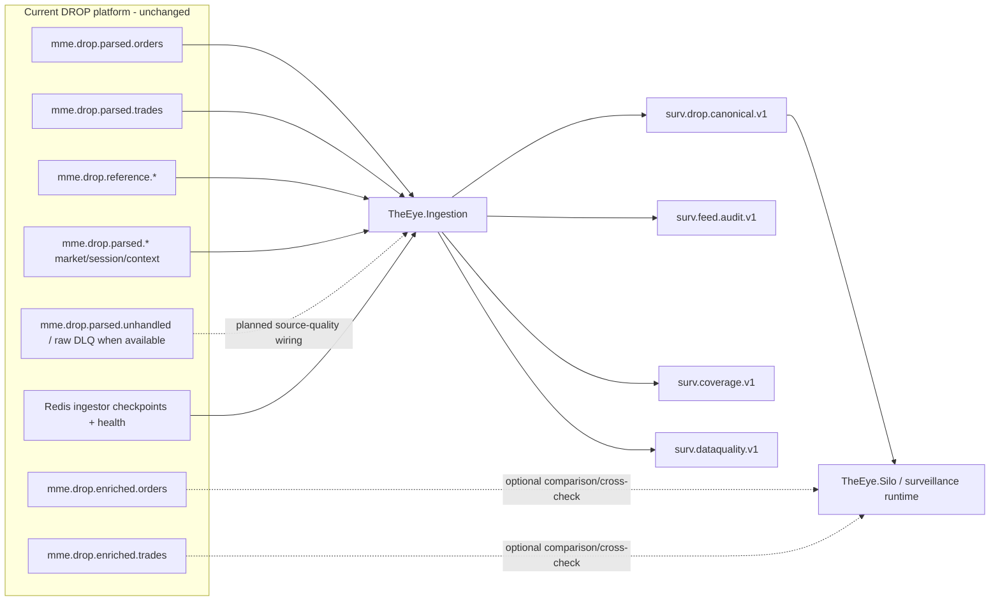

# Surveillance Data Interface Boundary

> [!IMPORTANT]
> This note defines how THE EYE consumes the **current DROP platform without modifying it**. Raw/current DROP Kafka topics enter `TheEye.Ingestion`; the downstream surveillance/Silo boundary is the ordered `surv.drop.canonical.v1` topic.

See [[Architecture/Implementation-Start/15 - Current Runtime Architecture and Fix Plan|Current Runtime Architecture and Fix Plan]].

## Boundary diagram



## Data layers available today

### 1. Native parsed business-event layer

Includes:

- full Order lifecycle events;
- Trade-side events;
- rejected orders and off-exchange trades;
- RFQ / indicative quote flows;
- BBO/equilibrium/price-limit/reference/index/away-market context;
- circuit breaker/session/business-date/announcement context.

These are source inputs to `TheEye.Ingestion`.

### 2. Reference identity/instrument layer

`mme.drop.reference.*` and related reference events provide Assets, OrderBooks, Participants, Actors, Accounts, Account Types/Groups, Investors and Custodians.

The Ingestor transports these as independent canonical events. The Silo builds as-of reference state and Account → Investor resolution.

### 3. Enriched convenience layer

```text
mme.drop.enriched.orders
mme.drop.enriched.trades
```

These are optional comparison views. They are not the authoritative THE EYE evidence path because current enrichment has documented degradation/replay/race windows.

### 4. Persistence layer

Oracle/PostgreSQL remain investigation/replay sources, but the live surveillance ordering path does not depend on database persistence.

## Global MME sequence

Operationally, the MME sequence is treated as global across message types inside its actual source sequence domain.

Therefore:

- each raw Kafka topic is a sparse view;
- a source jump inside `orders`, `trades`, `reference`, BBO, etc. does not prove a gap;
- Kafka does not create one global order across separate topics;
- source continuity is reconstructed only by `TheEye.Ingestion`/SourceAssembly;
- the exact `SequenceDomain` must be proven and must not be invented from Kafka topic/message family/order book/trader.

## Current source-integrity boundary

`TheEye.Ingestion` performs:

```text
broker topic reconciliation
→ Kafka source-header/context decode
→ typed DROP adaptation
→ header/payload validation
→ deterministic source EventId
→ global source-sequence buffer/reorder
→ replay duplicate classification
→ safe-watermark gap proof
→ canonical/audit/coverage/data-quality publication
```

`TheEye.SourceAssembly` is a C# library inside this Ingestor deployable.

## Canonical surveillance input

The normal Silo input for DROP is:

```text
surv.drop.canonical.v1
```

It carries the typed source payload plus deterministic identity, MME sequence/domain/epoch, source message identity, natural routing fields, event/receive times and Kafka forensic coordinates.

Initial ordering rule:

```text
one partition per SequenceDomain
```

The Silo reads this lane sequentially and then parallelizes by book/subject key.

## Audit / coverage / data-quality side streams

### `surv.feed.audit.v1`

Forensic copy/ledger of finalized source evidence.

### `surv.coverage.v1`

Confirmed gaps/stalls/coverage transitions. A source gap is declared only when the safe watermark proves it.

### `surv.dataquality.v1`

Malformed source headers, adapter parse failures, metadata mismatches and other source-integrity evidence. Same-sequence conflicts will become first-class durable events before production.

## Current live findings

The first live implementation run established:

- **22/37 documented topics** were present on the tested broker;
- the original fixed-width Kafka-header assumption was wrong;
- `SequenceEpoch` reset semantics are still unverified;
- source-quality topics are not yet wired;
- source-offset commit timing requires a P0 durability correction.

Topic absence must be classified as `Required`, `Optional`, or `NotProvisioned` before final coverage behavior is claimed.

## Source-offset safety

The Ingestor must not acknowledge a source Kafka record while its only accepted copy exists only in the in-memory reorder buffer.

Target:

```text
consume
→ validate/buffer
→ durably publish terminal output
→ mark source record safe
→ commit highest contiguous safe source offset per topic-partition
```

Duplicate replay is acceptable because deterministic `EventId` makes downstream application idempotent. Silent surveillance loss is not.

## Reference/Investor rule

Canonical source events remain source-faithful:

```text
InvestorReferenceEvent
AccountReferenceEvent
OrderLifecycleEvent
TradeSideEvent
...
```

The Silo resolves:

```text
Order/Trade account → Account as-of sequence → InvestorId → Investor
```

The Ingestor does not perform this join using mutable Redis.

## Surveillance input rule

Current active architecture:

1. `TheEye.Ingestion` reads native parsed/reference source topics.
2. It reconstructs source order/coverage and publishes canonical source truth.
3. `TheEye.Silo` consumes only the canonical DROP stream for normal market/reference processing.
4. Silo projectors build reference/context/trade-pair state.
5. Current enriched topics are optional comparison/cross-check views.
6. Original Kafka coordinates + source sequence remain alert evidence.

## Navigation

- [[Architecture/Implementation-Start/15 - Current Runtime Architecture and Fix Plan|Current Runtime Architecture and Fix Plan]]
- [[DROP-Current-System/03 - Current DROP Runtime Architecture|Current DROP Runtime Architecture]]
- [[Architecture/Implementation-Start/00 - Implementation Start Home|Implementation Start Home]]
- [[Architecture/Implementation-Start/02 - Canonical Event Contract|Canonical Event Contract]]
- [[Architecture/Implementation-Start/09 - Source Assembly and Ordering Logic|Source Assembly and Ordering Logic]]
- [[00 - Project Home|Project Home]]
