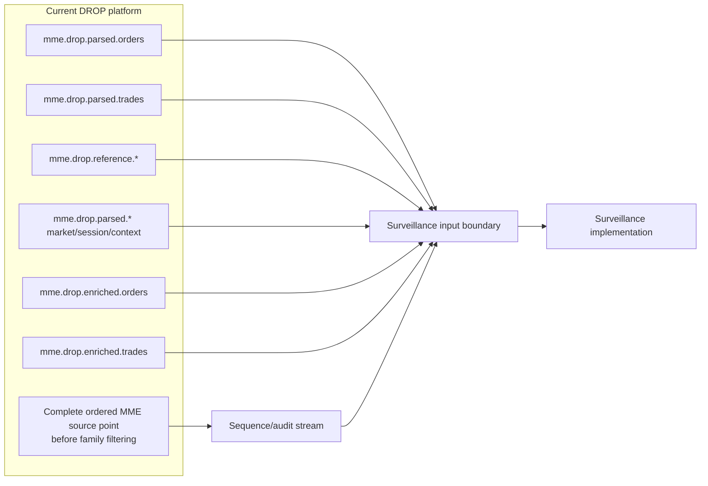

# Surveillance Data Interface Boundary

> [!IMPORTANT]
> This note defines **what data the current DROP platform can expose to surveillance** and the ordering evidence the surveillance implementation must preserve. It does not make the current DROP parsed topics globally ordered when they are not.

## Boundary diagram

## Data layers available today

### 1. Raw business-event layer - parsed topics

- Full order lifecycle events: `mme.drop.parsed.orders`.
- Trade-side events: `mme.drop.parsed.trades`.
- Rejected orders and off-exchange trades.
- RFQ / RFQ response / indicative-quote flows.
- BBO, equilibrium price, price limits, reference price, index price, away-market BBO and delayed last match price.
- Circuit-breaker, session-change, business-date and market-announcement context.

### 2. Reference identity/instrument layer

`mme.drop.reference.*` topics provide assets, order books, participants, actors, accounts, account types/groups, investors and custodians.

### 3. Enriched convenience layer

- `mme.drop.enriched.orders`
- `mme.drop.enriched.trades`

These are derived from parsed events plus Redis reference data. They are convenient but should not be treated as the only evidence source because enrichment has known degradation/duplicate windows.

### 4. Persistence layer

Oracle and PostgreSQL retain current DROP outputs for replay/investigation purposes, but live surveillance ordering must not depend on database persistence.

## Global MME sequence - corrected model

Operationally, the MME sequence used by this platform is **global across message types within its real source sequence domain**.

Therefore:

- `orders`, `trades`, `reference`, BBO and session topics each contain only a **sparse subset** of the source sequence.
- Seeing source sequence `1000` and then `1004` on `mme.drop.parsed.orders` does **not** prove messages `1001..1003` were lost; they may belong to other message types/topics.
- A downstream consumer must **never detect source feed gaps independently per Kafka topic or per message family**.
- Kafka preserves order only inside a partition; it does not provide a global ordering relationship across separate topics.
- The exact `SequenceDomain` must represent the source scope that owns the global sequence. It must never be derived from Kafka topic, message family, trader or order book.

See [[Architecture/Implementation-Start/01 - Global Sequence and Feed Continuity|Global Sequence and Feed Continuity]].

## Required surveillance-safe addition

For reliable feed coverage, surveillance needs a lightweight ordered stream produced at the first point where the **complete source message sequence** exists, before family filtering destroys contiguity.

Preferred contract/topic:

`surv.feed.audit.v1`

One record for every source message should preserve at least:

- `SourceSequence`
- `SequenceDomain`
- `EventType` / DROP message identity
- `MessageGroup`
- `MessageId`
- source/DROP partition identifier when present
- `EventTime`
- deterministic `EventId`

This audit stream is for **coverage and forensic ordering**. The existing parsed/enriched topics remain the business payload inputs.

> [!NOTE]
> If an existing current component already exposes every MME message in exact source order, that existing stream can satisfy this requirement instead of adding a duplicate stream. The requirement is the complete ordered sequence, not a particular topic name.

## Surveillance input rule

The active implementation should use:

1. the complete sequence/audit stream for feed continuity and coverage state;
2. parsed business topics for authoritative market events;
3. reference topics for identity/instrument state;
4. enriched topics only as convenience views or cross-checks;
5. Kafka coordinates + source sequence in alert evidence for reproducibility.

## Navigation

- [[DROP-Current-System/03 - Current DROP Runtime Architecture|Current DROP Runtime Architecture]]
- [[Architecture/Implementation-Start/00 - Implementation Start Home|Implementation Start Home]]
- [[Architecture/Implementation-Start/02 - Canonical Event Contract|Canonical Event Contract]]
- [[00 - Project Home|Project Home]]
